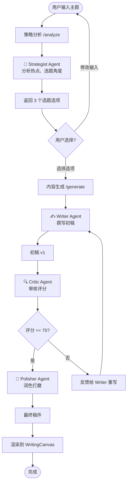
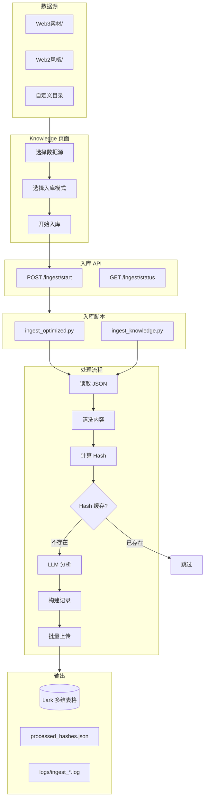
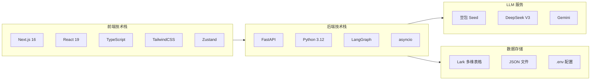
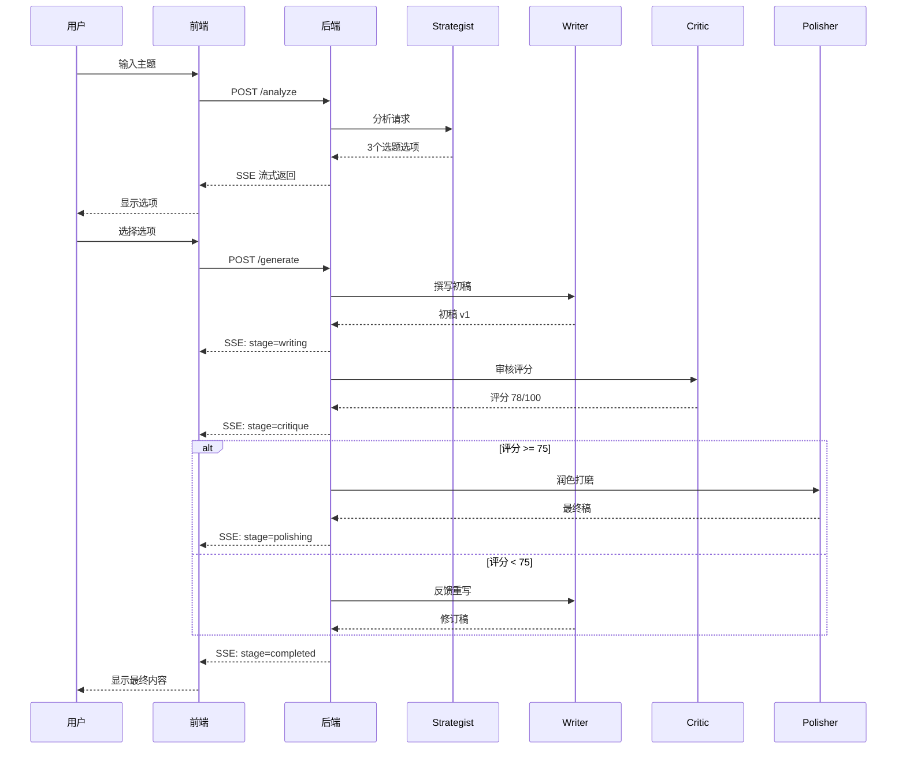
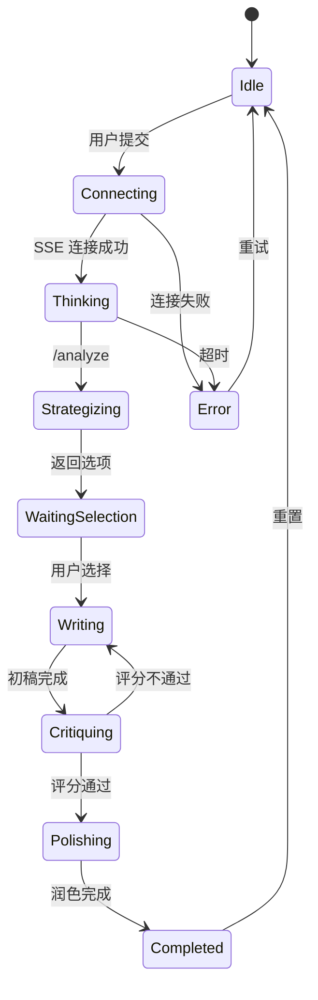

# Quantum Studio v6.3 - 系统架构流程图

> **版本**: v1.0 | **更新日期**: 2026-01-25

---

## 1. 系统总体架构

```mermaid
graph TB
    subgraph User["用户层"]
        BROWSER["浏览器"]
    end
    
    subgraph Frontend["前端 (Next.js 16)"]
        subgraph Pages["页面路由"]
            HOME["/home 主页"]
            STUDIO["/studio 创作工作室"]
            KNOWLEDGE["/knowledge 知识入库"]
            SETTINGS["/settings 系统设置"]
        end
        
        subgraph Components["核心组件"]
            ISLAND["IslandContainer"]
            TIMELINE["AgentTimeline"]
            CANVAS["WritingCanvas"]
            CONFIG["ConfigPanel"]
        end
        
        subgraph Store["状态管理"]
            ZUSTAND["Zustand Store"]
            NUQS["nuqs URL状态"]
        end
    end
    
    subgraph Backend["后端 (FastAPI)"]
        subgraph API["API 路由"]
            ANALYZE["/analyze SSE"]
            GENERATE["/generate SSE"]
            INGEST["/ingest/* 入库"]
            LARK_API["/lark/* 数据"]
        end
        
        subgraph Graph["LangGraph 工作流"]
            STRATEGIST["Strategist Agent"]
            WRITER["Writer Agent"]
            CRITIC["Critic Agent"]
            POLISHER["Polisher Agent"]
        end
        
        subgraph Core["核心模块"]
            LLM["llm.py"]
            LARK_CLIENT["lark_client.py"]
            HASH_CACHE["hash_cache.py"]
        end
    end
    
    subgraph External["外部服务"]
        VOLC["火山引擎 LLM"]
        LARK["Lark/飞书 API"]
    end
    
    BROWSER --> Pages
    Pages --> Components
    Components --> Store
    Store --> API
    API --> Graph
    Graph --> Core
    Core --> External
```



---

## 2. 内容创作工作流



---

## 3. 数据清洗入库流程



---

## 4. 技术栈



---

## 5. 核心模块

### 5.1 前端模块

| 模块 | 路径 | 功能 |
|------|------|------|
| **Studio 页面** | `/studio` | 内容创作主界面 |
| **Knowledge 页面** | `/knowledge` | 数据入库管理 |
| **Settings 页面** | `/settings` | 系统配置 |
| **AgentTimeline** | `components/` | Agent 思考过程可视化 |
| **WritingCanvas** | `components/` | 内容渲染画布 |
| **useAgentStore** | `features/` | SSE 流式状态管理 |

### 5.2 后端模块

| 模块 | 路径 | 功能 |
|------|------|------|
| **main.py** | `app/` | FastAPI 入口 + API 路由 |
| **graph.py** | `app/` | LangGraph 工作流定义 |
| **agents/** | `app/` | 4 个 Agent 实现 |
| **lark_client.py** | `app/core/` | Lark API 封装 |
| **llm.py** | `app/core/` | LLM 调用封装 |
| **ingest_optimized.py** | `scripts/` | 优化版入库脚本 |

---

## 6. Agent 协作流程



---

## 7. 状态机



---

## 8. API 端点一览

### 8.1 内容创作 API

| 方法 | 端点 | 功能 | 响应类型 |
|------|------|------|----------|
| POST | `/analyze` | 策略分析 | SSE |
| POST | `/generate` | 内容生成 | SSE |
| GET | `/health` | 健康检查 | JSON |

### 8.2 配置 API

| 方法 | 端点 | 功能 |
|------|------|------|
| GET/POST | `/config/models` | 模型配置 |
| GET/POST | `/config/keys` | API Key 配置 |
| GET/POST | `/config/prompts/{agent}` | Prompt 配置 |
| GET/PUT | `/config/ingest` | 入库配置 |

### 8.3 数据入库 API

| 方法 | 端点 | 功能 |
|------|------|------|
| POST | `/ingest/start` | 启动入库任务 |
| GET | `/ingest/status` | 获取入库状态 |
| GET | `/ingest/browse` | 浏览本地目录 |

### 8.4 Lark 数据 API

| 方法 | 端点 | 功能 |
|------|------|------|
| GET | `/lark/sources` | 获取知识库列表 |
| POST | `/lark/search` | 搜索知识库 |

---

## 9. 目录结构

```
Quantum Studio/
├── frontend/                     # Next.js 前端
│   └── src/
│       ├── app/                  # 页面路由
│       │   ├── (main)/           # 主布局
│       │   │   ├── studio/       # 创作工作室
│       │   │   ├── knowledge/    # 知识入库
│       │   │   └── settings/     # 系统设置
│       │   └── page.tsx          # 首页
│       ├── components/           # UI 组件
│       │   ├── island/           # Island 架构组件
│       │   └── ui/               # 基础 UI
│       └── features/             # 业务模块
│           └── studio/           # Studio 状态管理
│
├── backend/                      # FastAPI 后端
│   ├── app/
│   │   ├── main.py               # API 入口
│   │   ├── graph.py              # LangGraph 工作流
│   │   ├── agents/               # Agent 实现
│   │   └── core/                 # 核心模块
│   │       ├── llm.py            # LLM 封装
│   │       └── lark_client.py    # Lark API
│   ├── scripts/                  # 脚本工具
│   │   ├── ingest_optimized.py   # 优化版入库
│   │   ├── ingest_knowledge.py   # 旧版入库
│   │   └── batch/                # 批处理模块
│   └── data/                     # 数据目录
│       ├── Web3素材/             # Web3 知识库
│       └── processed_hashes.json # Hash 缓存
│
├── reports/                      # 设计文档
│   └── design_docs/
│       └── frontend_design/
│           ├── 12-3_Manual_*.md  # 数据清洗手册
│           └── 14-1_Arch_*.md    # 架构流程图
│
└── PROJECT_HANDBOOK.md           # 项目手册
```

---

## 10. 更新日志

| 日期 | 版本 | 变更 |
|------|------|------|
| 2026-01-25 | v1.0 | 初始版本：系统架构、Agent 协作流程、API 端点 |
