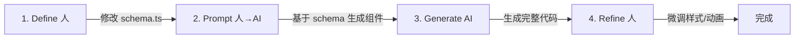

# 💎 2026 Quantum Studio 前端架构与开发规范
> **版本**: v3.1 (Schema-First & State-Layered)  
> **状态**: 🔴 最终执行版  
> **核心**: 以 Schema 为骨架，以 Vibe 为皮囊，以 Server Actions 为血肉。

---

## 📑 目录
1. [核心理念 (Philosophy)](#1-核心理念-philosophy)
2. [数据与状态规范 (Data & State Architecture)](#2-数据与状态规范-data--state-architecture) ⭐ (修复重点)
3. [视觉系统规范 (Visual System)](#3-视觉系统规范-visual-system)
4. [项目结构与岛屿架构 (Island Architecture)](#4-项目结构与岛屿架构-island-architecture)
5. [组件设计模式 (Co-location)](#5-组件设计模式-co-location)
6. [AI 协作工作流 (The Workflow)](#6-ai-协作工作流-the-workflow)
7. [重构任务清单 (Action Plan)](#7-重构任务清单-action-plan)

---

## 1. 核心理念 (Philosophy)

| 原则 | 说明 |
|------|------|
| **Schema is King** | 一切开发始于 `schema.ts`。它是 UI、API 和数据库的共同契约。 |
| **User is Architect** | 开发者负责定义"真理"（Schema）和"审美"（Vibe），AI 负责填充代码。 |
| **Vibe First** | 拒绝工业软件的冰冷感。追求"悬浮"、"留白"和"微交互"。 |

---

## 2. 数据与状态规范 (Data & State Architecture)

> 💡 这是 React 19 时代最核心的规范。请严格遵守以下分层，严禁混用。

### 2.1 唯一真理源 (Single Source of Truth)

所有业务实体定义必须写在 Feature 目录下的 `schema.ts` 中。**严禁手写 TypeScript Interface**。

```typescript
// features/studio/schema.ts
import { z } from 'zod';

export const CreationConfigSchema = z.object({
  topic: z.string().min(1, "Topic is required"),
  role: z.enum(['professional', 'storyteller']),
  // ...更多字段
});

// ✅ 自动推导类型，随 Schema 自动更新
export type CreationConfig = z.infer<typeof CreationConfigSchema>;
```

### 2.2 状态四层模型 (The 4-Layer State Model)

| 状态类型 | 推荐方案 (2026) | 适用场景 | 示例 |
|----------|-----------------|----------|------|
| **URL 状态** | `nuqs` (Type-safe search params) | ⭐ 最优先。配置项、搜索词、Tab切换。让链接可分享。 | `?role=kol&tab=config` |
| **服务端状态** | Server Components / Actions | 数据库数据、生成结果。直接 `await` 获取，不存客户端 Store。 | 知识库列表、文章内容 |
| **表单状态** | React Hook Form + Zod | 瞬时输入数据、校验错误信息。 | 文章生成配置表单 |
| **UI 交互状态** | Zustand (Minimal) | 🚨 最后手段。仅用于纯客户端交互（侧边栏开关、弹窗）。 | `useUIStore.isOpen` |

### 2.3 Server Actions 规范

重业务逻辑（如 LLM 调用）必须封装在 Server Actions 中，前端只负责 invoke。

```typescript
// features/studio/actions.ts
'use server'

export async function generate(data: CreationConfig) {
  // 1. 在服务端再次校验 Schema
  const parsed = CreationConfigSchema.parse(data);
  // 2. 执行逻辑
  return await llm.call(parsed);
}
```

---

## 3. 视觉系统规范 (Visual System)

### 3.1 核心色调 (Zinc & Flow)

| 元素 | 样式 | 说明 |
|------|------|------|
| **Canvas (画布)** | `bg-zinc-50` | 全页背景色 |
| **Islands (悬浮岛)** | `bg-white shadow-sm border-zinc-100` | 功能区容器 |
| **Accent (强调色)** | `bg-zinc-900` | 主要行动点，拒绝高饱和度蓝/绿色 |

### 3.2 字体与排版

| 用途 | 字体 | 说明 |
|------|------|------|
| **Headings** | `font-serif` (Newsreader) | 赋予高级编辑感 |
| **UI Controls** | `font-sans` (Geist/Inter) | 保持清晰易读 |
| **Radius** | `rounded-xl` (12px) | 基准；大卡片用 `rounded-2xl` (16px) |

---

## 4. 项目结构与岛屿架构 (Island Architecture)

> **原则**: 扁平化，按"业务域"组织。

```text
src/
├── app/
│   ├── layout.tsx              # Canvas Layer (全屏背景)
│   └── studio/                 # 业务页面
│       └── page.tsx            # 页面入口
│
├── components/
│   ├── ui/                     # ⚡ Primitives (Shadcn基础元件)
│   └── layout/                 # 🏝️ Islands (Navbar, SidebarFrame)
│
├── features/
│   └── studio/                 # ⚛️ Quantum Studio 核心业务域
│       ├── schema.ts           # ⭐ [STEP 1] 真理源
│       ├── actions.ts          # ⭐ [STEP 3] 服务端逻辑
│       ├── stores/             # 仅存放 UI 状态 (useStudioUI.ts)
│       ├── components/         # 业务组件 (Co-located)
│       │   ├── ConfigPanel.tsx
│       │   ├── AgentTimeline.tsx
│       │   └── PreviewCard.tsx
│       └── hooks/              # 业务 Hooks
│
└── lib/                        # 通用工具
```

---

## 5. 组件设计模式 (Co-location)

### 5.1 废弃清单 (❌ Don't)

| 模式 | 理由 |
|------|------|
| ❌ **Atomic Design** | 停止思考"这是原子还是分子"。 |
| ❌ **Container/View** | 禁止将逻辑和 UI 拆分到不同文件。这会打断 AI 上下文。 |

### 5.2 岛屿模型 (✅ Do)

组件应当是**自包含**的：

```tsx
// features/studio/components/ConfigPanel.tsx
'use client'; 

import { useQueryState } from 'nuqs'; // URL 状态
import { CreationConfigSchema } from '../schema'; // Schema

export function ConfigPanel() {
  // 1. 状态直接挂在 URL 上，刷新不丢失
  const [role, setRole] = useQueryState('role'); 
  
  return (
    // 2. 视觉：悬浮岛屿风格
    <aside className="fixed left-4 top-20 w-80 bg-white rounded-2xl shadow-sm border border-zinc-100 p-6">
       {/* UI Code */}
    </aside>
  );
}
```

---

## 6. AI 协作工作流 (The Workflow)



| 步骤 | 角色 | 动作 |
|------|------|------|
| **Define** | 人 | 修改 `schema.ts`，定义数据结构 |
| **Prompt** | 人→AI | "基于 schema.ts，为我生成 ConfigPanel 组件。使用 Shadcn UI，所有状态使用 nuqs 同步到 URL。" |
| **Generate** | AI | AI 生成包含 UI 和 Logic 的完整代码 |
| **Refine** | 人 | 微调 Tailwind 类名（如 `p-4` 改为 `p-6`），调整动画 |

---

## 7. 重构任务清单 (Action Plan)

### ✅ Phase 1: 地基清理与配置 (The Purge)
- [x] 全局样式重置: 清空 `globals.css`，只保留 Tailwind 指令
- [x] 视觉配置: 更新 `tailwind.config.ts`，写入 Zinc 色系和 Fonts
- [x] 依赖安装: 安装 `nuqs` 用于 URL 状态管理

### ✅ Phase 2: 地基与视觉验证 (Design Lab)
- [x] Canvas: 重写 `src/app/layout.tsx`，设置背景为 `bg-zinc-50`
- [x] 创建 Design Lab 验证三种布局方案 (Variant A/B/C)
- [x] 选定 **Variant A (The Athenaeum)** 作为最终方案

### ✅ Phase 3: 业务组件生成 (Island Construction)
- [x] 创建 `IslandContainer` 通用封装
- [x] 创建 `ConfigIsland` (Left) & `AgentIsland` (Right)
- [x] `ConfigPanel`: 基于 Schema + nuqs 重写左侧面板
- [x] `AgentTimeline`: 实现 Agent 状态可视化

### ✅ Phase 4: 逻辑接入 (Wiring)
- [x] 创建 `useAgentStore` (SSE 流式客户端)
- [x] 在 `ConfigPanel` 绑定 `StartButton`
- [x] 对接后端 `/generate` SSE 流式输出

### 🔜 Phase 5: 打磨优化 (Polish)
- [ ] UI 动画细节 (微交互、过渡动画)
- [ ] Markdown 内容渲染 (react-markdown)
- [ ] 错误处理优化 (友好提示、重试机制)
- [ ] 响应式适配 (移动端 Drawer)

### 📌 Phase 6: 功能扩展 (Enhancement)
- [ ] 深色模式切换
- [ ] 导出功能 (Markdown/HTML/PDF)
- [ ] 历史记录与版本管理
- [ ] 风格微调系统

---

<p align="center">
  <b>Quantum Studio</b> — 2026 Vibe Coding Standard
</p>