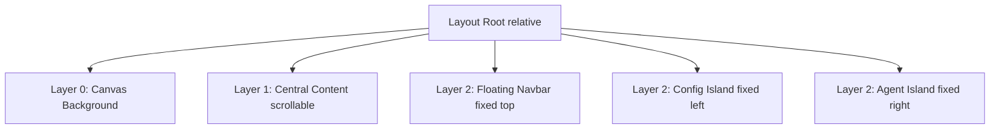

# Phase 3: Island Architecture Design (Variant A)

## 1. 核心理念: The Athenaeum (浮岛智库)
用户选择了 **Variant A**。此方案的核心在于"High-End Minimalism"与"Cognitive Clarity"（认知清晰度）。通过将功能区碎片化为独立的漂浮岛屿，最大化内容的留白与呼吸感。

### 视觉规范 (Visual Specs)
- **Background**: `bg-zinc-50` (#FAFAFA) + 5% 由于径向渐变 (Radial Gradient) 形成的噪点纹理。
- **Islands**: 
  - `bg-white` (#FFFFFF)
  - `rounded-2xl` (20px) 
  - `shadow-island` (soft spread) + `border-zinc-100`.
- **Typography**: 
  - **Headings/Content**: `font-serif` (Newsreader).
  - **UI/Labels**: `font-sans` (Geist).

---

## 2. 布局架构 (Layout Architecture)

不同于传统的 Flex/Grid 布局，Variant A 采用 **Z-Stack (层叠)** 布局策略。



### 关键组件定义

#### 2.1 导航岛 (StudioNavbar)
- **位置**: `fixed top-6 left-1/2 -translate-x-1/2`
- **形态**: "Pill Shape" (胶囊型)。
- **内容**: Logo, Tab Switcher (Editor/Knowledge/Agents), Global Action (Search).
- **交互**: 
  - 滚动时由透明变为半透明毛玻璃 (Wait, Variant A used solid white. We stick to solid white as requested, maybe minimal blur).

#### 2.2 左侧配置岛 (ConfigIsland)
- **位置**: `fixed left-6 top-24 bottom-6 w-80`
- **形态**: 垂直长条卡片 (Vertical Card).
- **功能**: 
  - 承载 `ConfigPanel.tsx` (Phase 2 已生成).
  - 包含 `CreationMode`, `Style`, `Length` 等表单控件.
- **响应式**: 在小屏幕上自动收起为 Fab Button。

#### 2.3 右侧智能体岛 (AgentIsland)
- **位置**: `fixed right-6 top-24 bottom-6 w-72`
- **形态**: 垂直长条卡片 (Vertical Card).
- **功能**: 
  - 实时显示 Multi-Agent 的思考过程。
  - Timeline 形式展示 Steps (Research -> Draft -> Critique).
  - 状态指示器 (Pulsing Dots).

#### 2.4 中央画布 (CentralCanvas)
- **位置**: `absolute top-0 left-0 right-0 min-h-screen`
- **Padding**: `pt-32 pl-96 pr-80 pb-20` (为岛屿预留空间).
- **内容**: 
  - **PaperSheet**: 拟物化的纸张容器 (`max-w-3xl bg-white shadow-sm borders`).
  - **Editor**: Tiptap / Markdown 编辑器。

---

## 3. 技术实现策略

### 3.1 文件结构 (File Structure)
```text
src/features/studio/
├── components/
│   ├── layout/
│   │   ├── StudioNavbar.tsx      # 顶部导航
│   │   ├── IslandContainer.tsx   # 通用岛屿容器 (样式封装)
│   │   ├── ConfigIsland.tsx      # 左侧容器
│   │   └── AgentIsland.tsx       # 右侧容器
│   ├── preview/
│   │   └── PaperSheet.tsx        # 中央纸张组件
│   └── ConfigPanel.tsx           # (已存在)
└── layout/
    └── StudioLayout.tsx          # 组装 Z-Stack
```

### 3.2 通用岛屿封装 (IslandContainer)
为了保证一致性，我们将创建一个 HOC 或 Wrapper 组件：

```tsx
export function IslandContainer({ children, position, className }) {
  return (
    <aside className={cn(
      "fixed bg-white rounded-2xl shadow-island border border-zinc-100 z-40 flex flex-col overflow-hidden",
      position === 'left' && "left-6 top-24 bottom-6 w-80",
      position === 'right' && "right-6 top-24 bottom-6 w-72",
      className
    )}>
      {children}
    </aside>
  )
}
```

### 3.3 响应式策略 (Mobile)
鉴于这是一种复杂的桌面级布局，移动端策略如下：
- **< md (Tablet/Mobile)**:
  - 隐藏左右 Sidebar。
  - 底部增加 BottomNav 用以唤起 Config/Agent Drawer (抽屉)。
  - Navbar 变为顶部吸附。

---

## 4. 实施步骤 (Execution Steps)

1.  **基础组件封装**: 创建 `IslandContainer` 和 `StudioLayout`。
2.  **左岛迁移**: 将 `ConfigPanel` 放入 `ConfigIsland`。
3.  **右岛开发**: 开发 `AgentTimeline` 并放入 `AgentIsland`。
4.  **页面组装**: 在 `app/studio/page.tsx` 中应用 `StudioLayout` 并替换旧代码。
