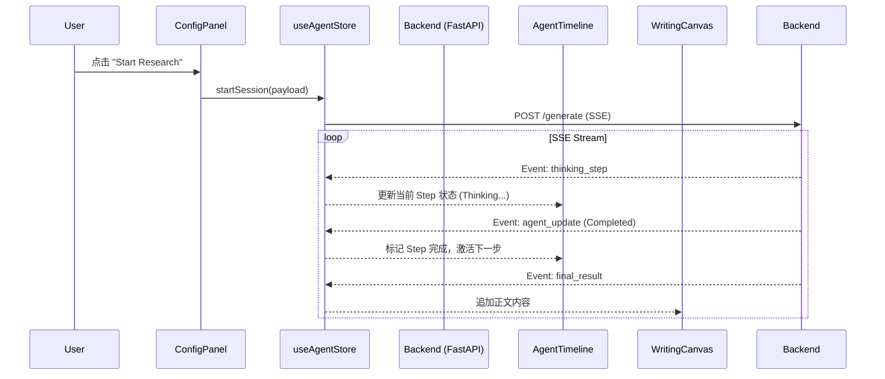

# Phase 4 Design: Deep Research Integration

## 1. 目标 (Objective)
将静态的 **Island Architecture (Variant A)** 接入真实的后端 **Deep Research Agent**，实现流式生成的全链路闭环。

**核心体验目标**:
1.  **实时感知**: 用户透过 `AgentTimeline` 实时看到 AI 的思考过程 (Thinking Process)。
2.  **流式交付**: 正文内容 (Writing Canvas) 逐字生成，带来"正在被书写"的沉浸感。
3.  **可控性**: 允许用户在生成过程中随时中止 (Stop Generation)。

## 2. 架构设计 (Architecture)

### 2.1 数据流架构 (Data Flow)



### 2.2 状态管理 (`useAgentStore`)

使用 **Zustand** 管理会话状态，避免 Context 引起的无关组件重渲染。

```typescript
type SessionStatus = 'idle' | 'connecting' | 'thinking' | 'writing' | 'completed' | 'error';

interface AgentState {
    status: SessionStatus;
    sessionId: string | null;
    
    // Agent Timeline Data
    steps: TimelineStep[]; 
    activeStepId: string | null;
    
    // Generated Content
    content: string;
    
    // Actions
    startSession: (config: GenerateRequest) => Promise<void>;
    stopSession: () => void;
    resetSession: () => void;
}
```

### 2.3 SSE 事件映射 (Event Mapping)

后端事件 (`backend/app/main.py`) 将映射到前端时间轴状态：

| 后端事件 (Event) | 字段特征 | 前端动作 (Action) | 视觉反馈 |
| :--- | :--- | :--- | :--- |
| `thinking_step` | `agent: strategist` | Update Step 1 (Strategy) | 思考中 (Sparkles) |
| `agent_update` | `step: strategist`, `status: completed` | Complete Step 1 | 打钩 (Check), 激活 Step 2 |
| `thinking_step` | `agent: writer` | Update Step 3 (Drafting) | 写作中 (Pen) |
| `final_result` | `payload: "..."` | Update `content` | 画布文字打字机效果 |
| `end` | - | Status -> `completed` | 停止所有动画 |

## 3. 组件改造 (Component Retrofit)

### 3.1 `ConfigIsland` -> `ConfigPanel`
- **新增**: `StartButton` 组件。
- **逻辑**: 点击时收集当前 URL 参数 (Mode, Style) + 输入框内容，构造 `GenerateRequest` payload。
- **状态**: 当 `status !== 'idle'` 时，按钮变为 "Stop Generating"。

### 3.2 `AgentIsland` -> `AgentTimeline`
- **移除**: Mock Data (`MOCK_STEPS`).
- **接入**: 订阅 `useAgentStore.steps`。
- **动画**: 确保从 Store 更新时，React 的 Diff 算法能平滑过渡动画 (使用 `layoutId` 或 `AnimatePresence`)。

### 3.3 `WritingCanvas`
- **接入**: 订阅 `useAgentStore.content`.
- **特性**: 支持 Markdown 实时渲染 (使用 `react-markdown` 或存量组件)。

## 4. 实施步骤 (Execution Plan)

- [ ] **Step 1: Store Implementation**
  - 创建 `src/features/agent/stores/useAgentStore.ts`.
  - 实现 `fetchSSE` 适配器 (处理 `POST` 请求的流式响应)。
  
- [ ] **Step 2: Component Wiring**
  - 改造 `ConfigPanel` 接入 `startSession`.
  - 改造 `AgentIsland` 接入 `steps`.
  - 改造 `WritingCanvas` 显示内容。

- [ ] **Step 3: Integration Verification**
  - 启动后端 (`localhost:8002`).
  - 运行全流程测试，验证 Log 和 UI 状态同步。

## 5. 风险控制 (Risk Management)
- **CORS**: 需确认后端 `CORSMiddleware` 允许前端端口。
- **超时**: 长文生成可能持续 60s+，需确认 Nginx/Browser 无超时限制。
- **重连**: 暂不实现断线重连 (MVP)，失败需重试。
