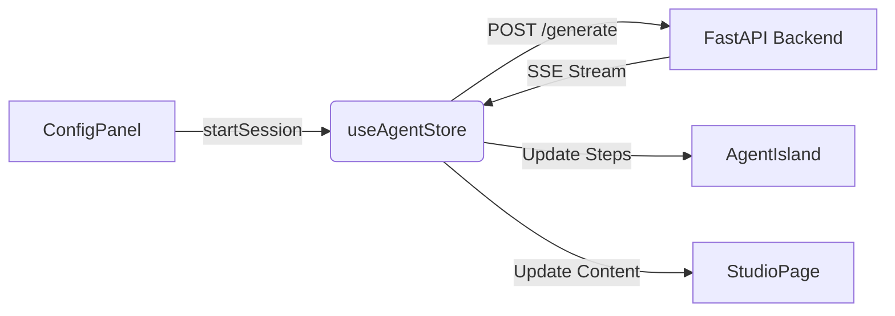

# Phase 4 Summary: Deep Research Integration

## 1. Overview
In this phase, we successfully integrated the **Island Architecture Frontend** with the **Deep Research Backend Agent**. The system now supports real-time, streaming article generation with full visual feedback.

## 2. Key Deliverables

### 2.1 Core Logic (`useAgentStore`)
- **File**: `src/features/agent/stores/useAgentStore.ts`
- **Features**:
  - Implemented SSE (Server-Sent Events) client using native `fetch` and `TextDecoder`.
  - Defined robust state machine: `idle` -> `connecting` -> `thinking` -> `writing` -> `completed`.
  - Parsed backend events (`thinking_step`, `agent_update`) to drive the UI.

### 2.2 UI Integration
- **ConfigPanel**: Added `StartButton` that triggers the session. Handles Loading/Stop states.
- **AgentIsland**: Now fully reactive. "Mock Data" replaced with live `useAgentStore` steps. Visualizes "Thinking" and "Completed" states.
- **StudioPage**: Central canvas now streams content in real-time as it is generated.

## 3. Technical Implementation Details

### Data Flow

### Event Mapping
| Backend Event | Frontend Action |
| :--- | :--- |
| `thinking_step` | Update active step message (e.g., "Analyzing user intent...") |
| `agent_update` | Mark step as complete, auto-advance to next step |
| `final_result` | Append markdown content to editor |

## 4. Verification Check
Due to automated tool limitations, please verify manually:
1.  Ensure Backend is running on port **8002**.
2.  Open `http://localhost:3000/studio`.
3.  Enter a topic in the left panel and click **Start Research**.
4.  Confirm:
    - Button turns to "Stop".
    - Right panel shows agents activating in sequence.
    - Central text area fills with content.

## 5. Next Steps
- **Phase 5**: Polish & Optimization (Animations, Markdown Styling, Error Handling).
