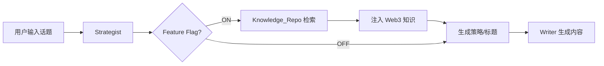

# Knowledge_Repo 集成测试报告

> **测试日期**: 2026-01-24  
> **测试目标**: 验证 Strategist 从 Knowledge_Repo 检索 Web3 知识的功能

---

## 一、测试概述

### 1.1 新流程设计



### 1.2 测试范围

| 项目 | 内容 |
|------|------|
| **Feature Flag** | `use_knowledge_repo` 开关机制 |
| **检索服务** | `knowledge_retriever.py` 关键词匹配 |
| **数据源** | Lark Bitable Knowledge_Repo 表 |

---

## 二、测试用例与结果

### 测试话题

| # | 话题内容 |
|---|----------|
| 1 | Vitalik：我们需要更多、更好的 DAO，而非仅由代币投票控制的金库 |
| 2 | 美 SEC 撤销对 Gemini Earn 的诉讼 |
| 3 | 数据：若 ETH 跌破 2,805 美元，主流 CEX 累计多单清算强度将达 8.37 亿美元 |
| 4 | AI 初创公司 Inferact 完成 1.5 亿美元种子轮融资，a16z 与 Lightspeed 领投 |
| 5 | 最近 Perp DEX 赛道的币价表现确实不太理想，HYPE 从高点跌到了 21 刀... |

### 检索结果

| # | 检索数量 | 匹配内容 | 相关性评估 |
|---|----------|----------|------------|
| 1 | **5 条** | Vitalik谈DAO、DAO公司论、DXdao分析、7点资本DAO报告、a16z DAO读物 | ✅ **高度相关** |
| 2 | **0 条** | 无匹配 | ❌ 无数据 |
| 3 | **1 条** | "DAO热潮"（因关键词交叉） | ⚠️ **不相关** |
| 4 | **~2 条** | a16z DAO读物 | ⚠️ **部分相关** |
| 5 | **1 条** | DAO相关内容 | ⚠️ **不相关** |

---

## 三、发现的问题

### 3.1 修复的 Bug

| # | 问题 | 原因 | 解决方案 |
|---|------|------|----------|
| 1 | 环境变量不匹配 | 代码用 `LARK_APP_TOKEN`，.env 是 `LARK_BASE_TOKEN` | 统一为 `LARK_BASE_TOKEN` |
| 2 | API 返回格式解析错误 | `list_records` 返回 `{data: {items: []}}` | 正确提取 `items` 数组 |
| 3 | 质量阈值过高 | 默认 5.0，但现有数据评分都是 0 | 降为 0 |

### 3.2 设计缺陷

| # | 问题 | 影响 | 建议 |
|---|------|------|------|
| 1 | **检索逻辑过于简单** | 关键词匹配导致不相关内容被检索 | 引入语义匹配(embedding) |
| 2 | **Writer 未使用检索结果** | `web3_knowledge` 未被 Writer prompt 引用 | 暂不修复，待检索质量提升后再集成 |
| 3 | **Knowledge_Repo 数据单一** | 主要是 DAO 相关内容，缺乏其他主题 | 扩充数据源 |

---

## 四、关键代码变更

### 4.1 修改的文件

| 文件 | 变更内容 |
|------|----------|
| [config.py](file:///d:/AI_Projects/2026001/backend/app/core/config.py) | 新增 `get_feature_flag()` / `set_feature_flag()` |
| [user_config.json](file:///d:/AI_Projects/2026001/backend/config/user_config.json) | 新增 `feature_flags` 配置项 |
| [knowledge_retriever.py](file:///d:/AI_Projects/2026001/backend/app/services/knowledge_retriever.py) | **新建** - Knowledge_Repo 检索服务 |
| [strategist.py](file:///d:/AI_Projects/2026001/backend/app/agents/strategist.py) | 集成 Knowledge_Repo 检索逻辑 |
| [main.py](file:///d:/AI_Projects/2026001/backend/app/main.py) | 新增 `/config/feature-flags` API |
| [settings/page.tsx](file:///d:/AI_Projects/2026001/frontend/src/app/(main)/settings/page.tsx) | 新增 Feature Flag 开关 UI |

### 4.2 核心检索逻辑

```python
# knowledge_retriever.py 核心流程
def retrieve_web3_knowledge(topic: str, max_results: int = 5):
    # 1. 提取关键词
    keywords = extract_keywords(topic)
    
    # 2. 从 Lark 获取所有记录
    records = client.list_records(app_token, KNOWLEDGE_TABLE_ID)
    
    # 3. 关键词匹配 + 评分
    for record in records:
        match_score = calculate_match_score(keywords, record_content)
        if match_score > 0:
            matched_records.append(record)
    
    # 4. 排序并返回 Top N
    return format_results(matched_records[:max_results])
```

---

## 五、结论与建议

### 5.1 当前状态

| 项目 | 状态 |
|------|------|
| Feature Flag 机制 | ✅ **可用** |
| Knowledge_Repo 检索 | ✅ **技术可行** |
| 检索质量 | ⚠️ **需优化** |
| Writer 集成 | ❌ **未完成** |

### 5.2 后续建议

1. **优先**：扩充 Knowledge_Repo 数据，覆盖更多 Web3 主题
2. **中期**：升级检索算法（语义匹配 embedding）
3. **最后**：确认检索质量后，再完成 Writer prompt 集成

---

## 六、测试截图

> 由于本次测试主要通过命令行和日志进行，无前端截图。

**后端日志确认检索成功**：
```
[Knowledge Retriever] 检索关键词: ['Vitalik', 'DAO', ...]
[Knowledge Retriever] 检索到 5 条相关知识
[Strategist] 检索到 Web3 知识背景
```

---

## 七、2026-01-24 进展更新

### 7.1 字段规范修复

| 操作 | 结果 |
|------|------|
| 删除多余字段 | ✅ 7 个（内容类型、来源文件、状态、来源链接、摘要、时效性、信息深度） |
| 当前字段数 | 11 个（10 个有效 + 1 个占位符 `web3`） |
| 字段规范版本 | **v4 定稿** |

### 7.2 v4 字段规范

| 字段 | 类型 | 来源 |
|------|------|------|
| 标题 | 文本 | JSON `title` |
| 核心摘要 | 文本 | 截取前 500 字 |
| 正文原文 | 文本 | JSON `content` |
| 赛道分类 | 单选 | 文件夹名称 |
| 关键词 | 文本 | LLM 提取 |
| 项目/人名/代币 | 文本 | LLM 提取 |
| 事实类型 | 单选 | 规则推断 |
| 质量评分 | 数字 | LLM 评分 (1-10) |
| 发布日期 | 日期 | JSON `published_at` |
| 内容指纹 | 文本 | MD5 哈希 |

### 7.3 下一步行动

| 优先级 | 任务 | 负责 |
|--------|------|------|
| P0 | 重新入库数据 | Agent |
| P1 | 验证检索功能 | Agent |
| P2 | 优化检索算法 | 待规划 |
| P3 | Writer 集成 | 待检索质量达标 |

---

## 附录：相关文档

| 文档 | 用途 |
|------|------|
| [12-1_Plan_Knowledge集成.md](file:///d:/AI_Projects/2026001/reports/design_docs/frontend_design/12-1_Plan_Knowledge集成.md) | 集成计划 |
| [12-3_Manual_Lark数据清洗工具手册.md](file:///d:/AI_Projects/2026001/reports/design_docs/frontend_design/12-3_Manual_Lark数据清洗工具手册.md) | 工具使用手册 |

