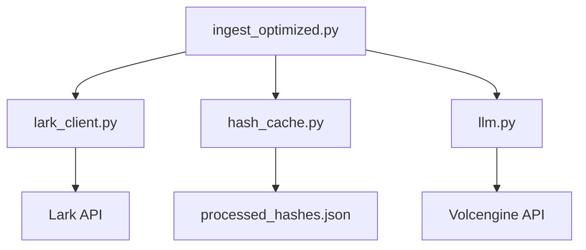
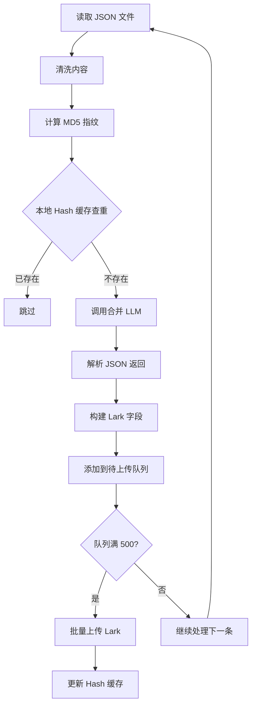
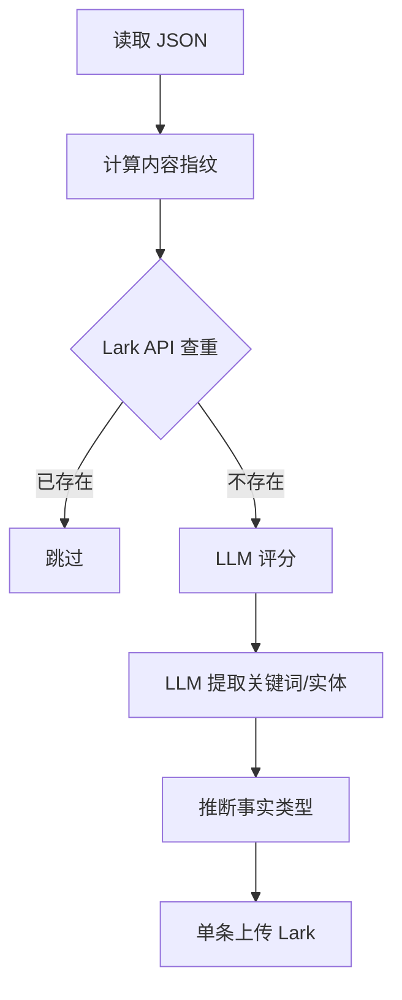

# Lark 数据清洗工具手册

> **版本**: v7.0 (前端集成版) | **更新日期**: 2026-01-25

---

## 1. 概述

本手册汇总了 Quantum Studio 中所有与 Lark (飞书多维表格) 数据清洗相关的工具，并详细介绍了 **A/B 测试方案**：旧版脚本作为兜底，新版优化脚本用于生产。

### 1.1 工具索引

| 工具 | 文件路径 | 用途 | 推荐 |
|------|----------|------|:----:|
| **优化版入库** | `scripts/ingest_optimized.py` | 批量清洗并入库 (优化版) | ⭐ |
| **旧版入库** | `scripts/ingest_knowledge.py` | 批量清洗并入库 (兜底版) | |
| **Lark Client** | `app/core/lark_client.py` | Lark API 核心客户端 | |
| **Hash 缓存** | `scripts/batch/hash_cache.py` | 本地查重缓存 | |
| **字段审计** | `scripts/audit_knowledge_fields.py` | 检查/删除/创建表字段 | |
| **清空表** | `scripts/clear_knowledge_repo.py` | 删除表中所有记录 | |
| **数据验证** | `scripts/verify_lark_data.py` | 验证入库数据完整性 | |
| **清洗 CLI** | `tools/cleaner_cli.py` | 工业级素材清洗工具 | |
| **前端入库页面** | `/knowledge` | 可视化入库管理 | ⭐ 新增 |

---

## 2. A/B 测试方案总览

### 2.1 架构图

```
                     ┌─────────────────────────────────────┐
                     │   命令行参数选择 A 或 B 方案         │
                     └─────────────────┬───────────────────┘
                                       │
           ┌───────────────────────────┴───────────────────────────┐
           ▼                                                       ▼
┌─────────────────────────┐                         ┌─────────────────────────┐
│    方案 A (旧版兜底)     │                         │   方案 B (优化版推荐)    │
│ ingest_knowledge.py     │                         │ ingest_optimized.py     │
├─────────────────────────┤                         ├─────────────────────────┤
│ ✗ 2 次 LLM 调用/条      │                         │ ✓ 1 次 LLM 调用/条      │
│ ✗ 单条 Lark 上传        │                         │ ✓ 批量 Lark 上传        │
│ ✗ Lark API 查重         │                         │ ✓ 本地 Hash 缓存        │
│ ✗ 截取前 500 字摘要      │                         │ ✓ LLM 生成一句话摘要    │
├─────────────────────────┤                         ├─────────────────────────┤
│ 费用: ¥16 / 5806 条     │                         │ 费用: ¥8 / 5806 条      │
│ 时间: 5-6h              │                         │ 时间: 2h                │
│ 稳定性: ⭐⭐⭐⭐⭐         │                         │ 稳定性: ⭐⭐⭐⭐ (已验证)  │
└─────────────────────────┘                         └─────────────────────────┘
```

### 2.2 方案对比

| 维度 | 方案 A (旧版) | 方案 B (优化版) | 差异 |
|------|--------------|----------------|------|
| **LLM 调用** | 2 次/条 | 1 次/条 | -50% Token |
| **Lark 上传** | 单条 | 批量 500 条/次 | -99% 网络时间 |
| **查重方式** | Lark API | 本地 Hash 缓存 | -99% 查重时间 |
| **核心摘要** | 截取前 500 字 | LLM 生成一句话 | 质量提升 |
| **费用估算** | ¥16 | ¥8 | **省 50%** |
| **时间估算** | 5-6h | 2h | **省 60%** |

### 2.3 如何选择

| 场景 | 推荐方案 |
|------|---------|
| 日常生产入库 | ⭐ **方案 B (优化版)** |
| 优化版出现问题时 | 方案 A (兜底) |
| 首次部署验证 | 方案 B (--limit 10 测试) |

---

## 3. 方案 B: 优化版入库脚本 (推荐)

> 📁 文件路径: `backend/scripts/ingest_optimized.py`

### 3.1 核心优化点

#### 3.1.1 合并 LLM 调用

**旧版 (2 次调用)**:
```
调用 1: score_content_async() → 返回评分
调用 2: extract_entities_keywords() → 返回实体和关键词
```

**新版 (1 次调用)**:
```python
MERGED_PROMPT = """
分析以下 Web3 内容，返回 JSON:

标题: {title}
赛道: {topic}
内容: {content[:2000]}

返回格式 (严格 JSON，无其他文字):
{
  "quality_score": 1-10,
  "summary": "一句话概括核心观点 (30字以内)",
  "entities": ["项目/人名/代币1", "项目/人名/代币2"],
  "keywords": ["关键词1", "关键词2", "关键词3"],
  "fact_type": "硬数据/深度分析/观点评论/梗_黑话/快讯资讯"
}
"""
```

#### 3.1.2 批量 Lark 上传

```python
# 旧版: 单条上传
for record in records:
    lark_client.create_record(app_token, table_id, record)  # 每条 1 次 API 调用

# 新版: 批量上传 (每批 500 条)
for i in range(0, len(records), 500):
    batch = records[i:i+500]
    lark_client.batch_create_records(app_token, table_id, batch)  # 每批 1 次调用
```

#### 3.1.3 本地 Hash 缓存

```python
# 旧版: 每条记录调用 Lark API 查重
existing = lark_client.list_records(filter=f"内容指纹={hash}")

# 新版: 本地文件缓存查重
hash_cache = get_hash_cache()  # 加载 processed_hashes.json
if hash_cache.contains(content_hash):
    skip()  # 毫秒级查重
```

### 3.2 技术实现

#### 3.2.1 文件结构

```
backend/scripts/
├── ingest_optimized.py      # 主脚本
└── batch/
    ├── __init__.py
    └── hash_cache.py        # 本地 Hash 缓存模块
```

#### 3.2.2 依赖关系



### 3.3 使用命令

```bash
cd backend

# 处理单个赛道 (测试用)
python -m scripts.ingest_optimized --folder "DAO与社区治理" --limit 10

# 处理所有赛道 (生产用)
python -m scripts.ingest_optimized --all --limit 0

# 限制每个赛道处理数量
python -m scripts.ingest_optimized --all --limit 5
```

### 3.4 入库流程



### 3.5 字段映射

| Lark 字段 | 数据来源 | 说明 |
|-----------|----------|------|
| 上传时间 | `datetime.now()` | 主字段，记录入库时间 |
| 标题 | JSON `title` | 原始标题 |
| 核心摘要 | LLM `summary` | ⭐ 一句话概括 (30字) |
| 正文原文 | JSON `content` | 清洗后全文 |
| 赛道分类 | 文件夹名称 | 42 个赛道分类 |
| 关键词 | LLM `keywords` | 最多 5 个 |
| 项目/人名/代币 | LLM `entities` | 最多 5 个 |
| 事实类型 | LLM `fact_type` | 5 种类型 |
| 质量评分 | LLM `quality_score` | 1-10 分 |
| 发布日期 | JSON `published_at` | 可选 |
| 内容指纹 | MD5 Hash | 查重用 |

### 3.6 输出示例

```
============================================================
🚀 Quantum Studio v5.2 - Knowledge_Repo 优化版入库
============================================================
📋 Base Token: CSfdbzErqay4bnsISxEuuVais3g
📋 Knowledge Table ID: tblkvQK9aKxP0wsk
📋 优化特性: 合并LLM调用 + 批量上传 + 本地Hash缓存

📂 处理文件夹: DAO与社区治理
   找到 10 个 JSON 文件
   入库中... ━━━━━━━━━━━━━━━━━━━━━━━━━━━━━━━━━━ 100%
   📤 批量上传 10 条记录...
   ✅ 成功: 10 | ⚠️ 跳过: 0 | ❌ 失败: 0

============================================================
📊 入库完成!
============================================================
  ✅ 成功入库: 10
  ⚠️ 重复跳过: 0
  ❌ 失败: 0
```

---

## 4. 方案 A: 旧版入库脚本 (兜底)

> 📁 文件路径: `backend/scripts/ingest_knowledge.py`

### 4.1 功能

从 `data/Web3素材/` 文件夹批量清洗 JSON 文件并入库到 Lark。

### 4.2 使用命令

```bash
cd backend

# 入库所有赛道（每个限制 N 条）
python -m scripts.ingest_knowledge --all --limit 2

# 入库指定赛道
python -m scripts.ingest_knowledge --folder "DAO与社区治理" --limit 5

# 仅统计不上传
python -m scripts.ingest_knowledge --all --dry-run
```

### 4.3 入库流程



### 4.4 与优化版的差异

| 步骤 | 旧版 | 优化版 |
|------|------|--------|
| 查重 | Lark API (慢) | 本地 Hash (快) |
| LLM | 2 次调用 | 1 次调用 |
| 摘要 | 截取前 500 字 | LLM 生成 |
| 上传 | 单条 | 批量 500 |

### 4.5 何时使用

- 优化版脚本出现 Bug 时
- 需要对比测试时
- 网络极不稳定时 (单条重试更可控)

---

## 5. 辅助工具

### 5.1 字段审计 (audit_knowledge_fields.py)

> ⚠️ 用于检查和清理多余字段

```bash
cd backend
python -m scripts.audit_knowledge_fields
```

**输出示例**:
```
✅ 保留字段: 10 个
❌ 待删字段: 1 个
⚠️ 缺失字段: 0 个

待删字段列表:
  - 上传时间 (id=fldBwqHMN7)

是否删除以上字段? (y/n): n
```

### 5.2 清空表 (clear_knowledge_repo.py)

```bash
cd backend
python -m scripts.clear_knowledge_repo
```

> [!WARNING]
> 此操作不可逆，执行前请确认！

### 5.3 数据验证 (verify_lark_data.py)

```bash
cd backend
python -m scripts.verify_lark_data
```

**输出示例**:
```
🔍 Verifying Lark Data Integrity...
✅ Total Records Fetched: 456
```

### 5.4 Hash 缓存管理

```bash
# 查看缓存数量
python -c "from scripts.batch.hash_cache import get_hash_cache; print(len(get_hash_cache()))"

# 清空缓存 (重新入库前需要)
python -c "from scripts.batch.hash_cache import get_hash_cache; c = get_hash_cache(); c.clear()"
```

---

## 6. 字段规范 v4 (11 字段)

| # | 字段 | 类型 | 来源 | 说明 |
|---|------|------|------|------|
| 1 | **上传时间** | 文本 | 系统时间 | 主字段 (无法删除) |
| 2 | 标题 | 文本 | JSON `title` | 原始标题 |
| 3 | 核心摘要 | 文本 | LLM `summary` | 一句话摘要 |
| 4 | 正文原文 | 文本 | JSON `content` | 清洗后全文 |
| 5 | 赛道分类 | 单选 | 文件夹名称 | 42 个选项 |
| 6 | 关键词 | 文本 | LLM `keywords` | 逗号分隔 |
| 7 | 项目/人名/代币 | 文本 | LLM `entities` | 逗号分隔 |
| 8 | 事实类型 | 单选 | LLM `fact_type` | 5 种类型 |
| 9 | 质量评分 | 数字 | LLM `quality_score` | 1-10 |
| 10 | 发布日期 | 日期 | JSON `published_at` | 可选 |
| 11 | 内容指纹 | 文本 | MD5 Hash | 查重用 |

---

## 7. 费用估算

### 7.1 计算公式

```
LLM 费用 = 文档数 × (输入 Token + 输出 Token) × 单价
```

### 7.2 对比 (5806 条 Web3 素材)

| 方案 | 输入 Token/条 | 输出 Token/条 | 调用次数/条 | 总费用 |
|------|--------------|--------------|------------|--------|
| 方案 A (旧版) | ~1500 | ~100 | 2 | **¥16** |
| 方案 B (优化版) | ~1500 | ~130 | 1 | **¥8** |

> 注：基于 DeepSeek V3 定价 (输入 ¥2/M, 输出 ¥8/M)

---

## 8. 环境配置

### 8.1 必需的 .env 变量

```env
# Lark/飞书配置
LARK_APP_ID=cli_xxx
LARK_APP_SECRET=xxx
LARK_BASE_URL=https://open.feishu.cn/open-apis
LARK_BASE_TOKEN=xxx
LARK_KNOWLEDGE_TABLE_ID=tblxxx

# LLM API (清洗评分需要)
ARK_API_KEY=xxx
```

### 8.2 Feature Flag (可选)

```json
// config/user_config.json
{
  "feature_flags": {
    "use_knowledge_repo": true,
    "use_optimized_ingest": true
  }
}
```

---

## 9. 常见问题

### Q1: 入库报错 `FieldNameNotFound`

**原因**: Lark 表中缺少该字段  
**解决**: 运行 `audit_knowledge_fields.py` 创建缺失字段

### Q2: 记录被跳过但 Lark 表中没有

**原因**: 本地 Hash 缓存包含该记录  
**解决**: 清空缓存后重试
```bash
python -c "from scripts.batch.hash_cache import get_hash_cache; c = get_hash_cache(); c.clear()"
```

### Q3: LLM 返回空结果

**原因**: JSON 解析失败  
**解决**: 检查 LLM 返回格式，脚本会使用默认值兜底

### Q4: 批量上传部分失败

**原因**: 网络波动或 Lark API 限流  
**解决**: 失败的记录会被记录，可重新运行入库

---

## 10. 回滚策略

如果优化版脚本出现问题：

```bash
# 1. 停止优化版脚本
Ctrl+C

# 2. 使用旧版脚本继续入库
python -m scripts.ingest_knowledge --all --limit 10
```

---

## 11. 分批执行工具 (batch_ingest.py)

> 📁 文件路径: `backend/scripts/batch_ingest.py`

### 11.1 功能

将 42 个 Web3 素材文件夹分成 9 批执行，每批 5 个文件夹，完成后暂停等待确认。

### 11.2 使用命令

```bash
cd backend

# 从头开始执行 (9 批)
python -m scripts.batch_ingest

# 从第 3 批开始 (断点恢复)
python -m scripts.batch_ingest --start-batch 3
```

### 11.3 执行计划

| 批次 | 文件夹数 | 预计时间 |
|------|---------|---------|
| Batch 1-8 | 各 5 个 | ~15 min/批 |
| Batch 9 | 2 个 | ~6 min |
| **合计** | **42 个** | **~2h** |

### 11.4 特性

| 特性 | 说明 |
|------|------|
| 分批执行 | 每批 5 个文件夹 |
| 暂停确认 | 每批完成后等待 Enter 继续 |
| 进度报告 | 实时显示成功/失败统计 |
| 断点恢复 | `--start-batch N` 从第 N 批开始 |
| 执行日志 | 自动保存到 `data/batch_ingest_log_*.txt` |

### 11.5 输出示例

```
============================================================
🚀 Quantum Studio - 分批执行入库
============================================================
📁 总文件夹数: 42
📦 总批次数: 9
📊 每批文件夹: 5
⏱️ 预计总时间: ~135 分钟

╭──── 🚀 Batch 1 ────╮
│ 开始执行 Batch 1/9 │
│ 包含文件夹: ...     │
╰────────────────────╯

📂 处理: AI_x_Crypto_动态研究
📂 处理: DAO与社区治理
...

╭───── 进度报告 ─────╮
│ 📈 整体进度: 1/9 批 │
│ ✅ 成功: 5          │
│ ❌ 失败: 0          │
╰────────────────────╯

⏸️ Batch 1 完成！
   按 Enter 继续 Batch 2，输入 'q' 退出...
```

---

## 12. 前端集成 (已完成 ✅)

> 📁 前端页面: `frontend/src/app/(main)/knowledge/page.tsx`

### 12.1 功能概述

Knowledge 页面提供可视化的数据清洗管理界面，支持：

| 功能 | 状态 |
|------|:----:|
| 批量入库监控 | ✅ |
| 自定义目录选择 | ✅ |
| 目标表格选择 (Web3/Web2) | ✅ |
| 实时进度显示 | ✅ |
| 费用预估 | ✅ |

### 12.2 页面访问

```
http://localhost:3000/knowledge
```

### 12.3 功能说明

#### 12.3.1 数据源选择

```
数据源选择:
┌─────────────────────────────────────────────────┐
│ ○ Web3素材 (41 文件夹, 5806 文件)               │
│ ○ Web2风格                                      │
│ ● 自定义目录  [浏览...] D:\测试222              │
│   └─ 目标表格:  ○ Web3 Knowledge  ● Web2 Style  │
└─────────────────────────────────────────────────┘
```

- **Web3素材**: 默认数据源，包含 42 个赛道分类
- **Web2风格**: Web2 相关素材
- **自定义目录**: 支持选择任意本地目录
  - 选择后可指定目标表格 (Web3 或 Web2)

#### 12.3.2 入库模式选择

| 模式 | 说明 |
|------|------|
| 优化版 (推荐) | 合并 LLM 调用 + 批量上传 + Hash 缓存 |
| 兜底版 | 传统逐条处理模式 |

#### 12.3.3 统计面板

| 指标 | 说明 |
|------|------|
| HASH 缓存 | 已缓存的内容数量 |
| LARK 记录 | 已入库的记录数量 |
| 总文件夹 | 数据源中的文件夹数量 |
| 预估费用 | LLM API 预估费用 (¥0.012/条) |

### 12.4 后端 API

| 端点 | 方法 | 功能 |
|------|------|------|
| `/ingest/status` | GET | 获取入库状态和统计信息 |
| `/ingest/start` | POST | 启动入库任务 |
| `/ingest/browse` | GET | 浏览本地目录 |
| `/config/ingest` | GET/PUT | 数据清洗配置管理 |

#### 12.4.1 启动入库请求

```json
POST /ingest/start
{
  "mode": "optimized",       // optimized | legacy
  "source": "custom",        // web3 | web2 | custom
  "custom_path": "D:\\测试222",
  "target_table": "web3"     // web3 | web2
}
```

### 12.5 Settings 配置

> 📁 Settings 页面: `frontend/src/app/(main)/settings/page.tsx`

在 Settings 页面添加了 **数据清洗配置** 区块：

```
┌──────────────────────────────────────────────────────────┐
│  📊 数据清洗配置                                         │
├──────────────────────────────────────────────────────────┤
│                                                          │
│  Web3 Knowledge 表格 ID: [tblkvQK9aKxP0wsk    ]         │
│  Web2 Style 表格 ID:     [tblXXXXXXXX         ]         │
│                                                          │
│  LLM 评分阈值: ━━━━━●━━━━ 6 分                          │
│  (低于此分数不入库)                                       │
│                                                          │
└──────────────────────────────────────────────────────────┘
```

| 配置项 | 说明 |
|--------|------|
| Web3 表格 ID | Knowledge 表格 ID |
| Web2 表格 ID | Style 表格 ID |
| 评分阈值 | LLM 质量评分过滤阈值 |

### 12.6 JSON 文件格式要求

自定义目录中的 JSON 文件必须包含以下字段：

```json
{
  "title": "文章标题",
  "content": "文章正文内容 (至少 50 字符)",
  "published_at": "2026-01-25"  // 可选
}
```

> [!WARNING]
> `content` 字段必须至少 50 字符，否则会被跳过

### 12.7 入库日志

日志文件保存在 `backend/logs/` 目录：

```
backend/logs/
├── ingest_20260125_212207.log
├── ingest_20260125_210838.log
└── ...
```

查看最新日志：
```powershell
Get-ChildItem D:\AI_Projects\2026001\backend\logs\ |
  Sort-Object LastWriteTime -Descending |
  Select-Object -First 1 |
  Get-Content -Encoding UTF8
```

### 12.8 开发状态

| 优先级 | 功能 | 状态 |
|--------|------|:----:|
| P0 | 命令行分批执行 | ✅ 已完成 |
| P1 | 后端 API | ✅ 已完成 |
| P2 | 前端页面 UI | ✅ 已完成 |
| P3 | 自定义目录选择 | ✅ 已完成 |
| P4 | 目标表格选择 | ✅ 已完成 |
| P5 | Settings 配置管理 | ✅ 已完成 |

---

## 13. 相关文档

| 文档 | 路径 |
|------|------|
| ⭐ **架构流程图** | [`14-1_Arch_数据清洗工具架构流程图.md`](14-1_Arch_数据清洗工具架构流程图.md) |
| 优化方案详解 | `reports/design_docs/frontend_design/13-1_Plan_Web3批量清洗优化方案.md` |
| 字段调用分析 | `reports/design_docs/frontend_design/13-2_Report_Knowledge字段调用流程分析.md` |
| 费用计算明细 | `reports/design_docs/历史文档/Web3数据清洗成本分析.md` |
| 项目手册 | `PROJECT_HANDBOOK.md` |

### Mermaid 图表在线预览

- **GitHub 在线查看**: [14-1_Arch_数据清洗工具架构流程图](https://github.com/ls569333469/wenzhang001/blob/main/reports/design_docs/frontend_design/14-1_Arch_数据清洗工具架构流程图.md)
- **Mermaid 在线编辑器**: https://mermaid.live/

---

## 14. 更新日志

| 日期 | 版本 | 变更 |
|------|------|------|
| 2026-01-25 | **v7.0** | 前端集成完成：Knowledge 页面入库管理、自定义目录、目标表格选择、Settings 配置 |
| 2026-01-24 | v6.1 | 新增分批执行工具 (batch_ingest.py)，前端集成规划 |
| 2026-01-24 | v6.0 | 新增 A/B 测试方案，优化版脚本，LLM 摘要，上传时间字段 |
| 2026-01-24 | v5.0 | 整合所有 Lark 清洗工具，新增字段审计工具 |
| 2026-01-24 | v4.0 | 字段规范 v4：移除来源链接等 6 个字段 |
| 2026-01-23 | v3.0 | 新增 LLM 实体提取和质量评分 |
