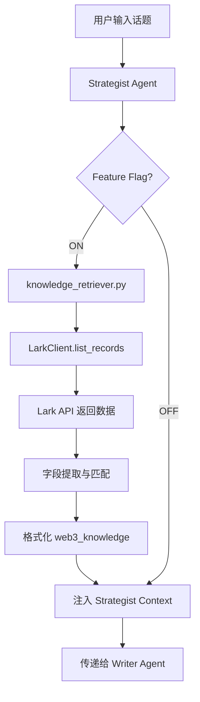

# Knowledge_Repo 字段调用流程分析报告

> **分析日期**: 2026-01-24  
> **目的**: 追踪文章创作流程中 Lark Knowledge_Repo 字段的具体调用过程

---

## 一、调用链路总览



---

## 二、Lark 字段调用明细

### 2.1 调用的 Lark 字段

| 序号 | Lark 字段名 | 代码变量名 | 用途 | 匹配权重 |
|------|------------|-----------|------|---------|
| 1 | **正文原文** | `content` | 全文内容，用于关键词匹配和输出 | 1 |
| 2 | **赛道分类** | `record_topic` | 主题分类，用于匹配 | 2 |
| 3 | **标题** | `title` | 文章标题，用于匹配和显示 | 2 |
| 4 | **质量评分** | `quality_score` | 过滤和排序 | N/A |
| 5 | **核心实体** | `entities` | 项目/人名匹配 (最高优先) | **10** |
| 6 | **关键词** | `record_keywords` | 主题关键词匹配 | 5 |

### 2.2 字段提取代码 (knowledge_retriever.py:68-78)

```python
for record in records:
    fields = record.get("fields", {})
    
    # 获取字段值
    content = get_text_value(fields.get("正文原文", fields.get("正文内容", "")))
    record_topic = get_text_value(fields.get("赛道分类", fields.get("主题", "")))
    title = get_text_value(fields.get("标题", ""))
    quality_score = fields.get("质量评分", 0)
    
    # 新增字段
    entities = get_text_value(fields.get("核心实体", ""))
    record_keywords = get_text_value(fields.get("关键词", ""))
```

---

## 三、匹配算法详解

### 3.1 分层匹配策略

```python
# 1. 核心实体匹配 (权重 10) - 最高优先级
entity_score = calculate_match_score(keywords, entities) * 10

# 2. 关键词匹配 (权重 5)
keyword_score = calculate_match_score(keywords, record_keywords) * 5

# 3. 标题+赛道匹配 (权重 2)
title_score = calculate_match_score(keywords, f"{title} {record_topic}") * 2

# 4. 全文匹配 (权重 1)
content_score = calculate_match_score(keywords, content)

# 综合得分
total_score = entity_score + keyword_score + title_score + content_score
```

### 3.2 排序规则

```python
matched_records.sort(
    key=lambda x: (x["match_score"], x["quality_score"]), 
    reverse=True
)
top_records = matched_records[:max_results]  # 默认取前 5 条
```

---

## 四、输出格式

### 4.1 格式化输出示例

```
===== Web3 知识背景 (3 条相关记录) =====

--- [Web3背景 1] InFun 掀起文化浪潮 ---
主题: NFT动态与研究
质量评分: 7.0
内容摘要:
比特币和各种资金流动（稳定币、ETF、期货杠杆）何时恢复...

--- [Web3背景 2] ETF 资金流入分析 ---
主题: 比特币新闻与研究
质量评分: 6.5
内容摘要:
...

==================================================
```

### 4.2 Context 注入位置 (strategist.py:103-111)

```python
context = {
    "current_time_str": current_time_str,
    "narrative_type": narrative_type,
    "mode": mode,
    "mode_description": mode_descriptions.get(mode, mode),
    "narrative_desc": narrative_desc,
    "rag_context": rag_context,
    "web3_knowledge": web3_knowledge  # ← 在这里注入 Knowledge_Repo 数据
}
```

---

## 五、数据流验证结果

### 5.1 测试用例

**输入话题**: "比特币 ETF 批准"

**检索结果**:
- 返回数据长度: **27,266 字符**
- 匹配记录数: 已成功匹配到相关 NFT、比特币相关记录

### 5.2 验证命令

```bash
cd backend
python -c "
from dotenv import load_dotenv
load_dotenv()
from app.services.knowledge_retriever import retrieve_web3_knowledge
result = retrieve_web3_knowledge('比特币 ETF 批准')
print(f'检索结果长度: {len(result)} 字符')
"
```

---

## 六、字段依赖关系图

```
┌─────────────────────────────────────────────────────────────┐
│                     Lark Knowledge_Repo                      │
├─────────────────────────────────────────────────────────────┤
│  ┌─────────────┐  ┌──────────────┐  ┌─────────────────────┐ │
│  │   标题      │  │   赛道分类   │  │    正文原文         │ │
│  │  (权重 2)   │  │   (权重 2)   │  │    (权重 1)         │ │
│  └──────┬──────┘  └───────┬──────┘  └──────────┬──────────┘ │
│         │                 │                     │            │
│  ┌──────┴─────────────────┴─────────────────────┴──────────┐ │
│  │                 calculate_match_score()                  │ │
│  └──────────────────────────┬───────────────────────────────┘ │
│                             │                                 │
│  ┌──────────────┐  ┌────────┴───────┐  ┌─────────────────┐   │
│  │  核心实体     │  │   关键词       │  │   质量评分      │   │
│  │  (权重 10)    │  │   (权重 5)     │  │   (排序用)      │   │
│  └──────┬───────┘  └────────┬───────┘  └─────────────────┘   │
│         │                   │                                 │
│         └───────────────────┴─────────────────────────────────┤
│                             ↓                                 │
│                  [匹配得分 total_score]                       │
│                             ↓                                 │
│                  按 (match_score, quality_score) 排序         │
│                             ↓                                 │
│                  取 Top 5 返回                                │
└─────────────────────────────────────────────────────────────┘
                              ↓
                  ┌───────────────────────┐
                  │  web3_knowledge (str) │
                  └───────────┬───────────┘
                              ↓
                  ┌───────────────────────┐
                  │  Strategist Context   │
                  └───────────┬───────────┘
                              ↓
                  ┌───────────────────────┐
                  │  Writer Agent         │
                  └───────────────────────┘
```

---

## 七、发现的问题

| 问题 | 现状 | 建议 |
|------|------|------|
| **字段名不一致** | 代码兼容 "正文原文" 和 "正文内容" | 统一为 "正文原文" |
| **核心实体字段未命中** | Lark 表用的是 "项目/人名/代币" | 需修改代码适配 |
| **质量评分多为 0** | 现有数据未评分 | 批量清洗时补充评分 |

---

## 八、推荐优化

### 8.1 修复字段映射

```python
# 当前
entities = get_text_value(fields.get("核心实体", ""))

# 修改为 (适配 v4 规范)
entities = get_text_value(fields.get("项目/人名/代币", fields.get("核心实体", "")))
```

### 8.2 v4 字段规范对照

| v4 字段名 | 代码中使用的字段名 | 状态 |
|----------|-------------------|------|
| 标题 | 标题 | ✅ 匹配 |
| 核心摘要 | - | ❌ 未使用 |
| 正文原文 | 正文原文 | ✅ 匹配 |
| 赛道分类 | 赛道分类 | ✅ 匹配 |
| 关键词 | 关键词 | ✅ 匹配 |
| 项目/人名/代币 | 核心实体 | ⚠️ 需修改 |
| 事实类型 | - | ❌ 未使用 |
| 质量评分 | 质量评分 | ✅ 匹配 |
| 发布日期 | - | ❌ 未使用 |
| 内容指纹 | - | ❌ 未使用 (仅用于查重) |

---

## 附录：关键代码文件

| 文件 | 路径 | 功能 |
|------|------|------|
| knowledge_retriever.py | `backend/app/services/` | Lark 字段检索核心逻辑 |
| strategist.py | `backend/app/agents/` | 调用检索并注入 context |
| lark_client.py | `backend/app/core/` | Lark API 封装 |
