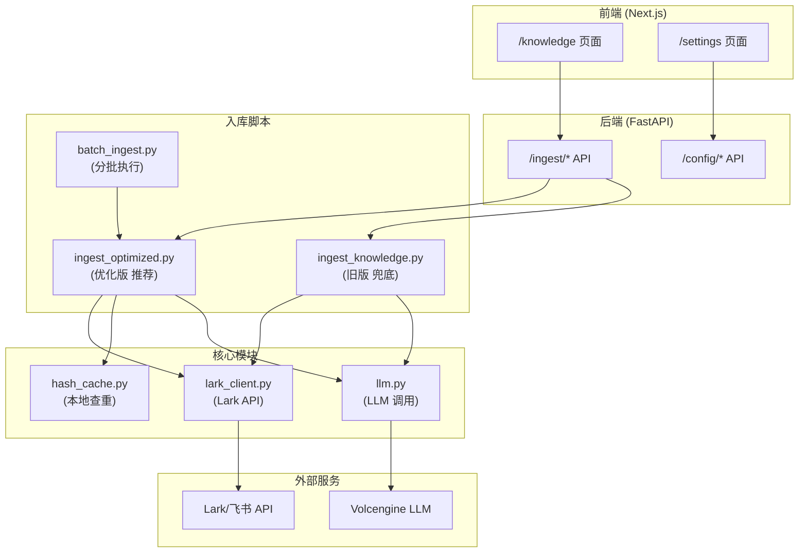
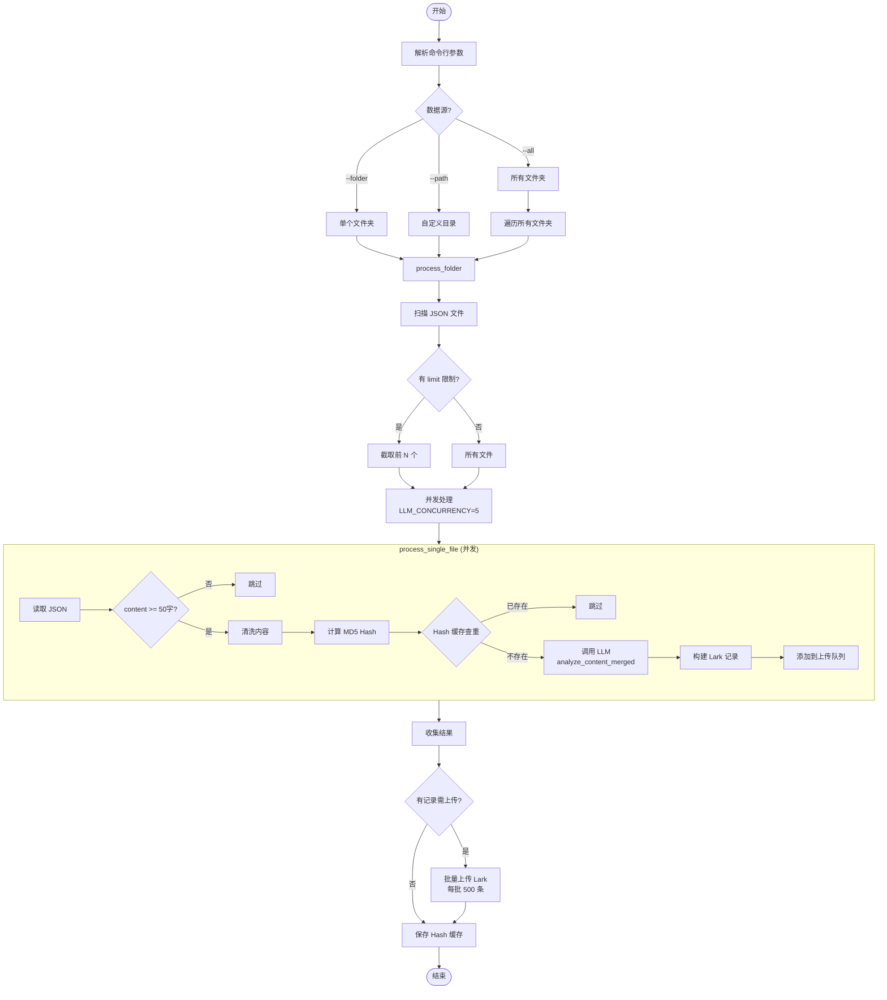
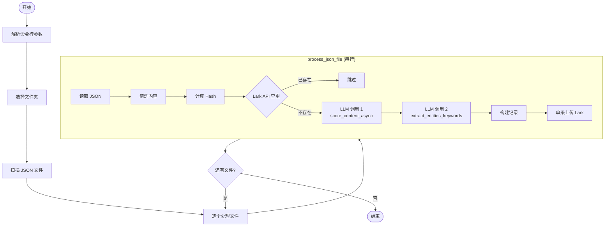
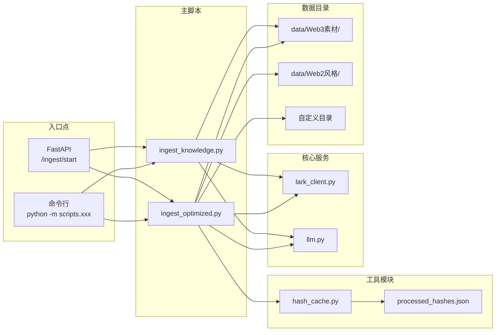
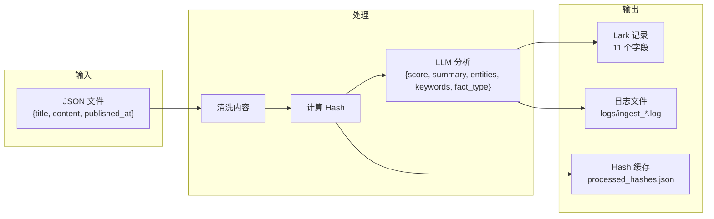
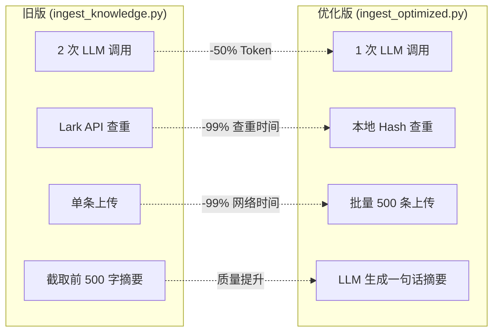

# Lark 数据清洗工具架构流程图

> **版本**: v1.0 | **更新日期**: 2026-01-25

---

## 1. 系统架构总览



---

## 2. 入库流程详细图

### 2.1 优化版入库流程 (ingest_optimized.py)



### 2.2 旧版入库流程 (ingest_knowledge.py)



---

## 3. 核心模块依赖图



---

## 4. 文件索引

### 4.1 核心入库脚本

| 文件 | 路径 | 功能 | 关键函数 |
|------|------|------|----------|
| **优化版入库** | `scripts/ingest_optimized.py` | 批量入库 (推荐) | `main`, `process_folder`, `process_single_file`, `analyze_content_merged` |
| **旧版入库** | `scripts/ingest_knowledge.py` | 批量入库 (兜底) | `main`, `process_folder`, `process_json_file`, `score_content_async`, `extract_entities_keywords` |
| **分批执行** | `scripts/batch_ingest.py` | 分 9 批执行 | `main`, `run_batch` |

### 4.2 核心模块

| 文件 | 路径 | 功能 | 关键类/函数 |
|------|------|------|-------------|
| **Lark 客户端** | `app/core/lark_client.py` | Lark API 封装 | `LarkClient`, `create_record`, `batch_create_records`, `list_records` |
| **Hash 缓存** | `scripts/batch/hash_cache.py` | 本地查重 | `HashCache`, `get_hash_cache`, `compute_content_hash` |
| **LLM 服务** | `app/core/llm.py` | LLM API 封装 | `call_llm`, `call_volcengine` |

### 4.3 辅助脚本

| 文件 | 路径 | 功能 |
|------|------|------|
| **字段审计** | `scripts/audit_knowledge_fields.py` | 检查/删除/创建表字段 |
| **清空表** | `scripts/clear_knowledge_repo.py` | 删除表中所有记录 |
| **数据验证** | `scripts/verify_lark_data.py` | 验证入库数据完整性 |
| **重建表** | `scripts/recreate_knowledge_repo.py` | 重建 Knowledge 表 |

### 4.4 前端相关

| 文件 | 路径 | 功能 |
|------|------|------|
| **Knowledge 页面** | `frontend/src/app/(main)/knowledge/page.tsx` | 可视化入库管理 |
| **Settings 页面** | `frontend/src/app/(main)/settings/page.tsx` | 数据清洗配置 |

### 4.5 后端 API

| 端点 | 文件 | 功能 |
|------|------|------|
| `POST /ingest/start` | `app/main.py` | 启动入库任务 |
| `GET /ingest/status` | `app/main.py` | 获取入库状态 |
| `GET /ingest/browse` | `app/main.py` | 浏览本地目录 |
| `GET/PUT /config/ingest` | `app/main.py` | 数据清洗配置 |

---

## 5. 函数调用链

### 5.1 优化版入库调用链

```
main()
├── process_folder(folder_path, topic, limit, target)
│   ├── get_hash_cache() → HashCache
│   ├── asyncio.gather(*tasks)
│   │   └── process_single_file(json_file, topic, hash_cache, semaphore)
│   │       ├── json.load() → 读取 JSON
│   │       ├── clean_content(content) → 清洗内容
│   │       ├── compute_hash(content) → MD5 哈希
│   │       ├── hash_cache.contains(hash) → 本地查重
│   │       └── analyze_content_merged(content, title, topic) → LLM 调用
│   │           └── llm.call_volcengine(prompt) → Volcengine API
│   └── lark_client.batch_create_records(records) → 批量上传
│       └── requests.post() → Lark API
└── hash_cache.save() → 保存缓存
```

### 5.2 旧版入库调用链

```
main()
├── process_folder(folder_name, app_token, table_id, limit)
│   └── asyncio.gather(*tasks)
│       └── process_json_file(file_path, topic, app_token, table_id, semaphore)
│           ├── json.load() → 读取 JSON
│           ├── compute_hash(content) → MD5 哈希
│           ├── check_exists_async(hash) → Lark API 查重
│           ├── score_content_async(content, topic) → LLM 调用 1
│           ├── extract_entities_keywords(content, title) → LLM 调用 2
│           └── upload_record_async(...) → 单条上传
│               └── lark_client.create_record() → Lark API
```

---

## 6. 数据流图



---

## 7. 配置文件索引

| 文件 | 路径 | 用途 |
|------|------|------|
| `.env` | `backend/.env` | 环境变量 (API 密钥等) |
| `processed_hashes.json` | `backend/data/processed_hashes.json` | Hash 缓存 |
| `user_config.json` | `backend/config/user_config.json` | 用户配置 |

### 7.1 必需的环境变量

```env
# Lark/飞书
LARK_APP_ID=cli_xxx
LARK_APP_SECRET=xxx
LARK_BASE_TOKEN=xxx
LARK_KNOWLEDGE_TABLE_ID=tblxxx     # Web3 表格
LARK_WEB2_TABLE_ID=tblxxx          # Web2 表格 (可选)

# LLM
ARK_API_KEY=xxx
```

---

## 8. 优化版 vs 旧版对比



| 维度 | 旧版 | 优化版 |
|------|------|--------|
| LLM 调用 | 2 次/条 | 1 次/条 |
| 查重方式 | Lark API (慢) | 本地 Hash (快) |
| 上传方式 | 单条 | 批量 500 条 |
| 摘要生成 | 截取前 500 字 | LLM 生成 |
| 费用 | ¥16/5806 条 | ¥8/5806 条 |
| 时间 | 5-6h | 2h |

---

## 9. 更新日志

| 日期 | 版本 | 变更 |
|------|------|------|
| 2026-01-25 | v1.0 | 初始版本：系统架构图、入库流程图、模块依赖图、文件索引 |
