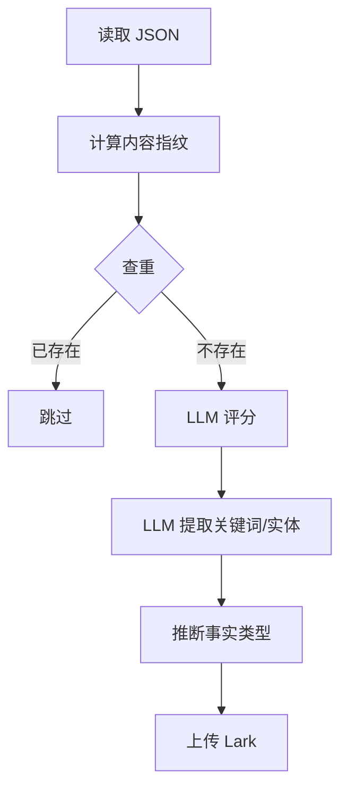

# Lark 数据清洗工具手册

> **版本**: v5.0 | **更新日期**: 2026-01-24

---

## 1. 概述

本手册汇总了 Quantum Studio 中所有与 Lark (飞书多维表格) 数据清洗相关的工具。

### 1.1 工具索引

| 工具 | 文件路径 | 用途 |
|------|----------|------|
| **Lark Client** | `app/core/lark_client.py` | Lark API 核心客户端 |
| **字段审计** | `scripts/audit_knowledge_fields.py` | 检查/删除/创建表字段 |
| **数据入库** | `scripts/ingest_knowledge.py` | 批量清洗并入库 JSON 数据 |
| **清空表** | `scripts/clear_knowledge_repo.py` | 删除表中所有记录 |
| **重建表** | `scripts/recreate_knowledge_repo.py` | 删除并重新创建表 |
| **初始化表** | `scripts/setup_knowledge_repo.py` | 首次创建 Knowledge_Repo 表 |
| **数据验证** | `scripts/verify_lark_data.py` | 验证入库数据完整性 |
| **清洗 CLI** | `tools/cleaner_cli.py` | 工业级素材清洗工具 |

---

## 2. 字段审计工具 (audit_knowledge_fields.py)

> ⚠️ **新增于 2026-01-24**，用于检查和清理多余字段

### 2.1 功能

- ✅ 列出 Lark 表中所有字段
- ✅ 对比 v4 规范，识别保留/删除字段
- ✅ 交互式删除多余字段
- ✅ 自动创建缺失字段

### 2.2 使用命令

```bash
cd backend
python -m scripts.audit_knowledge_fields
```

### 2.3 输出示例

```
✅ 保留字段: 10 个
❌ 待删字段: 8 个
⚠️ 缺失字段: 0 个

待删字段列表:
  - 内容类型 (id=fld9BXXVFF)
  - 来源链接 (id=fldwcwMdao)
  ...
```

### 2.4 注意事项

> [!CAUTION]
> **Primary Field 无法删除**：Lark 表的首列字段（如"内容"或"web3"）只能在 Lark UI 中手动重命名，无法通过 API 删除。

---

## 3. 数据入库工具 (ingest_knowledge.py)

### 3.1 功能

从 `data/Web3素材/` 文件夹批量清洗 JSON 文件并入库到 Lark。

### 3.2 字段规范 v4 (10 字段)

| 字段 | 类型 | 来源 |
|------|------|------|
| 标题 | 文本 | JSON `title` |
| 核心摘要 | 文本 | 截取前 500 字 |
| 正文原文 | 文本 | JSON `content` |
| 赛道分类 | 单选 | 文件夹名称 |
| 关键词 | 文本 | LLM 提取 |
| 项目/人名/代币 | 文本 | LLM 提取 |
| 事实类型 | 单选 | 规则推断 |
| 质量评分 | 数字 | LLM 评分 (1-10) |
| 发布日期 | 日期 | JSON `published_at` |
| 内容指纹 | 文本 | MD5 哈希 |

### 3.3 使用命令

```bash
cd backend

# 入库所有赛道（每个限制 N 条）
python -m scripts.ingest_knowledge --all --limit 2

# 入库指定赛道
python -m scripts.ingest_knowledge --folder "DAO与社区治理" --limit 5

# 仅统计不上传
python -m scripts.ingest_knowledge --all --dry-run
```

### 3.4 入库流程



---

## 4. 清空表工具 (clear_knowledge_repo.py)

### 4.1 功能

批量删除 Knowledge_Repo 表中的所有记录。

### 4.2 使用命令

```bash
cd backend
python -m scripts.clear_knowledge_repo
```

> [!WARNING]
> 此操作不可逆，执行前请确认！

---

## 5. 重建表工具 (recreate_knowledge_repo.py)

### 5.1 功能

删除旧表并创建新的 Knowledge_Repo 表，自动配置中文字段。

### 5.2 使用命令

```bash
cd backend
python -m scripts.recreate_knowledge_repo
```

### 5.3 注意事项

执行后需要更新 `.env` 文件中的 `LARK_KNOWLEDGE_TABLE_ID`。

---

## 6. 初始化表工具 (setup_knowledge_repo.py)

### 6.1 功能

首次创建 Knowledge_Repo 表并配置 42 个赛道选项。

### 6.2 使用命令

```bash
cd backend
python -m scripts.setup_knowledge_repo
```

---

## 7. 数据验证工具 (verify_lark_data.py)

### 7.1 功能

查询 Lark 表记录数量并显示样本数据，用于验证入库完整性。

### 7.2 使用命令

```bash
cd backend
python -m scripts.verify_lark_data
```

---

## 8. 工业级清洗 CLI (cleaner_cli.py)

### 8.1 功能

基于 Shell-Kernel 壳肉分离法的工业级数据清洗工具：
- ⚡ 异步并发 (AsyncIO + Semaphore)
- 📦 批量处理多个文件
- 🔄 断点续传
- 🧹 内容去重 (MD5 指纹)

### 8.2 使用命令

```bash
cd backend

# 清洗指定分类的所有文件
python -m tools.cleaner_cli --category "OKX_Web3_洞见数据" --model deepseek

# 限制数量
python -m tools.cleaner_cli --category "DeFi进展与分析" --limit 10

# 干运行模式
python -m tools.cleaner_cli --category "MemeCoin_研究所" --dry-run
```

### 8.3 支持的 LLM

| Provider | 模型 | 说明 |
|----------|------|------|
| volcengine | DeepSeek 3.2 | 默认推荐 |
| google | Gemini 2.5 | 可选 |

---

## 9. 环境配置

### 9.1 必需的 .env 变量

```env
# Lark/飞书配置
LARK_APP_ID=cli_xxx
LARK_APP_SECRET=xxx
LARK_BASE_URL=https://open.feishu.cn/open-apis
LARK_BASE_TOKEN=xxx
LARK_KNOWLEDGE_TABLE_ID=tblxxx

# LLM API (清洗评分需要)
ARK_API_KEY=xxx
```

---

## 10. 常见问题

### Q1: 入库报错 `FieldNameNotFound`

**原因**: Lark 表中缺少该字段  
**解决**: 运行 `audit_knowledge_fields.py` 创建缺失字段

### Q2: 入库报错 `The Primary Field cannot be deleted`

**原因**: 尝试删除首列字段  
**解决**: 在 Lark UI 中手动重命名该字段（改为"web3"等占位符）

### Q3: 网络连接频繁中断

**原因**: 飞书 API 网络不稳定  
**解决**: 脚本已内置 5 次重试机制，如仍失败可稍后重试

### Q4: LLM 评分失败

**原因**: Volcengine API Key 未配置或额度用尽  
**解决**: 检查 `.env` 中的 `ARK_API_KEY`

---

## 11. 相关文档

| 文档 | 路径 |
|------|------|
| 项目手册 | `PROJECT_HANDBOOK.md` |
| Knowledge 集成计划 | `reports/design_docs/frontend_design/12-1_Plan_Knowledge集成.md` |

---

## 12. 更新日志

| 日期 | 版本 | 变更 |
|------|------|------|
| 2026-01-24 | v5.0 | 整合所有 Lark 清洗工具，新增字段审计工具 |
| 2026-01-24 | v4.0 | 字段规范 v4：移除来源链接等 6 个字段 |
| 2026-01-23 | v3.0 | 新增 LLM 实体提取和质量评分 |
