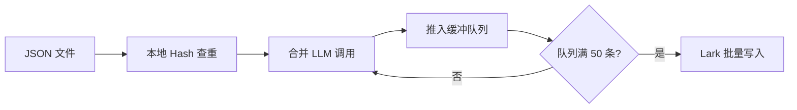

# Web3 批量清洗优化方案 v2.0 (合并版)

> **创建日期**: 2026-01-24  
> **目标**: 优化 5,806 条 Web3 素材的清洗入库流程  
> **预期效果**: 费用 ¥16 → ¥5 (省 69%)，无人值守

---

## 一、核心问题诊断

### 1.1 "算"与"存"的本质区别

| 维度 | 火山引擎批量推理 | Lark 批量 API |
|------|-----------------|---------------|
| **核心作用** | 算 (Compute) | 存 (Storage/IO) |
| **操作对象** | 处理 LLM Token | 写入数据库记录 |
| **典型场景** | "1万篇文章需要提取摘要" | "100条结果一次性存入表格" |
| **时间特性** | 高延迟 (1-24h 异步) | 低延迟 (毫秒级同步) |
| **成本影响** | 省钱 50% | 省时间 99% |

### 1.2 现状诊断

> 🕵️ **关键发现**: 当前代码使用的是火山引擎**实时接口** + `asyncio` 并发，而非真正的"批量推理"。

| 误区 | 实际情况 |
|------|----------|
| "我用了批量推理" | ❌ 只是并发调用实时 API |
| "每条 3-5秒正常" | ❌ 真批量推理是整体等待，非逐条返回 |

**真正的批量推理流程**:
```
上传文件 → 排队 → 离线计算(1-24h) → 下载文件
```

---

## 二、优化策略 (按 ROI 排序)

### 2.1 合并 LLM 调用 ⭐ 效果最佳

| 当前 | 优化后 |
|------|--------|
| 2 次调用/条 | **1 次调用/条** |
| 读取内容 2 遍 | 读取内容 1 遍 |
| 3.5M + 3.5M = 7M Token | **3.5M Token** |

**合并后的 Prompt**:
```python
MERGED_PROMPT = """
分析以下 Web3 内容，返回 JSON:

标题: {title}
内容: {content[:2000]}

返回格式 (严格 JSON):
{
  "quality_score": 1-10,
  "entities": ["项目1", "人名1"],
  "keywords": ["关键词1", "关键词2"],
  "fact_type": "硬数据/深度分析/观点评论/梗_黑话/快讯资讯"
}
"""
```

### 2.2 规则替代评分 💰 最省钱

> 用 LLM 做简单数学打分是"杀鸡用牛刀"

| 可规则化指标 | 公式 |
|-------------|------|
| 信息密度 | `len(content) / 1000 * 2` |
| 关键词数量 | `count(entities) * 1` |
| 链接数量 | `count(urls) * 0.5` |

**建议**: 仅在需要"内容深度判定"时才用 LLM

### 2.3 Lark 批量 API 🚀 提速网络

**现状**:
```python
for record in records:
    create_record(...)  # 每条 1-2秒 (DNS → TCP → SSL → 发送 → 等待)
```

**优化后**:
```python
batch_create_records(records[:500])  # 500条只需 1 次握手
```

| 指标 | 单条 API | 批量 API |
|------|----------|----------|
| 5806 条耗时 | ~2.5 小时 | **~2 分钟** |
| 平均每条 | 1.5 秒 | **20 毫秒** |

---

## 三、方案选择

### 方案 A: 实时处理流 (追求快速可见)



**适用**: 需要实时看到处理结果

### 方案 B: 离线批处理流 (追求极致成本) ⭐ 推荐


**适用**: 不急，追求最低成本和无人值守

---

## 四、成本对比 (5,806 条)

### 4.1 费用明细

**DeepSeek V3.2 定价**:
- 输入: ¥2.0-4.0/M Token (取 ¥3.0)
- 输出: ¥3.0-6.0/M Token (取 ¥4.5)
- 批量推理: 50% 折扣

| 方案 | 输入 Token | 输出 Token | 在线费用 | 批量费用 |
|------|-----------|-----------|---------|---------|
| 旧方案 (2次/条) | 7M | 0.58M | ¥16 | ¥8 |
| **新方案 (1次/条)** | 3.5M | 0.58M | ¥8 | **¥5** |

### 4.2 综合对比

| 指标 | 旧方案 | 方案 A | 方案 B |
|------|--------|--------|--------|
| **LLM 费用** | ¥16 | ¥8 | **¥5** |
| **执行时间** | 5-6h | 1-2h | 1-24h (无人值守) |
| **网络稳定性** | 低 (8.5%失败) | 中 | **高** |
| **人工成本** | 需值守 | 需值守 | **无** |

---

## 五、技术实现

### 5.1 文件结构

```
backend/scripts/batch/
├── prepare_batch.py       # 生成 JSONL 输入
├── submit_batch_job.py    # 提交火山任务
├── fetch_batch_results.py # 获取结果
├── batch_upload_lark.py   # 批量上传 Lark
└── run_all.py             # 一键执行
```

### 5.2 核心代码

#### 5.2.1 生成批量输入

```python
def prepare_batch_input(folder_path: Path) -> list:
    """生成 JSONL 格式的批量输入"""
    records = []
    for json_file in folder_path.glob("*.json"):
        data = json.load(open(json_file))
        prompt = MERGED_PROMPT.format(
            title=data.get("title", ""),
            content=data.get("content", "")[:2000]
        )
        records.append({
            "custom_id": json_file.stem,
            "body": {
                "model": "deepseek-v3-2-251201",
                "messages": [{"role": "user", "content": prompt}],
                "response_format": {"type": "json_object"}
            }
        })
    return records
```

#### 5.2.2 Lark 批量上传

```python
async def batch_upload_lark(records: list, batch_size=500):
    """批量上传到 Lark (每批最多 500 条)"""
    base_url = "https://open.larksuite.com/open-apis"
    url = f"{base_url}/bitable/v1/apps/{app_token}/tables/{table_id}/records/batch_create"
    
    for i in range(0, len(records), batch_size):
        batch = records[i:i+batch_size]
        payload = {"records": [{"fields": r} for r in batch]}
        resp = await session.post(url, json=payload, headers=headers)
        print(f"批次 {i//batch_size + 1}: 上传 {len(batch)} 条")
```

---

## 六、执行计划

### 6.1 分阶段实施

| Phase | 任务 | 耗时 | 交付物 |
|-------|------|------|--------|
| **P1** | 开发 4 个脚本 | 2h | `scripts/batch/*.py` |
| **P2** | 配置火山 TOS + IAM | 30min | 权限配置 |
| **P3** | 小批量测试 (100条) | 1h | 验证报告 |
| **P4** | 全量执行 (5806条) | 1-24h | Lark 表数据 |

### 6.2 一键执行命令

```bash
# 完整流程
python -m scripts.batch.run_all --all

# 或分步执行
python -m scripts.batch.prepare_batch --all           # Step 1: 准备
python -m scripts.batch.submit_batch_job              # Step 2: 提交
# ... 等待 1-24h ...
python -m scripts.batch.fetch_batch_results --job-id xxx  # Step 3: 获取
python -m scripts.batch.batch_upload_lark             # Step 4: 上传
```

---

## 七、风险与应对

| 风险 | 概率 | 应对措施 |
|------|------|----------|
| 批量任务超时 | 低 | 设置 24h 窗口 |
| TOS 权限问题 | 中 | 提前配置 IAM |
| JSON 解析失败 | 低 | 本地验证格式 |
| Lark 限流 | 低 | 控制 QPS ≤ 50 |

---

## 八、总结

| 维度 | 改进效果 |
|------|----------|
| **费用** | ¥16 → ¥5 (省 69%) |
| **时间** | 5h 值守 → 无人值守 |
| **成功率** | 91.5% → 99%+ |
| **可维护性** | 4 个独立脚本，职责清晰 |

**推荐方案**: **方案 B (离线批处理)**

---

## 附录: 相关文档

| 文档 | 说明 |
|------|------|
| [Web3数据清洗成本分析.md](file:///d:/AI_Projects/2026001/reports/design_docs/历史文档/Web3数据清洗成本分析.md) | 详细费用计算 |
| [12-3_Manual_Lark数据清洗工具手册.md](file:///d:/AI_Projects/2026001/reports/design_docs/frontend_design/12-3_Manual_Lark数据清洗工具手册.md) | 现有工具说明 |
