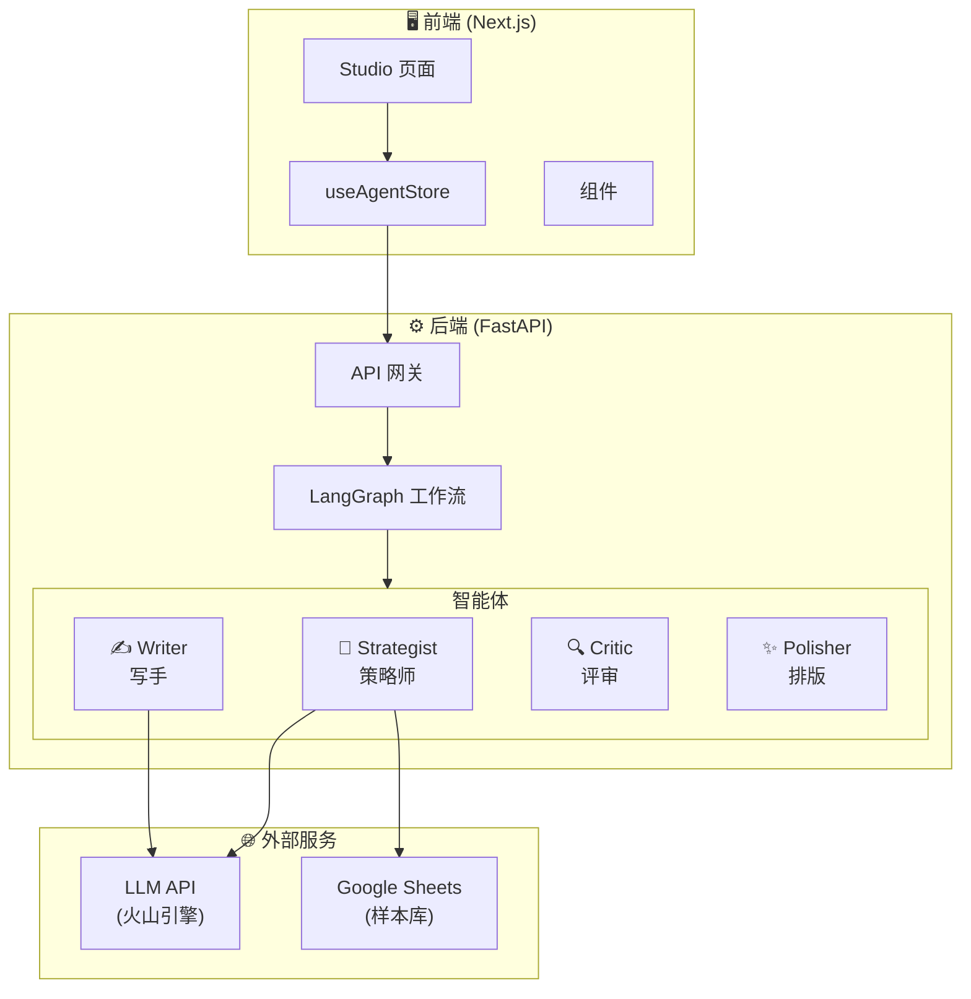
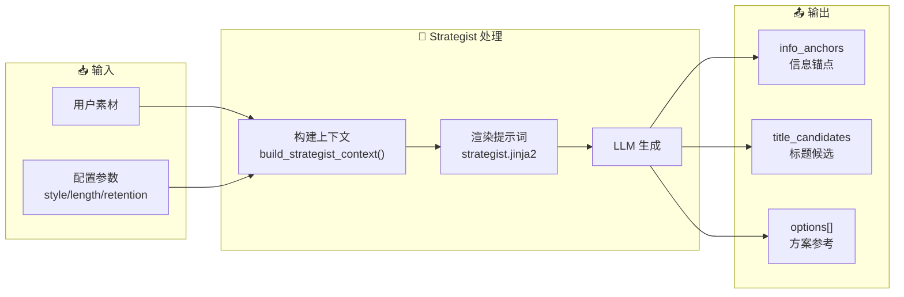
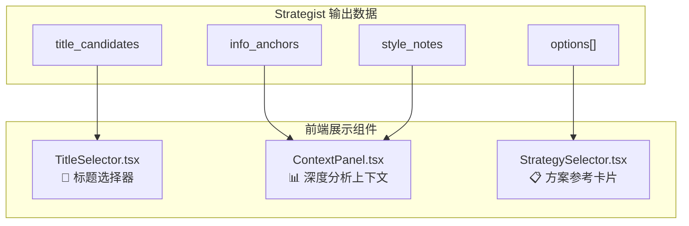
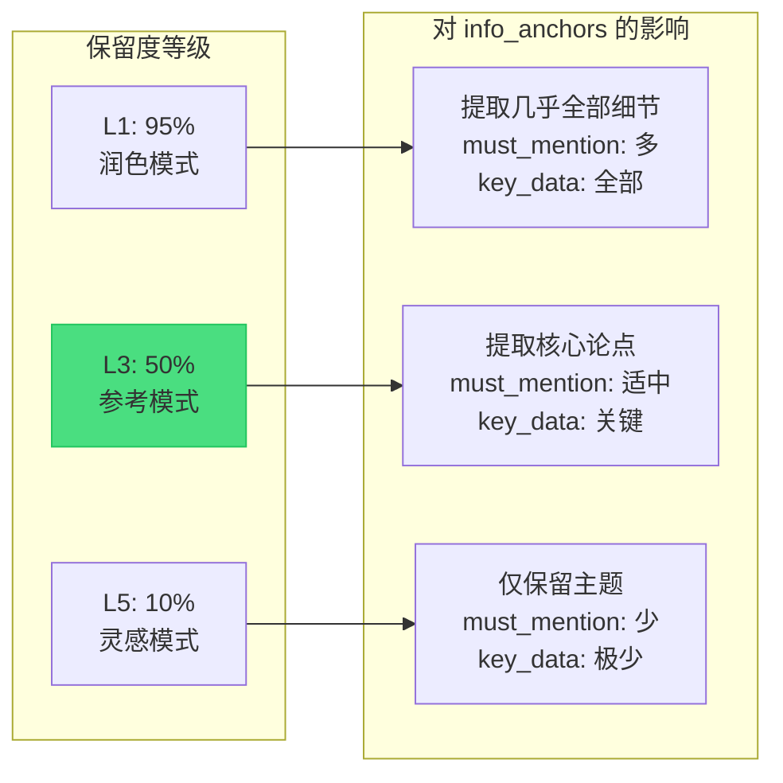

# Strategist 写作流程技术文档

> **版本**: v1.0  
> **日期**: 2026-01-30  
> **关联**: P10 创作工作流重构

---

## 📊 架构图

### 图1: 系统整体架构



### 图2: Strategist 数据流



### 图3: 前端组件对应关系



### 图4: 保留度等级影响



---

## 一、写作流程检查清单

### Strategist Agent 输出结构

| 序号 | 组件 | 前端展示组件 | 数据来源字段 |
|:----:|------|-------------|--------------|
| ① | 选择标题 (爆款公式分析) | `TitleSelector.tsx` | `title_candidates` |
| ② | 深度分析上下文 | `ContextPanel.tsx` | `info_anchors` + `style_notes` |
| ③ | 方案参考 1/2/3 | `StrategySelector.tsx` | `options[]` |

### 各组件详细字段

#### ① 标题候选 (title_candidates)

```json
{
    "title": "黄金日内暴涨100美元破5280！机构资金已进场，你再不行动就晚了？",
    "formula_tags": ["数字法则", "FOMO情绪"],
    "hook_score": 88,
    "rationale": "用精确到个位的涨幅数字增强可信度..."
}
```

#### ② 深度分析上下文 (info_anchors)

```json
{
    "must_mention": ["现货黄金"],
    "key_data": ["日内暴涨100美元", "突破5280美元/盎司"],
    "can_extend": ["机构观点", "后市预测"]
}
```

#### ③ 方案参考 (options)

```json
{
    "id": "option_1",
    "title": "方案标题",
    "hook_angle": "切入角度 (如: FOMO情绪)",
    "pain_point": "目标痛点",
    "target_audience": "目标受众",
    "outline": ["大纲1", "大纲2", "大纲3"],
    "viral_score": { "emotion_resonance": 85, "info_density": 70, "overall": 78 }
}
```

---

## 二、Strategist 标题生成完整文档路径

### 后端 (数据流)

| 序号 | 文件路径 | 作用 |
|:----:|----------|------|
| 1 | `backend/data/prompts/strategist.jinja2` | **核心提示词模板** - 爆款公式、禁止词、输出格式 |
| 2 | `backend/app/agents/strategist.py` | **Agent 逻辑** - 构建上下文、调用 LLM |
| 3 | `backend/app/core/prompts.py` | **模板渲染器** - 加载 Jinja2 模板 |
| 4 | `backend/app/services/sample_service.py` | **样本服务** - 获取 Few-Shot 样本 |

### 前端 (展示层)

| 序号 | 文件路径 | 作用 |
|:----:|----------|------|
| 1 | `frontend/src/features/studio/components/TitleSelector.tsx` | **标题选择器** - 展示 `title_candidates` |
| 2 | `frontend/src/features/studio/components/ContextPanel.tsx` | **上下文面板** - 展示 `info_anchors` + `style_notes` |
| 3 | `frontend/src/features/studio/components/StrategySelector.tsx` | **方案选择器** - 展示 `options[]` |
| 4 | `frontend/src/features/agent/stores/useAgentStore.ts` | **状态管理** - 存储 `analysisResult` |
| 5 | `frontend/src/features/studio/schema.ts` | **数据校验** - Zod schema 定义 |

### 执行流程图

```
┌─────────────────────────────────────────────────────────────────┐
│  1️⃣ 用户输入素材                                                 │
│     ↓                                                            │
│  2️⃣ strategist.py → build_strategist_context()                  │
│     • 获取 style 样本 (Google Sheets / Lark)                     │
│     • 构建 mode_description, narrative_desc                     │
│     ↓                                                            │
│  3️⃣ strategist.py → build_strategist_prompt()                   │
│     • 渲染 strategist.jinja2 模板                                │
│     • 注入 raw_input + references                               │
│     ↓                                                            │
│  4️⃣ LLM 生成 JSON                                               │
│     • info_anchors (必须提及、关键数据、可扩展)                   │
│     • title_candidates (标题候选)                                │
│     • options[] (方案参考1/2/3)                                  │
│     ↓                                                            │
│  5️⃣ 前端展示                                                     │
│     • TitleSelector ← title_candidates                          │
│     • ContextPanel ← info_anchors + style_notes                 │
│     • StrategySelector ← options[]                              │
└─────────────────────────────────────────────────────────────────┘
```

### 调试检查点

| 检查点 | 如果有问题修改... |
|--------|------------------|
| 标题重复/AI味重 | `strategist.jinja2` 第 66-186 行 (爆款公式 + 禁止词) |
| 深度分析缺失 | `strategist.jinja2` 第 46-63 行 (信息锚点提取规则) |
| 方案参考同质化 | `strategist.jinja2` 第 253-294 行 (options 输出格式) |
| 风格指南无效 | `strategist.py` 第 44-55 行 (mode_descriptions) |

---

## 三、深度分析上下文 (Deep Analysis Context)

### 作用

**深度分析上下文**是 Strategist Agent 提取的**信息锚点**，核心作用：

| 作用 | 说明 |
|------|------|
| **约束 Writer** | 确保 Writer 在创作时必须包含这些关键信息 |
| **防止幻觉** | 锚定真实数据，避免 AI 编造内容 |
| **传递上下文** | 让后续 Agent 知道哪些是核心事实 |
| **用户确认** | 让用户在生成前确认关键信息是否正确 |

### 在流程中的位置

```
用户输入素材
    ↓
┌─────────────────────────────────────────┐
│  Strategist Agent (策略师)              │
│  ├── 1. 提取 info_anchors ← 【深度分析】 │
│  ├── 2. 生成 title_candidates           │
│  └── 3. 生成 options[]                  │
└─────────────────────────────────────────┘
    ↓
前端展示 "深度分析上下文" 面板
    ↓
用户选择标题 + 方案
    ↓
┌─────────────────────────────────────────┐
│  Writer Agent (写手)                    │
│  • 接收 info_anchors.must_mention       │
│  • 必须在文章中包含这些内容              │
└─────────────────────────────────────────┘
```

### 涉及的代码文件

| 层级 | 文件路径 | 关键代码位置 |
|------|----------|--------------|
| Prompt 定义 | `backend/data/prompts/strategist.jinja2` | 第 46-63 行 (信息锚点提取规则) |
| 输出格式 | `backend/data/prompts/strategist.jinja2` | 第 237-244 行 (info_anchors JSON 结构) |
| 前端展示 | `frontend/src/features/studio/components/ContextPanel.tsx` | 第 27-60 行 |
| 状态存储 | `frontend/src/features/agent/stores/useAgentStore.ts` | 第 439-444 行 |

### 保留度等级 (Retention Level)

| 保留度等级 | 百分比 | 用途 | 说明 |
|:----------:|:------:|------|------|
| **Level 1** | 95% | 润色优化 | 几乎保留所有细节，仅改写措辞 |
| **Level 3** | 50% | 参考创作 | 保留核心论点和数据，自由组织结构 (默认) |
| **Level 5** | 10% | 自由重写 | 只保留主题，大幅发挥创意 |

**默认值**: Level 3 (50% 保留)

**设置位置**:
- `backend/app/main.py` 第 85 行: `retention_level: int = 3`
- `backend/app/agents/strategist.py` 第 76 行
- `frontend/src/features/studio/schema.ts` 第 62 行

### 三种保留度对比示例

**输入素材**: "现货黄金日内暴涨 100 美元，突破 5280 美元/盎司"

| 保留度 | must_mention | key_data | can_extend |
|:------:|--------------|----------|------------|
| L1 (95%) | 现货黄金 | 日内暴涨100美元, 突破5280美元/盎司, 突破时间, 市场反应... | 无 |
| L3 (50%) | 现货黄金 | 日内暴涨100美元, 突破5280美元/盎司 | 机构观点, 后市预测 |
| L5 (10%) | 黄金 | 突破新高 | 完全自由创作 |

---

## 四、P10 Phase 7 待完成任务

> **状态**: Phase 1-6 ✅ 已完成 | Phase 7 ⏳ 待完成

### Phase 7: 前端适配

| 任务 | 描述 | 文件 |
|------|------|------|
| 7.1 Style 选择器 | 下拉框选择写作风格 | `ConfigPanel.tsx` |
| 7.2 Length 选择器 | Short/Medium/Long 选项 | `ConfigPanel.tsx` |
| 7.3 Retention Level 滑块 | 1-5 级保留度控制 | `ConfigPanel.tsx` |
| 7.4 Store 集成 | 传递新参数给后端 | `useAgentStore.ts` |

---

*文档更新: 2026-01-30 16:35*
