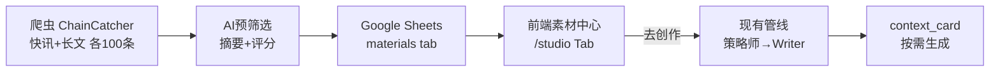

# P23 设计文档：每日素材源系统

> 版本：v4（2026-02-08）
> 状态：✅ 已确认，待实施
> 核心原则：方案A — 预分析做筛选门卫，策略师做创作军师
> 数据源：Phase 1 仅 ChainCatcher（与现有 web3_knowledge 数据同源，便于清洗）

---

## 一、目标

建立「爬取 → 筛选 → 存储 → 创作」素材管线，替代手动复制粘贴。

- **ChainCatcher** 自动抓取（快讯 + 长文各100条），与现有 `web3_knowledge`（🥩 肉）同源
- **AI 预筛选**快速评估创作价值（不做前因后果分析）
- **前端素材中心**（`/studio` Tab）浏览 → 选中 → 一键跳转创作
- **后续扩展**：吴说区块链、深潮 TechFlow（框架已预留接口）

> [!IMPORTANT]
> **方案A 核心原则**：
> - 预分析只判断「值不值得写」（筛选门卫），不做 context
> - 前因后果由策略师在点击「去创作」后通过 context_card 按需生成
> - 时效性从 HTML 发布时间计算，不消耗 LLM

---

## 二、数据流



---

## 三、Google Sheets Tab 重命名

### 现状 → 新名

| 旧名 | 内容 | 新名 | 说明 |
|------|------|------|------|
| `_registry` | Web3知识库 (~15269条) | `web3_knowledge` | 批量导入的深度文章 |
| `mimeng` | 咪蒙风格样本 | `style_mimeng` | Web2 写作风格样本 |
| `banfo` | 半佛风格样本 | `style_banfo` | Web2 写作风格样本 |
| *(新增)* | P23每日素材 | `materials` | 每日爬取素材池 |

### 代码改动

`google_sheets_source.py` 第121行，样本查找加 `style_` 前缀：

```diff
- sheet_name = style.lower()
+ sheet_name = f"style_{style.lower()}"
```

> [!NOTE]
> `materials` 独立运行，测试阶段不与 `web3_knowledge` 混合，后续可按需合并。

---

## 四、爬虫模块

### 4.1 目录结构

```
backend/app/services/material_fetcher/
├── __init__.py           # get_fetcher(source_name)
├── base.py               # BaseFetcher 抽象类
├── wublock.py            # 吴说区块链
├── techflow.py           # 深潮 TechFlow
└── chaincatcher.py       # 链捕手
```

### 4.2 抽象接口

```python
class BaseFetcher:
    def fetch_latest(self, count=100) -> list[dict]:
        """
        返回: [{
            "source": "链捕手",
            "title": "标题",
            "url": "https://...",
            "content": "正文内容",
            "published_at": "2026-02-08T14:30:00",
            "content_type": "快讯" | "长文",
        }, ...]
        """
```

### 4.3 Phase 1 抓取（ChainCatcher）

| 源 | URL | 快讯入口 | 长文入口 | 每次 |
|---|---|---|---|---|
| 链捕手 | chaincatcher.com | 快讯 | 文章 | 各100条 |

> [!NOTE]
> 选择 ChainCatcher 作为首个数据源的原因：现有 `web3_knowledge` 的15269条数据即来自 ChainCatcher 本地文件清洗入库，同源数据格式一致，便于复用清洗逻辑。
>
> **后续扩展**（框架已通过 `BaseFetcher` 预留接口）：
> - 吴说区块链 (wublock123.com)
> - 深潮 TechFlow (techflowpost.com)

### 4.4 时效性（代码计算，零 LLM 开销）

```python
def calc_timeliness(published_at: str) -> str:
    delta = datetime.now() - datetime.fromisoformat(published_at)
    if delta < timedelta(hours=24): return "fresh"
    elif delta < timedelta(days=3): return "recent"
    else: return "stale"
```

### 4.5 去重

- 以 `url` 为唯一键
- 每次爬取前先读 Sheets 已有 URL 列表
- 只写入新素材

---

## 五、AI 预筛选（轻量版）

### 5.1 文件

```
backend/app/services/material_analyzer.py  # ~60行
```

### 5.2 LLM Prompt（复用 Knowledge_Repo 的 MERGED_PROMPT 模式）

```
分析以下 Web3 内容，返回 JSON（不做任何展开分析）：

标题: {title}
内容: {content[:2000]}

返回：
{
  "summary": "一句话核心摘要（30字内）",
  "quality_score": 创作适合度1-10,
  "score_reason": "一句话评分理由",
  "fact_type": "硬数据/深度分析/观点评论/快讯资讯",
  "keywords": ["关键词1", "关键词2"],
  "entities": ["项目/代币/人名"],
  "suggested_modes": ["short_article"]
}

评分标准：
- 8-10：有具体数据+争议性/情绪点
- 5-7：有信息量但角度普通
- 1-4：纯公告/无新意/过于细碎
```

### 5.3 推荐模式逻辑

```python
if content_type == "快讯" or len(content) < 80:
    suggested_modes = ["short_article"]
elif len(content) < 250:
    suggested_modes = ["mid_article", "short_article"]
else:
    suggested_modes = ["mid_article", "long_article"]
```

### 5.4 Token 成本

| 项目 | 单条 | 300条/天 | 月成本 |
|------|------|---------|--------|
| 预筛选 | ~300 token | 90K token | ~2.7M token |
| 估算费用 | | | ¥0.5-1/天 |

---

## 六、Google Sheets 存储

### 6.1 新服务（不改现有 GoogleSheetsDataSource）

```python
# backend/app/services/material_sheet.py （新建）

class MaterialSheetService:
    """materials 工作表的读写服务"""
    
    def write_materials(self, materials: list[dict]):
        """批量写入素材"""
    
    def get_existing_urls(self) -> set[str]:
        """获取已有URL，用于去重"""
    
    def list_materials(self, filters: dict) -> list[dict]:
        """读取素材列表"""
    
    def mark_used(self, url: str):
        """标记已使用"""
```

### 6.2 `materials` Tab 字段（对齐 Knowledge_Repo 规范）

| # | 列名 | 来源 | 对齐 Knowledge_Repo | 说明 |
|---|------|------|:---:|------|
| 1 | 抓取日期 | 系统 | ≈上传时间 | 2026-02-08 |
| 2 | 发布时间 | 爬虫HTML | ≈发布日期 | 原文发布时间 |
| 3 | 时效性 | 代码计算 | *新增* | fresh/recent/stale |
| 4 | 来源 | 爬虫 | *新增* | 吴说/深潮/链捕手 |
| 5 | 内容类型 | 爬虫 | *新增* | 快讯/长文 |
| 6 | 标题 | 爬虫 | ✅标题 | 原文标题 |
| 7 | URL | 爬虫 | *新增* | 去重唯一键 |
| 8 | 正文原文 | 爬虫 | ✅正文原文 | 完整内容 |
| 9 | 核心摘要 | LLM | ✅核心摘要 | 30字摘要 |
| 10 | 质量评分 | LLM | ✅质量评分 | 1-10 |
| 11 | 评分理由 | LLM | *新增* | 一句话 |
| 12 | 事实类型 | LLM | ✅事实类型 | 硬数据/分析/评论/快讯 |
| 13 | 关键词 | LLM | ✅关键词 | 逗号分隔 |
| 14 | 项目/人名/代币 | LLM | ✅实体 | 逗号分隔 |
| 15 | 推荐模式 | LLM+规则 | *新增* | short/mid/long |
| 16 | 内容指纹 | MD5 | ✅内容指纹 | 备用去重 |
| 17 | 状态 | 前端 | ✅状态 | 未使用/已创作 |

> [!NOTE]
> 17列中有8列直接对齐 Knowledge_Repo 现有规范，确保字段命名一致。

---

## 七、API 路由

```python
# backend/app/api/materials.py

@router.post("/materials/fetch")
async def fetch_materials(
    sources: list[str] = ["wublock", "techflow", "chaincatcher"],
    count: int = 100
):
    """爬取 + 预筛选 + 写入Sheets"""

@router.get("/materials/list")
async def list_materials(
    date: str = None,
    source: str = None,
    min_score: int = 0,
    content_type: str = None,  # 快讯/长文
    status: str = None,
    timeliness: str = None,
):
    """从 Sheets 读取素材列表"""

@router.post("/materials/{url}/use")
async def use_material(url: str):
    """标记素材已使用"""
```

---

## 八、前端素材中心

### 8.1 页面布局

```
┌──────────────────────────────────────────────────┐
│ 创作工坊                                          │
│ ┌────────┬───────────┐                            │
│ │ 创作    │ 素材中心   │ ← Tab 切换                │
│ └────────┴───────────┘                            │
│                                                    │
│ [🔄 获取今日素材]  ☑吴说 ☑深潮 ☑链捕手              │
│                                                    │
│ 筛选：全部 | ⭐8+ | 🕐24h | 📰快讯 | 📄长文 | 未使用 │
│                                                    │
│ ┌──────────────────────────────────────────────┐  │
│ │ ⭐9 | 📰快讯 | 吴说 | 14:30 (2h前)           │  │
│ │ BTC跌破65000美元，24H清算17亿                  │  │
│ │ 📝 多头清算15亿，杠杆踩踏引发链反应             │  │
│ │ 🏷 硬数据 | 推荐：短篇                         │  │
│ │              [📋 查看原文] [✍️ 去创作]          │  │
│ └──────────────────────────────────────────────┘  │
│ ┌──────────────────────────────────────────────┐  │
│ │ ⭐7 | 📄长文 | 深潮 | 11:20 (5h前)            │  │
│ │ 以太坊到底怎么了？                              │  │
│ │ 📝 V神承认战略错误后ETH生态面临方向选择          │  │
│ │ 🏷 深度分析 | 推荐：中篇/长篇                   │  │
│ │              [📋 查看原文] [✍️ 去创作]          │  │
│ └──────────────────────────────────────────────┘  │
└──────────────────────────────────────────────────┘
```

### 8.2 「去创作」逻辑

```typescript
const handleCreate = (material) => {
    setActiveTab("create");
    setInput(material.content);   // 原文直接填入
    setMode(material.suggested_modes[0]);  // 自动选模式
    markAsUsed(material.url);     // 后台标记
};
```

> [!NOTE]
> 不拼接 context —— 策略师在正常流程中通过 context_card 自动补充前因后果。

---

## 九、不需要改动的现有模块

| 模块 | 原因 |
|------|------|
| `strategist.py` + `.jinja2` | context_card 正常运作 |
| `short_article.py` | Writer 不感知素材来源 |
| `mid_article.py` / `long_article.py` | 同上 |
| `google_sheets_source.py` | **仅改1行**（style_ 前缀） |

---

## 十、需新增模块

| 模块 | 文件 | 估算 |
|------|------|------|
| 爬虫基类 + 3源 | `material_fetcher/` | ~300行 |
| AI预筛选 | `material_analyzer.py` | ~60行 |
| Sheets读写 | `material_sheet.py` | ~100行 |
| API路由 | `api/materials.py` | ~60行 |
| 前端（3组件） | `MaterialCenter` 等 | ~250行 |
| **总计** | **~8个文件** | **~770行** |

---

## 十一、风险与应对

| 风险 | 等级 | 应对 |
|------|------|------|
| 反爬封锁 | 中 | delay + UA轮换 + 异常重试 |
| Sheets API写入限额 | 低 | 200条分2-3批写入 |
| 单次获取耗时(2-3min) | 中 | 前端loading + 进度反馈 |
| Tab重命名影响现有功能 | 低 | 只改1行代码 + 回归测试 |

> [!NOTE]
> Google Sheets Service Account 已配置为编辑者权限，无需额外授权操作。

---

## 十二、执行顺序

```
Phase 0: Google Sheets 整理
  ├─ 0a. 重命名现有 Tab（_registry→web3_knowledge, mimeng→style_mimeng, banfo→style_banfo）
  ├─ 0b. 新建 materials Tab + 表头
  └─ 0c. 改 google_sheets_source.py（style_ 前缀）+ 验证样本读取

Phase 1: 后端核心（仅 ChainCatcher）
  ├─ 1a. ChainCatcher 爬虫（快讯 + 长文）
  ├─ 1b. AI 预筛选
  ├─ 1c. Sheets 写入服务
  └─ 1d. 集成测试脚本

Phase 2: API + 前端
  ├─ 2a. FastAPI 路由（材料 CRUD）
  └─ 2b. /studio 素材中心 Tab

Phase 3: 与创作流程打通
  └─ 3a. 「去创作」→ 自动填入 + 跳转

Phase 4:（后续）扩展数据源
  ├─ 4a. 吴说区块链爬虫
  └─ 4b. 深潮 TechFlow 爬虫
```

---

## 十三、已确认事项

| # | 决策 | 确认 |
|---|------|:---:|
| Q1 | Phase 1 仅 ChainCatcher（与 web3_knowledge 同源），吴说+深潮后续扩展 | ✅ |
| Q2 | 快讯+长文各100条 | ✅ |
| Q3 | 新建 `materials` Tab，不与 web3_knowledge 合并 | ✅ |
| Q4 | 方案A：预分析只做筛选，策略师保留 context_card | ✅ |
| Q5 | 时效性从 HTML 发布时间计算 | ✅ |
| Q6 | 快讯 + 长文都抓 | ✅ |
| Q7 | Tab 重命名（_registry→web3_knowledge, mimeng→style_mimeng, banfo→style_banfo） | ✅ |
| Q8 | 字段对齐 Knowledge_Repo 规范 | ✅ |
| Q9 | 素材中心放在 `/studio` 下作为 Tab | ✅ |
| Q10 | Google Sheets Service Account 已是编辑者，无需改权限 | ✅ |
