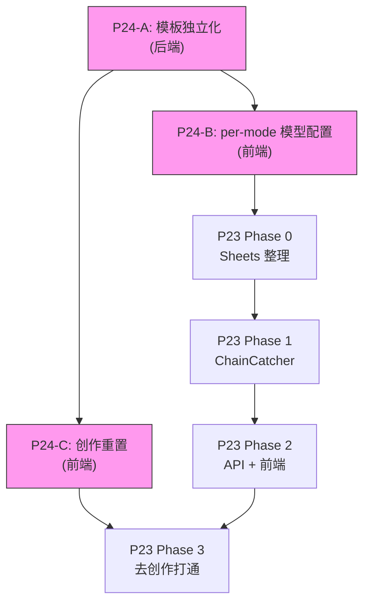

# P24: 全模式独立管线 + UX 完善

> 版本：v3（2026-02-08）
> 状态：✅ 已确认，待实施
> 前置：P18 方案B 的后续完成
> 目标：每个创作模式拥有完整独立的 Strategist → Writer → Critic → Polisher 管线
> 关联：P24 → P23（P24 完成后才能启动 P23）

---

## 一、问题诊断

### 现状审计（2026-02-08）

| 模块 | 代码路由 | 模板独立 | 模型配置 | 状态 |
|------|---------|---------|---------|:---:|
| Strategist | ✅ 通用 | ✅ `strategist.jinja2` | ✅ 全局 | ✅ 设计如此 |
| Writer | ✅ `get_writer(mode)` → 5个独立 `.py` | ✅ 6个独立 `.jinja2` | ✅ per-mode | ✅ 完成 |
| Critic | ✅ `get_critic(mode)` → `standard.py`/`skip.py` | ❌ 1个共享 `critic.jinja2` | ❌ 全局 | 🔴 假独立 |
| Polisher | ✅ `get_polisher(mode)` → `standard.py`/`skip.py` | ❌ 1个共享 `polisher.jinja2` | ❌ 全局 | 🔴 假独立 |

### 根因

```
graph.py → get_critic("short_article")
         → critic/standard.py
         → render_prompt("critic")         ← 🔴 加载根级 critic.jinja2
         → 同一个模板评审所有模式           ← 🔴 300字短篇和1800字长篇用同一标准
```

### 附带问题

| # | 问题 | 位置 |
|---|------|------|
| 1 | `CRITIC_REGISTRY` 缺 `short_article` | `critic/__init__.py` |
| 2 | `AgentRoleSchema` 缺 `polisher` | `schema.ts` L164 |
| 3 | Router 模板死代码（`critic_router.jinja2`, `polisher_router.jinja2`） | `prompts/` |
| 4 | `polisher_router.jinja2` 含旧模式名 `mid_take`/`deep_analysis` | 过时 |
| 5 | 创作完成后无「新建创作」按钮 | `WritingCanvas.tsx` |
| 6 | `resetSession()` 未清理 `critiqueResult`/`analysisResult`/版本历史 | `useAgentStore.ts` |

---

## 二、P24 范围（三大块）

### A. Critic/Polisher 模板独立化

每模式一对独立 Critic + Polisher 模板，评审标准按模式区分。

| 模式 | Critic 重点 | Polisher 策略 |
|------|------------|-------------|
| **short_article** | 冲击力、锐度、信息密度 | 跳过 |
| **mid_article** | 观点链条、数据支撑、风格 | 中度润色 |
| **long_article** | 深度分析、论证完整、数据引用 | 强力润色 |
| **tutorial** | 步骤清晰、术语准确、可复现 | 轻度格式化 |
| **rewrite** | 语义保真度、风格调性 | 中度优化表达 |
| **hot_take** | 跳过 | 跳过 |

### B. per-mode Critic/Polisher 模型配置

复用 `ModeWriterConfigSchema` 模式，在 Settings 每模式卡片中显示 Writer/Critic/Polisher 三个模型选择器。

### C. 创作重置功能

`WritingCanvas` 加「新建创作」按钮，调用补全后的 `resetSession()` 回到空白输入界面。

---

## 三、后端改动

### 3.1 `critic/standard.py`（~15行改动）

```python
# 核心改动
- system_prompt = render_prompt("critic", context)
+ system_prompt = render_prompt(f"critic/{mode}", context)

# 新增 context 字段
context = {
    ...
    # P24: 注入模式专用评分配置
    "dimensions": scoring.get("dimensions", SCORING_DIMENSIONS),
    "penalty_rules": scoring.get("penalty_rules", PENALTY_RULES),
    "penalty_cap": scoring.get("penalty_cap", 30),
    "pass_threshold": scoring.get("pass_threshold", 85),
    "refine_threshold": scoring.get("refine_threshold", 70),
}
```

### 3.2 `polisher/standard.py`（~10行改动）

```python
- system_prompt = render_prompt("polisher", context)
+ system_prompt = render_prompt(f"polisher/{mode}", context)
```

### 3.3 `critic/__init__.py`（+1行）

```python
CRITIC_REGISTRY = {
    "short_article": standard_critic,  # P24: 补注册
    "mid_article": standard_critic,
    ...
}
```

### 3.4 新建模板文件

```
backend/data/prompts/
├── critic/
│   ├── short_article.jinja2    🆕
│   ├── mid_article.jinja2      🆕
│   ├── long_article.jinja2     🆕
│   ├── tutorial.jinja2         🆕
│   └── rewrite.jinja2          🆕
└── polisher/
    ├── mid_article.jinja2      🆕
    ├── long_article.jinja2     🆕
    ├── tutorial.jinja2         🆕
    └── rewrite.jinja2          🆕
```

### 3.5 graph.py — 无需改动 ✅

---

## 四、前端改动

### 4.1 `schema.ts` — 新增 per-mode Critic/Polisher Schema

```typescript
// P24: 复用 ModeWriterConfigSchema 模式
export const ModeCriticConfigSchema = z.object({
    short_article: AgentModelSettingSchema,
    mid_article: AgentModelSettingSchema,
    long_article: AgentModelSettingSchema,
    tutorial: AgentModelSettingSchema,
    rewrite: AgentModelSettingSchema,
    // hot_take: skip_critic，无需配置
});

export const ModePolisherConfigSchema = z.object({
    mid_article: AgentModelSettingSchema,
    long_article: AgentModelSettingSchema,
    tutorial: AgentModelSettingSchema,
    rewrite: AgentModelSettingSchema,
    // hot_take + short_article: skip_polisher
});
```

### 4.2 Settings 页面 — 模式卡片 UI

```
┌─ 🔥 锐评 (hot_take) ────────────────────────┐
│  Writer:    [doubao-seed    ▼]               │
│  Critic:    跳过（锐评无需评审）              │
│  Polisher:  跳过（锐评直接输出）              │
└──────────────────────────────────────────────┘

┌─ 💬 短篇 (short_article) ───────────────────┐
│  Writer:    [doubao-seed    ▼]               │
│  Critic:    [doubao-seed    ▼]               │
│  Polisher:  跳过（保持碎句节奏）              │
└──────────────────────────────────────────────┘

┌─ 中篇 (mid_article) ────────────────────────┐
│  Writer:    [deepseek-v3    ▼]               │
│  Critic:    [doubao-seed    ▼]               │
│  Polisher:  [doubao-seed    ▼]               │
└──────────────────────────────────────────────┘
```

### 4.3 `AgentRoleSchema` 补全

```diff
- z.enum(['strategist', 'researcher', 'writer', 'critic'])
+ z.enum(['strategist', 'researcher', 'writer', 'critic', 'polisher'])
```

### 4.4 请求发送适配

前端根据当前 mode 从 `ModeCriticConfig` / `ModePolisherConfig` 查找模型配置，填入 `agent_config` 字段。**后端无需改动**，现有 `agent_config` 已支持。

### 4.5 创作重置功能

**WritingCanvas.tsx** — 浮动操作栏加「新建创作」按钮：

```
[MD | HTML]  [📋 复制]  [🔄 重新生成]  [➕ 新建创作]
```

点击弹确认 → 调用 `resetSession()` → 回到 HeroInput 空白界面。

**useAgentStore.ts** — `resetSession()` 补全字段：

```diff
 resetSession: () => {
     set({
         status: 'idle',
         error: null,
         steps: INITIAL_STEPS,
         content: '',
         strategyOptions: null,
         isWaitingForSelection: false,
         lastGeneratedContent: '',
         lastSelectedOption: null,
         titleCandidates: [],
         selectedTitle: '',
+        critiqueResult: null,
+        analysisResult: null,
+        draftHistory: [],
+        currentVersionId: null,
     });
 },
```

---

## 五、清理旧代码

| 文件 | 操作 | 原因 |
|------|------|------|
| `prompts/critic.jinja2` | 🗑️ 删 | 被5个独立模板替代 |
| `prompts/polisher.jinja2` | 🗑️ 删 | 被4个独立模板替代 |
| `prompts/writer.jinja2` | 🗑️ 删 | P18遗留，已被独立模板替代 |
| `prompts/critic/critic_router.jinja2` | 🗑️ 删 | 死代码 |
| `prompts/polisher/polisher_router.jinja2` | 🗑️ 删 | 死代码 + 旧模式名 |

> [!IMPORTANT]
> `shared/base_critic.jinja2` 和 `shared/base_polisher.jinja2` 保留。新模板可通过 `` 复用其公共结构。

---

## 六、执行顺序

```
═══════════════ 后端 (4h) ═══════════════
Step 1:  创建 5 个 Critic 独立模板
Step 2:  改 critic/standard.py (render_prompt 路径)
Step 3:  补 critic 注册 short_article
Step 4:  [检查点] 5种模式各测1次

Step 5:  创建 4 个 Polisher 独立模板
Step 6:  改 polisher/standard.py
Step 7:  [检查点] 5种模式各测1次

Step 8:  删旧文件 (5个)

═══════════════ 前端 (3.5h) ═══════════════
Step 9:  schema.ts 新增 ModeCriticConfig + ModePolisherConfig
Step 10: Settings 模式卡片 UI
Step 11: 请求发送适配 (agent_config 按 mode 查配置)
Step 12: AgentRoleSchema 补 polisher
Step 13: WritingCanvas 加「新建创作」+ resetSession 补全
Step 14: [检查点] 全流程前后端联调回归

═══════════ 总计 ~8h ═══════════
```

---

## 七、风险与预判方案

| # | 风险 | 概率 | 影响 | 预判方案 |
|---|------|:---:|:---:|---------|
| R1 | **Critic 模板改动后评分飘移** — 新的模式专用评分标准可能导致 PASS/REFINE 阈值不符合预期 | 🟡 中 | 🔴 高 | 先用现有 `critic.jinja2` 内容做基础模板，逐步差异化；每个模式改完后用固定输入跑一次，对比改前改后评分 |
| R2 | **短篇 Critic 评分不稳定** — 200字文本太短，LLM 评分方差大 | 🟡 中 | 🟡 中 | 短篇 penalty_cap 设低（25分），pass_threshold 也设低（85），容忍度更高 |
| R3 | **Settings 页面 localStorage 格式变更** — 新增 `modeCritics`/`modePolishers` 可能与旧缓存冲突 | 🟡 中 | 🟡 中 | 读取时做 fallback：如果 localStorage 无新 key，用 `DEFAULT_MODE_CRITICS` 兜底；不做强制清空 |
| R4 | **`render_prompt(f"critic/{mode}")` 找不到模板** — 如果某模式模板文件名不匹配 | 🟢 低 | 🔴 高 | `render_prompt` 的 `load_template` 函数需检查：路径解析是否支持子目录写法；如不支持，需改用显式路径 `critic/short_article.jinja2` |
| R5 | **创作重置丢失未保存内容** — 用户可能误触「新建创作」 | 🟡 中 | 🟡 中 | 确认弹窗："当前内容将丢失，确定开始新创作？"；自动保存最后版本到 `draftHistory` 后再清空 |
| R6 | **P23「去创作」依赖 resetSession** — 素材中心跳转创作前需清空旧状态 | 🟢 低 | 🔴 高 | P24 的 `resetSession` 补全直接解决；P23 `handleCreate` 调用顺序：`resetSession()` → `setInput()` → `setMode()` |

### R4 深入分析（关键风险）

`core/prompts.py` 的 `load_template` 函数当前逻辑：

```python
def load_template(agent_name: str) -> str:
    # 加载 prompts/{agent_name}.jinja2
```

需要验证：`load_template("critic/short_article")` 是否能正确解析为 `prompts/critic/short_article.jinja2`。如果内部用 `f"{agent_name}.jinja2"` 拼接，就能自动工作。如果有路径限制（如禁止 `/`），则需小改。

**预判**：大概率能工作，因为 Writer 已有子目录模板（`writer/short_article.jinja2`），说明 `render_prompt("writer/short_article")` 的路径解析已被验证。

---

## 八、与 P23 的关系



**P24-C（创作重置）是 P23 Phase 3（去创作）的直接前置**：素材中心跳转创作时需要先 `resetSession()` 清空旧状态。

---

## 九、已确认事项

| # | 决策 | 确认 |
|---|------|:---:|
| Q1 | per-mode Critic/Polisher 模型配置（与 Writer 对齐） | ✅ |
| Q2 | 创作重置功能纳入 P24 | ✅ |
| Q3 | 确认弹窗避免误触 | ✅ |
| Q4 | Studio Tab 用 URL query 管理（`?tab=create`/`?tab=materials`） | ✅ |
| Q5 | P24 → P23 顺序执行 | ✅ |
| Q6 | 4 智能体 × 6 模式统一矩阵 | ✅ |
| Q7 | 策略师不拆模板文件（变量注入已适配 mode） | ✅ |

---

## 十、P24-D 一致性补全（2026-02-09 补充）

> 版本：v4
> 状态：待实施
> 原因：P24-A/B/C 完成后发现模型配置与提示词配置存在不一致

### 10.1 现状审计

| 区域 | 策略师 | 写手 | 评论家 | 润色师 |
|------|:-----:|:----:|:-----:|:-----:|
| **模型配置** (AgentModelConfig) | ❌ 全局 1个 | ✅ 6模式 | ⚠️ 5模式 | ⚠️ 4模式 |
| **提示词配置** (P15 PromptManager) | ❌ 全局 1个 | ✅ 6模式 sub-tabs | ❌ 全局 1个 | ❌ 全局 1个 |
| **API 请求下发** | ⚠️ 仅全局 | ✅ per-mode | ⚠️ 仅全局 | ⚠️ 仅全局 |
| **后端 graph.py 接收** | ✅ L82 | ✅ L161 | ✅ L202 | ✅ L273 |

### 10.2 跳过逻辑矩阵

| 模式 | 策略师 | 写手 | 评论家 | 润色师 |
|------|:-----:|:----:|:-----:|:-----:|
| hot_take | ✅ | ✅ | ⏭️ skip | ⏭️ skip |
| short_article | ✅ | ✅ | ✅ | ⏭️ skip |
| mid_article | ✅ | ✅ | ✅ | ✅ |
| long_article | ✅ | ✅ | ✅ | ✅ |
| tutorial | ✅ | ✅ | ✅ | ✅ |
| rewrite | ✅ | ✅ | ✅ | ✅ |

跳过的组合在 UI 中**仍然显示**，标记为「⏭️ 跳过」且选择器 disabled。

### 10.3 审计发现（8 项）

| # | 级别 | 问题 | 代码证据 |
|---|:---:|------|---------|
| 1 | 🔴 | 策略师非「通用逻辑」— 已通过 `{{ mode }}` 变量注入适配 | `strategist.jinja2` L38, `strategist.py` L19 |
| 2 | 🔴 | API 只覆盖 Writer per-mode，其余 3 agent 用全局 | `useAgentStore.ts` L347-354 |
| 3 | 🟢 | 后端 **0 改动** — `graph.py` 已读取各 agent 配置 | L82 / L202 / L273 |
| 4 | 🟡 | `getAssembledPrompt` 对非 Writer 忽略 mode 参数 | `usePromptStore.ts` L104-113 |
| 5 | 🟡 | `usePromptStore` 持久化迁移 v3→v4 | L142 |
| 6 | 🟡 | `defaultPrompts.ts` 需展开为 6 模式 | L114-136 |
| 7 | 🟢 | `SKIP_MODES` 仅 UI 层 — 后端由 registry 控制 | — |
| 8 | 🟢 | critic/polisher store 需 version bump v1→v2 | — |

### 10.4 改动清单

**后端**：0 改动

**前端**（~12 文件）：

| 层 | 文件 | 改动 |
|---|------|------|
| Schema | `schema.ts` | 新增 `ModeStrategistConfigSchema` / `SKIP_MODES`；Critic 5→6 模式；Polisher 4→6 模式 |
| Store | `useModeStrategistStore.ts` [NEW] | 策略师 per-mode store |
| Store | `useModeCriticStore.ts` | 5→6 模式 + v2 迁移 |
| Store | `useModePolisherStore.ts` | 4→6 模式 + v2 迁移 |
| UI | `AgentModelConfig.tsx` | 4 卡片统一 6 行；提取 `renderPerModeConfig()` 通用函数 |
| API | `useAgentStore.ts` | `startGeneration` / `selectOptionAndGenerate` / `regenerate` 覆盖 4 agent per-mode 配置 |
| P15 | `defaultPrompts.ts` | strategist/critic/polisher 从平面 → 6 模式对象 |
| P15 | `usePromptStore.ts` | per-mode 类型 + v3→v4 迁移 + `getAssembledPrompt` 修正 |
| P15 | `StrategistPromptEditor.tsx` | 加 6 模式 sub-tabs |
| P15 | `CriticPromptEditor.tsx` | 加 6 模式 sub-tabs |
| P15 | `PolisherPromptEditor.tsx` | 加 6 模式 sub-tabs |
