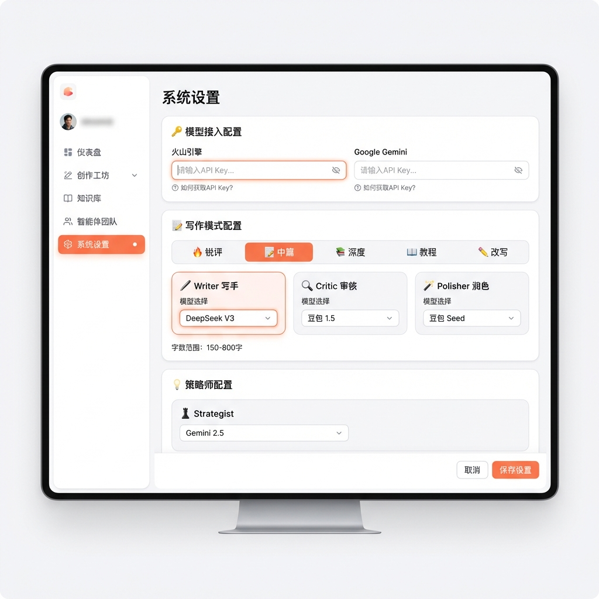
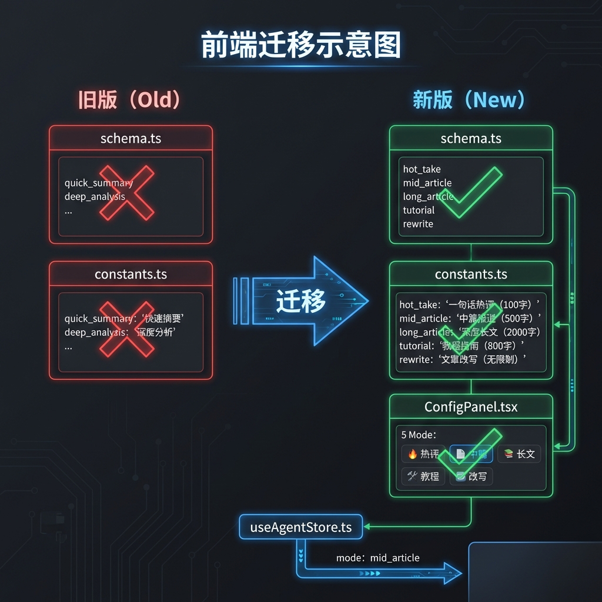

# P18: 方案 B - 全模块独立架构设计

**创建日期**: 2026-02-03  
**状态**: 📝 规划中  
**背景**: P13-P16 快速迭代导致配置散落、约束注入冲突、持续修补

---

## 一、P12-P15 历史方案回顾

### P11: 新篇幅体系
| 设计 | 内容 |
|:---|:---|
| 篇幅命名 | tweet(150-300) / thread(500-800) / post(1000-1500) |
| Mode 指导 | 每种 Mode 有专属禁止规则 |
| 问题 | 后续 P14 改用 mode_configs，导致两套系统共存 |

### P12: 5 维度评分系统
| 设计 | 内容 |
|:---|:---|
| 评分维度 | 语义保真(35%) / 信息深度(25%) / 逻辑结构(15%) / 语言调性(15%) / 原创表观(10%) |
| 阈值 | PASS≥85 / REFINE 70-84 / REWRITE<70 |
| **可复用** | ✅ 评分维度和阈值设计成熟 |

### P13: 前后端配置同步
| 设计 | 内容 |
|:---|:---|
| agent_config | 支持每个 Agent 独立配置 Provider/Model |
| SSE 事件 | critique_update 传递评分数据 |
| **可复用** | ✅ 多 Agent 配置框架 |

### P14: 模式模块化架构
| 设计 | 内容 |
|:---|:---|
| mode_configs.py | 集中管理所有模式参数 |
| 路由模板 | critic_router.jinja2 / polisher_router.jinja2 |
| ~~MODE_ALIASES~~ | ❌ 兼容旧命名 → **方案 B 删除** |
| **问题** | 路由模板未实现，改用代码注入约束 |

### P15: 自定义提示词编辑器
| 设计 | 内容 |
|:---|:---|
| 结构化编辑 | role/task/style/forbidden 四区块 |
| 系统注入 | 素材 `{{ raw_input }}` + 输出格式 |
| **问题** | 未继承字数/语言等硬性约束 |

---

## 二、快速修复期间的问题清单

### P16.1 修补记录

| # | 问题 | 修补方式 | 潜在冲突 |
|:---:|:---|:---|:---|
| 1 | 字数超标 | max_tokens 系数 3→2.2→1.5 | ⚠️ 可能限制创作空间 |
| 2 | LLM 不遵守 max_tokens | 硬性后处理截断 | ⚠️ 可能截断句子中间 |
| 3 | Polisher 无字数感知 | 传入 length_constraints | ✅ 无冲突 |
| 4 | 自定义提示词无中文约束 | 运行时注入 `【系统强制要求】` | ⚠️ 可能与提示词冲突 |
| 5 | Critic JSON 被截断 | max_tokens<4096 条件判断 | ⚠️ Hacky workaround |
| 6 | Polisher 英文提示 | 改为中文 | ✅ 已修复 |
| 7 | 默认值不一致 | 未彻底清理 | ⚠️ 仍有隐患 |

### 冲突分析

**方案 B (独立模块) 会消除以下冲突**：

| 冲突点 | 方案 A (当前) | 方案 B (独立) |
|:---|:---|:---|
| 运行时注入约束 | ⚠️ 可能被 LLM 忽略 | ✅ 约束烘焙到模板 |
| 硬性截断 | ⚠️ 可能破坏内容 | ✅ 每个模板自带字数限制 |
| 默认值散落 | ⚠️ fallback 不一致 | ✅ 每个模块自包含 |
| max_tokens 条件判断 | ⚠️ Hacky | ✅ 各模块独立处理 |

---

## 三、方案 B 架构设计

### 目录结构

```
backend/app/agents/
├── strategist/
│   └── strategist.py           # 策略师 (通用)
│
├── writer/
│   ├── __init__.py             # 路由入口
│   ├── hot_take.py             # 锐评 Writer
│   ├── mid_article.py          # 中篇 Writer
│   ├── long_article.py         # 长篇 Writer
│   ├── tutorial.py             # 教程 Writer
│   └── rewrite.py              # 改写 Writer
│
├── critic/
│   ├── __init__.py             # 路由入口
│   ├── standard.py             # 标准评分 (中篇/长篇/教程)
│   ├── rewrite.py              # 改写评分 (宽松)
│   └── skip.py                 # 跳过评分 (锐评)
│
└── polisher/
    ├── __init__.py             # 路由入口
    ├── short_form.py           # 短文润色 (锐评)
    ├── long_form.py            # 长文润色 (中篇/长篇)
    └── tutorial.py             # 教程润色
```

### 模板结构

```
backend/data/prompts/
├── writer/
│   ├── hot_take.jinja2         # 锐评 (50-150字，自带约束)
│   ├── mid_article.jinja2      # 中篇 (150-800字，自带约束)
│   ├── long_article.jinja2     # 长篇 (900-1800字，自带约束)
│   ├── tutorial.jinja2         # 教程 (400-1500字，自带约束)
│   └── rewrite.jinja2          # 改写 (无字数限制)
│
├── critic/
│   ├── standard.jinja2         # 标准评分模板
│   └── rewrite.jinja2          # 改写评分模板
│
└── polisher/
    ├── short_form.jinja2       # 短文润色
    └── long_form.jinja2        # 长文润色
```

---

## 四、每个模块自包含约束

### 示例: mid_article.jinja2

```jinja2
Current Time: {{ current_time_str }}

你是 Web3 领域资深内容创作者，擅长撰写 150-800 字的中篇分析文章。

## 🎯 任务
根据素材撰写一篇中篇分析，要求：
- 字数：**150-800 字**（必须严格遵守）
- 语言：**必须使用中文**
- 结构：开头抓眼球 → 核心观点 → 数据支撑 → 结尾升华

## ✍️ 风格
{{ style_instructions }}

## ❌ 禁止
- 高频套话：众所周知、值得一提、综上所述
- 虚构数据/价格
- 投资建议

---

## 📥 素材
{{ raw_input }}

---

直接输出文章，不要任何解释。
```

**优势**：字数/语言/禁止事项已经**烘焙**在模板中，无需运行时注入。

---

## 五、路由入口设计

### writer/__init__.py

```python
from .hot_take import hot_take_writer
from .mid_article import mid_article_writer
from .long_article import long_article_writer
from .tutorial import tutorial_writer
from .rewrite import rewrite_writer

WRITER_REGISTRY = {
    "hot_take": hot_take_writer,
    "mid_article": mid_article_writer,
    "long_article": long_article_writer,
    "tutorial": tutorial_writer,
    "rewrite": rewrite_writer,
}

def get_writer(mode: str):
    """获取对应模式的 Writer"""
    return WRITER_REGISTRY.get(mode, mid_article_writer)
```

### graph.py 调用

```python
from app.agents.writer import get_writer

def node_writer(state: AgentState):
    mode = state["mode"]
    writer = get_writer(mode)
    return writer(state)
```

---

## 六、与 P15 自定义提示词兼容

### 方案: 自定义提示词作为模板覆盖

```python
# writer/mid_article.py

def mid_article_writer(state: dict) -> dict:
    custom_prompt = state.get("custom_prompts", {}).get("writer")
    
    if custom_prompt:
        # 使用自定义提示词，但仍注入硬性约束
        system_prompt = custom_prompt + HARD_CONSTRAINTS["mid_article"]
    else:
        # 使用标准模板 (已包含约束)
        system_prompt = render_prompt("writer/mid_article.jinja2", context)
    
    ...
```

### HARD_CONSTRAINTS (最小化注入)

```python
HARD_CONSTRAINTS = {
    "hot_take": "\n\n【字数：50-150字 | 语言：中文】",
    "mid_article": "\n\n【字数：150-800字 | 语言：中文】",
    "long_article": "\n\n【字数：900-1800字 | 语言：中文】",
    ...
}
```

---

## 七、前端迁移计划

### Settings 页面新 UI 设计



**核心变化**:
- **写作模式配置**: 5 个模式 Tab（锐评/中篇/深度/教程/改写）
- **每模式独立配置**: 切换 Tab 显示该模式的 Writer/Critic/Polisher 模型
- **字数提示**: 每个模式下方显示字数范围
- **策略师独立**: Strategist 是通用的，单独区块

---

### 代码迁移



### 需修改文件

| 文件 | 改动 | 旧值 → 新值 |
|:---|:---|:---|
| `schema.ts` | 创作模式枚举 | `quick_summary` → `mid_article` |
| `schema.ts` | 创作模式枚举 | `deep_analysis` → `long_article` |
| `constants.ts` | 模式显示名称映射 | 同上 |
| `ConfigPanel.tsx` | 模式选择器 | UI 标签更新 |
| `useAgentStore.ts` | 请求发送 | mode 字段使用新名 |
| `settings/page.tsx` | **Settings UI 重构** | 新增模式 Tab 切换 |

### schema.ts 修改

```typescript
// 旧版
export const CreationModeSchema = z.enum([
  'deep_analysis',   // ❌ 删除
  'quick_summary',   // ❌ 删除
  'rewrite',
  'tutorial',
]);

// 新版
export const CreationModeSchema = z.enum([
  'hot_take',        // 锐评 (50-150字)
  'mid_article',     // 中篇 (150-800字)
  'long_article',    // 长篇 (900-1800字)
  'tutorial',        // 教程 (400-1500字)
  'rewrite',         // 改写 (无限制)
]);
```

### constants.ts 修改

```typescript
// 旧版
export const MODE_LABELS = {
  deep_analysis: '深度分析',
  quick_summary: '快讯点评',
  ...
};

// 新版
export const MODE_LABELS = {
  hot_take: '锐评',
  mid_article: '中篇点评',
  long_article: '深度分析',
  tutorial: '教程指南',
  rewrite: '改写润色',
};

export const MODE_WORD_COUNTS = {
  hot_take: '50-150字',
  mid_article: '150-800字',
  long_article: '900-1800字',
  tutorial: '400-1500字',
  rewrite: '保持原文',
};
```

### ConfigPanel.tsx 修改

```tsx
// 模式选择器 UI
<Select value={mode} onValueChange={setMode}>
  <SelectItem value="hot_take">🔥 锐评 (50-150字)</SelectItem>
  <SelectItem value="mid_article">📝 中篇 (150-800字)</SelectItem>
  <SelectItem value="long_article">📚 深度 (900-1800字)</SelectItem>
  <SelectItem value="tutorial">📖 教程 (400-1500字)</SelectItem>
  <SelectItem value="rewrite">✏️ 改写</SelectItem>
</Select>
```

### 前端测试检查点

| 检查项 | 验证方式 |
|:---|:---|
| 模式选择器显示 5 个选项 | 目视检查 |
| 选择后 mode 值正确 | console.log |
| 请求发送 mode 字段正确 | Network tab |
| 无 TypeScript 类型错误 | `npm run build` |

---

## 八、实施计划

| 阶段 | 内容 | 时间 |
|:---:|:---|:---:|
| 1 | 创建 writer/ 模块目录结构 | 30min |
| 2 | 迁移 5 个 Writer 模板到独立模块 | 2h |
| 3 | 创建 critic/ 模块 (标准/改写/跳过) | 1.5h |
| 4 | 创建 polisher/ 模块 | 1h |
| 5 | 更新 graph.py 使用路由入口 | 1h |
| 6 | 删除运行时约束注入代码 | 30min |
| 7 | **前端模式名迁移** | **1h** |
| 8 | 前后端联调测试 | 1h |
| **总计** | | **8.5h**

---

## 九、清理清单 (修补代码移除)

| 文件 | 移除内容 | 原因 |
|:---|:---|:---|
| llm.py | 硬性截断逻辑 | 约束已在模板中 |
| writer.py | `【系统强制要求】` 注入 | 约束已在模板中 |
| polisher.py | 中文/字数注入 | 约束已在模板中 |
| mode_configs.py | **删除 MODE_ALIASES** | 不兼容旧名，彻底清理 |

### 旧模式名清理 (无兼容性)

| 旧名 | 替换为 | 需搜索替换的文件 |
|:---|:---|:---|
| `quick_summary` | `mid_article` | 前端 schema.ts, 后端 graph.py, 模板 |
| `deep_analysis` | `long_article` | 同上 |
| `mid_take` | `mid_article` | 同上 |
| `quick_take` | ❌ 删除 | 无 |

**执行命令**：
```powershell
# 前端
grep -r "quick_summary" frontend/src/ --include="*.ts" --include="*.tsx"
grep -r "deep_analysis" frontend/src/ --include="*.ts" --include="*.tsx"

# 后端
grep -r "quick_summary" backend/ --include="*.py"
grep -r "deep_analysis" backend/ --include="*.py"

# 模板
grep -r "quick_summary" backend/data/prompts/ --include="*.jinja2"
```

---

## 十、迁移预案 (关键!)

### Git 分支策略

```
main (稳定版)
  └── feature/p18-independent-modules (开发分支)
        ├── Phase 1: Writer 迁移
        ├── Phase 2: Critic 迁移
        ├── Phase 3: Polisher 迁移
        └── Phase 4: 清理旧代码
```

### 迁移检查点

| 阶段 | 检查点 | 验证方式 | 回滚触发条件 |
|:---:|:---|:---|:---|
| 1 | Writer 模块创建 | 5 种模式各跑 1 次 | 任一模式失败 |
| 2 | Critic 模块创建 | 评分返回正常 JSON | score=0 或解析失败 |
| 3 | Polisher 模块创建 | 润色输出中文 | 英文输出 |
| 4 | 旧代码清理 | 全流程测试 | 任何回归 |
| 5 | MODE_ALIASES 删除 | 旧名搜索无结果 | 前端报错 |

### 每阶段回滚命令

```powershell
# 回滚到上一个检查点
git checkout HEAD~1 -- backend/app/agents/

# 完全回滚到迁移前
git checkout main -- backend/app/agents/
git checkout main -- backend/data/prompts/

# 重启服务
cd backend && python -m uvicorn app.main:app --reload
```

### 迁移执行流程

```
Phase 1: Writer 迁移 (2.5h)
├── 1.1 创建 backend/app/agents/writer/ 目录
├── 1.2 迁移 hot_take → hot_take.py + hot_take.jinja2
├── 1.3 [检查点] 测试锐评模式
├── 1.4 迁移其他 4 个 Writer
├── 1.5 [检查点] 测试全部 5 种模式
└── 1.6 ✅ 或 ❌ 回滚

Phase 2: Critic 迁移 (1.5h)
├── 2.1 创建 backend/app/agents/critic/ 目录
├── 2.2 创建 standard.py (中篇/长篇/教程共用)
├── 2.3 创建 skip.py (锐评跳过)
├── 2.4 [检查点] 测试评分返回
└── 2.5 ✅ 或 ❌ 回滚

Phase 3: Polisher 迁移 (1h)
├── 3.1 创建 backend/app/agents/polisher/ 目录
├── 3.2 创建 long_form.py / short_form.py
├── 3.3 [检查点] 测试润色输出
└── 3.4 ✅ 或 ❌ 回滚

Phase 4: 清理旧代码 (1h)
├── 4.1 删除 llm.py 硬性截断
├── 4.2 删除 writer.py/polisher.py 约束注入
├── 4.3 删除 MODE_ALIASES
├── 4.4 搜索替换旧模式名
├── 4.5 [检查点] 全流程测试
└── 4.6 ✅ 合并到 main 或 ❌ 回滚
```

### 前后端同步点

| 时机 | 前端改动 | 后端改动 | 风险 |
|:---|:---|:---|:---:|
| Phase 4.4 | schema.ts 更新模式名 | mode_configs.py 删除别名 | 🔴 高 |
| **建议** | **同时部署前后端** | - | - |

### 紧急回滚脚本

```powershell
# 文件: scripts/p18_rollback.ps1

Write-Host "🔴 执行 P18 紧急回滚..."

# 1. 停止服务
Stop-Process -Name "uvicorn" -Force -ErrorAction SilentlyContinue

# 2. 回滚代码
git checkout main -- backend/app/agents/
git checkout main -- backend/data/prompts/
git checkout main -- frontend/src/features/studio/schema.ts

# 3. 重启
cd backend
Start-Process -FilePath "python" -ArgumentList "-m uvicorn app.main:app --reload"

Write-Host "✅ 回滚完成"
```

---

## 十一、风险评估

| 风险 | 概率 | 缓解 |
|:---|:---:|:---|
| 模板维护成本增加 | 🟡 中 | 提取公共片段到 shared/ |
| P15 自定义提示词兼容 | 🟡 中 | 最小化硬约束注入 |
| 迁移期间回归 | 🟢 低 | 分阶段迁移 + 检查点 |
| 前后端不同步 | 🔴 高 | 同时部署 + 回滚脚本 |

## 十二、最终审核与注意事项

### 遗漏项检查

| # | 检查项 | 状态 | 补充说明 |
|:---:|:---|:---:|:---|
| 1 | hot_take 独立 API | ⚠️ | hot_take 目前走 `/hot_take` 独立端点，需确认是否纳入统一架构 |
| 2 | localStorage 配置迁移 | ⚠️ | 旧 mode 值存在 localStorage，需前端清理或兼容 |
| 3 | 后端 API 同步迁移 | ⚠️ | `/analyze` 和 `/generate` 需验证 mode 参数 |
| 4 | P15 自定义提示词存储 | ✅ | 已设计 HARD_CONSTRAINTS 注入方案 |
| 5 | 评分阈值保留 | ✅ | mode_configs.py 保留评分配置 |

### 设计不足之处

| 问题 | 风险 | 建议 |
|:---|:---:|:---|
| 模板重复代码 | 🟡 | 提取公共片段到 `shared/base_writer.jinja2` |
| 每模式 3 个文件 (py + jinja2 × 2) | 🟡 | 可接受，换取清晰的职责边界 |
| Settings UI 复杂度增加 | 🟡 | 5 Tab 比 4 卡片更复杂，需前端 UI 迭代 |

### ⚠️ 需特别注意

> [!IMPORTANT]
> **hot_take 独立 API 处理**
> 当前 `/hot_take` 不走 LangGraph，直接调用 LLM。方案 B 需决定：
> - **选项 A**: 保持独立，不纳入 writer/ 模块
> - **选项 B**: 统一到 writer/hot_take.py，但跳过 Critic/Polisher

> [!WARNING]
> **localStorage 兼容**
> 用户浏览器可能存有 `quick_summary` 等旧值。前端需：
> ```typescript
> // 启动时清理旧配置
> const mode = localStorage.getItem('qs_mode');
> if (mode === 'quick_summary') {
>   localStorage.setItem('qs_mode', 'mid_article');
> }
> ```

> [!CAUTION]
> **前后端同步部署**
> Phase 4.4 (旧名替换) 必须前后端同时部署，否则会导致请求失败！

---

## 十三、执行分工

| 负责人 | 工作内容 | 时间 |
|:---:|:---|:---:|
| **Claude** | 后端：writer/critic/polisher 模块创建 | 5h |
| **Claude** | 后端：graph.py 路由更新 | 1h |
| **Claude** | 后端：旧代码清理 | 30min |
| **Gemini** | **前端：schema.ts / constants.ts 更新** | 30min |
| **Gemini** | **前端：Settings UI 重构 (5 Tab)** | 1.5h |
| **Gemini** | **前端：localStorage 兼容处理** | 15min |
| **双方** | 前后端联调测试 | 1h |

---

## 十四、审批确认

- [ ] 同意方案 B 全模块独立架构
- [ ] 同意清理 P16.1 修补代码
- [ ] 同意 8.5h 工时估算
- [ ] 同意迁移预案和回滚策略
- [ ] 确认 hot_take API 处理方案 (A 或 B)
- [ ] 确认执行分工 (Claude 后端 / Gemini 前端)
