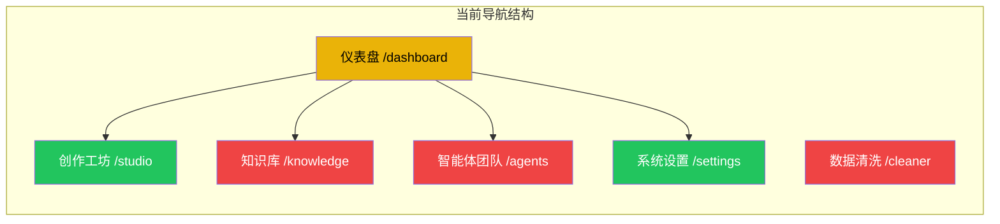
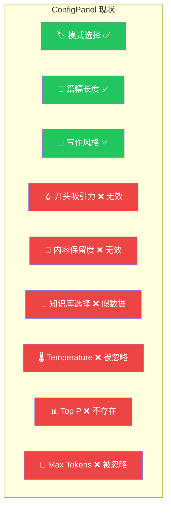
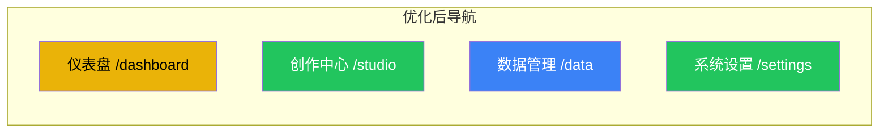

# P27 前端优化设计方案

> 日期: 2026-02-20 | 作者: AI Assistant + 架构师讨论
> 完整页面预览: [P27_完整页面预览.html](file:///d:/AI_Projects/2026001/reports/设计文档/P27_完整页面预览.html)（4页面切换 + 4模式，全交互）
> 配套设计稿: [P27_configpanel_mockup.html](file:///d:/AI_Projects/2026001/reports/设计文档/P27_configpanel_mockup.html)（浏览器打开可交互）
> 架构视图: [P27_前端架构图.html](file:///d:/AI_Projects/2026001/reports/设计文档/P27_前端架构图.html)（Before/After 全景对比 + 4种模式详细视图）

> [!IMPORTANT]
> **核心设计原则**: ConfigPanel 只放配置选项（风格/篇幅/数据源等），模式相关的**数据展示**（Feed、看板、搜索框）放在 Canvas 的**左侧 DataPanel** 中，与 WritingCanvas **左右并排（方案B）**。右侧保留 UnifiedSidebar（进度/版本/日志/导出）。

---

## 一、现状问题总结

### 1.1 当前页面架构



| 颜色 | 含义 |
|------|------|
| 🟢 绿色 | 功能正常，核心页面 |
| 🟡 黄色 | 功能单薄，需增强或简化 |
| 🔴 红色 | 摆设/重叠/脱节，需重构或删除 |

### 1.2 ConfigPanel 6 个无效控件

当前 `ConfigPanel.tsx`（580 行）包含大量前端有 UI 但后端不读取的控件：



**原因分析**:
- Temperature / Top P / Max Tokens: 后端每个 Agent 各自硬编码最优值（策略师 0.85，短篇写手 0.88，审核官 0.1），前端值被完全忽略
- 知识库选择: DeFi / MemeCoin / Layer2 分类没有后端数据源和检索逻辑，纯占位符
- 开头吸引力 / 内容保留度: 后端无对应处理逻辑

### 1.3 页面级问题

| 页面 | 问题 |
|------|------|
| **智能体团队** `/agents` | 纯只读展示卡片，无法操作。点"配置模型"跳 `/settings`。整个页面是 **摆设** |
| **知识库** `/knowledge` | 本质是 Lark 数据清洗/入库工具（594行），与创作流程**完全脱节** |
| **数据清洗** `/cleaner` | 与 Knowledge 功能**高度重叠**，且侧边栏无入口 |
| **仪表盘** `/dashboard` | 仅 2 个健康检查卡片 + 3 个跳转按钮 |
| **侧边栏** | "最近项目"写死了"DeFi 周报"和"Layer 2 深度分析"假数据 |

---

## 二、优化方案

### 2.1 整体布局（确定方案：方案B 左右分栏）

**最终决定**: 采用 **方案B（DataPanel + WritingCanvas 左右并排）**，适配宽屏工作流。

#### 完整布局结构

```
┌── AppSidebar ─┐┌── TopNavbar (Pill) ──────────────────────────┐┌─ RightSidebar ─┐
│               ││ [🏠] | [✨创作中心] [📁数据管理] [素材] [历史] [🔍] ││                │
│ 📊 仪表盘    │├──────────────────────────────────────────────┤│ [进度][版本]   │
│ ✍️ 创作中心   ││ ConfigPanel │ DataPanel    │ WritingCanvas  ││ [日志][导出]   │
│ 📁 数据管理  ││ (180px)     │ (~40% 可拖) │ (flex-1)       ││                │
│ ⚙️ 系统设置   ││ ┌─────────┐ │ ┌──────────┐│ ┌────────────┐ ││ ✅ 策略师    │
│               ││ │模式选择 │ │ │ Feed/    ││ │ 版本 1/2/3 │ ││ ✅ 写手      │
│ ──最近创作── ││ │写作风格 │ │ │ 看板/    ││ │ 富文本输出  │ ││ ⏳ 润色中    │
│ · Berachain  ││ │篇幅长度 │ │ │ 搜索     ││ │ RichEditor │ ││ ⬜ 完成      │
│ · CZ 锐评    ││ └─────────┘ │ └──────────┘│ └────────────┘ ││                │
│               ││             │  ↕ 可拖拽   │                ││                │
├───────────────┤│             │  240-560px  │                │├────────────────┤
│ 👤 Web3 Master││             │             │                ││ 260px          │
└───────────────┘└─────────────┴─────────────┴────────────────┘└────────────────┘
     220px              ConfigPanel + Canvas (flex-1)             RightSidebar
```

> **↑ 完整交互预览: [P27_完整页面预览.html](file:///d:/AI_Projects/2026001/reports/设计文档/P27_完整页面预览.html)**（浏览器打开，4页面+4模式全可切换）

#### 方案B 核心设计

| 设计要素 | 说明 |
|---------|------|
| **数据面板位置** | Canvas 左侧，与 WritingCanvas 左右并排 |
| **面板宽度** | 可拖拽，范围 240px–560px（默认 ~40%） |
| **适配场景** | 宽屏 (≥1440px) 同时查看数据和输出 |
| **无数据模式** | 锐评/短篇等普通模式无 DataPanel，WritingCanvas 独占全宽 |

#### 方案对比总结

| | 方案A (上下折叠) | **方案B (左右分栏) ✅ 选中** |
|--|--|--|
| 数据位置 | Canvas 顶部，折叠/展开 | Canvas 左侧，并排 |
| 数据可见性 | 需手动展开 | **始终可见** |
| 宽屏利用率 | 低（垂直堆叠） | **高（水平铺开）** |
| WritingCanvas 影响 | 高度受压缩 | **零影响** |

---

### 2.2 ConfigPanel 精简化（核心变更）

**整体思路**: ConfigPanel 保持轻量（180px），只放**配置项**。数据展示由新增的 **DataPanel** 组件负责。

#### Before → After 对比

```
┌── Before ──────────────┐     ┌── After ──────────────────────────────────────────────┐
│  ConfigPanel (9项)     │     │  ConfigPanel  │  DataPanel (新)  │  WritingCanvas    │
│                        │     │  (精简)       │  (模式数据)      │  (不变)           │
│  [模式选择]            │     │  [模式选择]   │  吹捧→ Feed      │  📝 RichEditor   │
│  [篇幅长度]            │     │  [写作风格]   │  Kaito→ 看板     │  SSE 流式输出     │
│  [开头吸引力] ← 无效   │     │  [篇幅长度]   │  投研→ 搜索      │  3版本 · 保存     │
│  [写作风格]            │     │               │  普通→ 隐藏      │                   │
│  [内容保留度] ← 无效   │     │  ✅ 只放配置  │  ✅ 只放数据     │  ✅ 零修改        │
│  [知识库] ← 假数据     │     │               │                  │                   │
│  [Temperature] ← 无效  │     │               │                  │                   │
│  [Top P] ← 无效        │     │               │                  │                   │
│  [Max Tokens] ← 无效   │     │               │                  │                   │
└────────────────────────┘     └───────────────┴──────────────────┴───────────────────┘
     9 个控件，6 个无效          Config: 3项 │ DataPanel: 新 │ WritingCanvas: 不改
```

#### 每个模式的完整布局（ConfigPanel + DataPanel + WritingCanvas）

**普通模式（锐评 / 短篇 / 中篇 / 长篇）** — 无 DataPanel，WritingCanvas 独占：

```
┌─ ConfigPanel ──┐ ┌─ Canvas (全宽) ──────────────────────────┐
│ 🎨 写作风格   │ │  [输入研究主题... ⌘+Enter]              │
│ [咪蒙][半佛]  │ │                                         │
│ 📐 篇幅长度   │ │  📝 WritingCanvas (RichEditor)          │
│ [默认][自定义] │ │  SSE流式 · 3版本 · 保存/复制             │
│               │ │                                         │
│ ✅ 只有配置   │ │  无 DataPanel，WritingCanvas 独占 flex-1 │
└───────────────┘ └─────────────────────────────────────────┘
```

**吹捧模式** — DataPanel 展示 Feed，左右并排：

```
┌─ ConfigPanel ──┐ ┌─ DataPanel ─────────┐ ┌─ WritingCanvas ──────┐
│ 🌸 吹捧(选中) │ │ 🌸 币安动态         │ │  📝 RichEditor      │
│ � 吹捧体     │ │ [全部][CZ][何一]    │ │                     │
│ 📐 50-500字   │ │ ┌ @cz_binance 2h ┐ │ │  CZ的又一次降维打击  │
│               │ │ │ Binance...     │ │ │  别人还在研究K线... │
│               │ │ └────────────────┘ │ │                     │
│               │ │ ┌ @heyibinance  ┐ │ │  [版本1][版本2][3]  │
│               │ │ │ Thank you...  │ │ │                     │
│               │ │ └────────────────┘ │ │  [💾][📋][🔄][新建] │
│               │ │ Grok→binance_daily │ │                     │
└───────────────┘ └──── ↕ 可拖拽 ──────┘ └─────────────────────┘
```

**Kaito 嘴撸模式** — DataPanel 展示项目看板：

```
┌─ ConfigPanel ──┐ ┌─ DataPanel ──────────┐ ┌─ WritingCanvas ─────┐
│ 🎯 Kaito(选中)│ │ 🎯 项目看板          │ │  📝 RichEditor     │
│ 🎨 嘴撸体     │ │ [Bera✓][Monad][Sui]  │ │                    │
│ 📐 50-500字   │ │                      │ │  Berachain 正在... │
│               │ │ 💡 推荐角度          │ │                    │
│               │ │ [生态扩展✓][PoL]    │ │  [版本1][版本2][3] │
│               │ │ [社区治理][TVL]      │ │                    │
│               │ │                      │ │                    │
│               │ │ 📰 最新情报          │ │                    │
│               │ │ ⚠️ 重复提醒          │ │                    │
└───────────────┘ └──── ↕ 可拖拽 ────────┘ └────────────────────┘
```

**投研模式** — DataPanel 展示搜索+数据源：

```
┌─ ConfigPanel ──┐ ┌─ DataPanel ──────────┐ ┌─ WritingCanvas ─────┐
│ 🔬 投研(选中) │ │ 🔬 研究数据          │ │  📝 RichEditor     │
│ 📄 输出格式   │ │ [搜索项目名称...]    │ │                    │
│ [⚡Alpha]     │ │                      │ │  投研报告输出区    │
│ [📊完整报告]  │ │ � 数据源            │ │                    │
│               │ │ [CoinGecko✓][DeFi✓] │ │                    │
│               │ │                      │ │                    │
│               │ │ 📈 市场概览          │ │                    │
│               │ │ BTC: $97,850 (+2.3%) │ │                    │
└───────────────┘ └──── ↕ 可拖拽 ────────┘ └────────────────────┘
```

> **↑ 以上所有模式均可在 [完整页面预览](file:///d:/AI_Projects/2026001/reports/设计文档/P27_完整页面预览.html) 中体验**

---

### 2.3 WritingCanvas 影响分析

> [!TIP]
> **结论：WritingCanvas / RichEditor 内部代码 零修改。**

| 组件 | 是否修改 | 说明 |
|------|---------|------|
| `WritingCanvas.tsx` | ❌ 不改 | 内部逻辑（保存/复制/导出/版本切换）完全不受影响 |
| `RichEditor.tsx` | ❌ 不改 | 富文本编辑器与外部布局完全解耦 |
| `StudioLayout.tsx` | ✅ 改布局 | `<main>` 内容区加 flex 分栏容器 |
| WritingCanvas 容器 | ⚠️ 一行 | `max-w-[960px]` → `w-full`（让 flex-1 自然限宽） |
| **DataPanel.tsx** | ✅ **新建** | 纯新组件，根据模式展示 Feed/看板/搜索 |

布局改动仅在 `StudioLayout.tsx`：

```diff
 // StudioLayout.tsx <main> 内容容器:
 <div className="w-full px-4 max-w-6xl">
-    {children}  // WritingCanvas
+    <div className="flex gap-4">
+        {hasDataPanel && <DataPanel mode={mode} />}
+        <div className="flex-1 min-w-0">
+            {children}  // WritingCanvas 原样不动
+        </div>
+    </div>
 </div>
```

---

### 2.4 右侧边栏 (UnifiedSidebar)

右侧边栏**保留不变**，包含 4 个功能 Tab：

| Tab | 图标 | 功能 | 状态 |
|-----|------|------|------|
| 进度 | Activity | Agent 执行时间轴（策略师→写手→审核→润色） | ✅ 已实现 |
| 版本 | History | 创作版本历史（P19） | ✅ 已实现 |
| 日志 | ScrollText | 详细执行日志 | 🔲 占位 |
| 导出 | Download | 导出 MD/HTML | 🔲 占位 |

- **仅在创作中心页面显示**，其他页面（仪表盘/数据管理/设置）不显示
- 宽度 w-72 (288px)，浮动岛屿样式
- 组件: `UnifiedSidebar.tsx` → `IslandContainer position="right"`

#### 代码重构方案

```
    ConfigPanel.tsx (580行单文件)           DataPanel.tsx (新建)
           ↓ 拆分为                              ↓
    ┌──────────────────────────┐    ┌──────────────────────────┐
    │ ConfigPanel.tsx (主框架)  │    │ DataPanel.tsx (主框架)    │  ← switch(mode) 路由
    │   ├─ ModeStandard.tsx    │    │   ├─ BullishFeed.tsx     │  ← CZ/何一/Binance 动态
    │   ├─ ModeBullish.tsx     │    │   ├─ KaitoBoard.tsx      │  ← 项目看板+角度推荐
    │   ├─ ModeKaito.tsx       │    │   └─ ResearchPanel.tsx   │  ← 搜索+数据源+市场
    │   └─ ModeResearch.tsx    │    └──────────────────────────┘
    └──────────────────────────┘    * 普通模式不渲染 DataPanel
```

---

### 2.5 页面整合方案

#### 目标导航结构



| 变更 | Before | After | 理由 |
|------|--------|-------|------|
| **删除** 智能体团队页 | `/agents` 独立页面 | 删除，模型配置已在 `/settings` | 纯只读摆设，所有操作都跳 Settings |
| **合并** 知识库 + 清洗 | `/knowledge` + `/cleaner` 两页 | 合并为 `/data` 数据管理 | 功能重叠，Cleaner 甚至无侧边栏入口 |
| **保留** 仪表盘 | `/dashboard` 独立页 | 保留，增强统计 | 系统概况、API状态、快速入口 |
| **保留** 历史创作 | `/studio?view=history` | 保持 | P27 已实现 |

#### 侧边栏调整（改动量小）

```
Before:                          After:
📊 仪表盘                        📊 仪表盘
✏️ 创作工坊                       ✍️ 创作中心
🧠 知识库 ← 删除                  � 数据管理 ← NEW (合并)
👥 智能体团队 ← 删除              ⚙️ 系统设置
⚙️ 系统设置
⚠️ /cleaner 无入口
```

> **暂不改**: 最近项目（硬编码）、用户信息（硬编码） — 后续再接真数据

---

### 2.6 系统设置页适配

当前系统设置页是**功能最完整的页面**，需要适配以下变更：

| 变更项 | 说明 |
|--------|------|
| 删除 `rewrite` 模式 | `AgentModelConfig.tsx` 的 `MODE_DEFINITIONS` 移除改写润色 |
| 新增 3 个模式 | `bullish_take` / `kaito_yap` / `project_research` 加入模型配置 |
| 智能体模型配置入口整合 | 原 `/agents` 页面的功能保留在 Settings 里（已经在这里） |

---

## 三、执行计划

### 阶段 1: P0 清理（优先，无依赖）

> **目标**: 删除所有已确认无效的代码，让代码库干净。
> **预估**: 1-2 小时

```mermaid
gantt
    title P0 前端清理
    dateFormat X
    axisFormat %s
    section 删除无效控件
    删除 Temperature/TopP/MaxTokens    :0, 20
    删除 Hook Intensity               :20, 30
    删除 Retention Level              :30, 40
    删除 KnowledgeSelector 假数据      :40, 50
    section 删除废弃功能
    删除改写润色模式 (前端+后端)        :50, 70
    删除智能体团队页面                 :70, 80
    删除侧边栏硬编码假数据             :80, 90
    section 验证
    前端编译通过 + 手动烟雾测试         :90, 100
```



### 阶段 2: P1 ConfigPanel 重构 + 新模式

> **目标**: 实现 switch(mode) 动态面板 + 3 个新模式的前端 shell。
> **预估**: 4-6 小时
> **依赖**: P0 完成后

| 步骤 | 内容 |
|------|------|
| 1 | `schema.ts` 新增 `bullish_take` / `kaito_yap` / `project_research` 到 CreationMode |
| 2 | `constants.ts` 更新 `CREATION_MODES` |
| 3 | `ConfigPanel.tsx` 拆分为主框架 + 4 个模式子组件 |
| 4 | 新建 `DataPanel.tsx` + `BullishFeed` / `KaitoBoard` / `ResearchPanel` 子组件 |
| 5 | `StudioLayout.tsx` 加 flex 分栏容器 + WritingCanvas `max-w-[960px]` → `w-full` |
| 6 | 新增模式子组件（吹捧 / Kaito / 投研） — 初期可用 mock 数据 |
| 7 | `AgentModelConfig.tsx` 适配新模式 |

### 阶段 3: P2 页面整合（后续）

> **目标**: 导航精简、数据接通。
> **预估**: 3-5 小时

| 步骤 | 内容 |
|------|------|
| 1 | Knowledge + Cleaner 合并为数据管理页 |
| 2 | StudioNavbar 同步更新（删 agents pill、knowledge → data、更新 UI_TEXT） |
| 3 | 侧边栏接 creation_store API 展示真实历史 |
| 4 | 仪表盘增强（API状态、创作统计、快速入口） |
| 5 | 用户名从 Settings 读取 |

---

## 四、设计资源

| 资源 | 路径 |
|------|------|
| **⭐ 完整页面预览 (4页+4模式)** | [P27_完整页面预览.html](file:///d:/AI_Projects/2026001/reports/设计文档/P27_完整页面预览.html) |
| **前端架构全景图 (Before/After)** | [P27_前端架构图.html](file:///d:/AI_Projects/2026001/reports/设计文档/P27_前端架构图.html) |
| 交互式 ConfigPanel 设计稿 | [P27_configpanel_mockup.html](file:///d:/AI_Projects/2026001/reports/设计文档/P27_configpanel_mockup.html) |
| 方案A/B 对比 Mockup | [P27_数据区方案对比_mockup.html](file:///d:/AI_Projects/2026001/reports/设计文档/P27_数据区方案对比_mockup.html) |
| 模式重构总规划 | [P27_模式重构规划.md](file:///d:/AI_Projects/2026001/reports/设计文档/P27_模式重构规划.md) |
| P27 交接报告 (上次) | [P27_交接报告_0219.md](file:///d:/AI_Projects/2026001/reports/设计文档/P27_交接报告_0219.md) |
