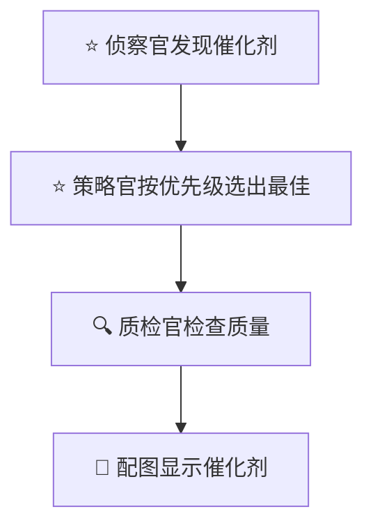
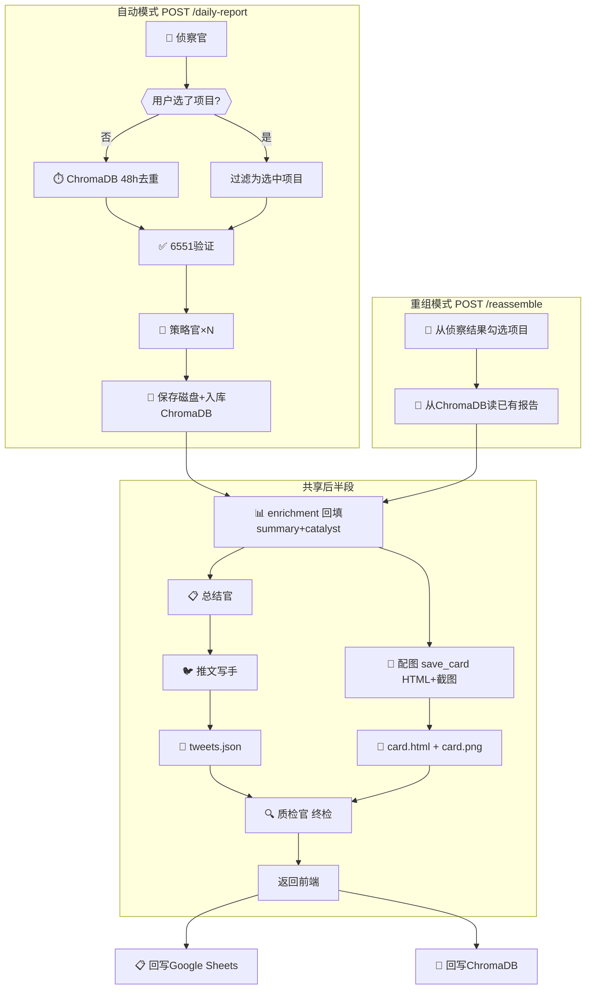

# P36 投研管线修复方案

> 创建时间: 2026-03-10 | 状态: 设计中

## 背景

P35 完成后的全链路深度排查发现管线存在 **6 个问题**，涉及数据丢失、架构设计、冗余逻辑三大类。

---

## 问题清单

### 🔴 P0 — 推文 twitter handle 丢失

**现象**: 前端推文区域无 twitter 账号显示
**根因**: 数据在两个地方丢失：
1. `_save_tweets()` 保存 md 时只写 name/text，丢弃 twitter
2. `GET /latest` 从 md 文件重新解析，再次丢失 twitter

**修复**: `_save_tweets()` 同时保存 JSON（保留所有字段），`/latest` 优先读 JSON

---

### 🔴 P0 — 配图催化剂为空（链路过长+评分冲突）

**现象**: 配图卡片上大部分项目无催化标签

**根因（深度排查确认）**:
催化剂经过4层处理，每层都可能丢数据：
1. 侦察官发现催化剂 ✅
2. 策略官按提示词优先级重新选 → 可能输出"无" ⚠️
3. 代码评分系统再筛一遍 → 评分0的有效事件被丢弃 ❌
4. 最终清理 → "无"被删除 ❌

> [!CAUTION]
> 代码评分系统（评分系统B）和策略官提示词（评分系统A）用**完全相同的关键词**做同一件事，但代码比提示词更严格（评分0直接丢弃），导致催化剂丢失。P34 已发现此问题，标记为"暂保留待观察"但从未移除。

**修复方案 — 简化链路，移除冲突**:



具体操作：
1. **移除** `pick_best_catalyst()` + `_catalyst_importance()` 代码评分系统
2. **移除** enrichment 中的三级 fallback 匹配逻辑
3. **移除** enrichment 中的7天日期检查（策略官提示词已处理）
4. **保留** 策略官提示词里的优先级系统（评分系统A）
5. **新增** 质检官检查催化剂质量：字数超限、是否中文、是否客观、是否被截断

---

### 🔴 P0 — 质检官位置错误 + 职责扩展

**现象**: 质检官在 enrichment 之后、推文/配图之前运行，检查的是中间数据而非最终产物

**修复后顺序**:
```
enrichment → 总结官 → 推文 → 配图 → 质检官（终检） → Sheets
```

**质检官职责（P36扩展）**:
- 催化剂文本被截断 → 补全
- 催化剂是英文 → 翻译成中文
- 催化剂含主观预测 → 删除只保留事实
- 催化剂字数超限（配图空间） → 精简
- 是否调用了最佳催化剂 → 确认

**P36 质检官提示词设计**（替换现有 `reviewer.jinja2`）：

```jinja2
{# P36: Reviewer（质检官）— 配图数据终检 prompt #}
你是投研配图质检员。检查以下项目的催化事件和一句话定位，修复问题后原样返回。

检查项：
1. 催化文本被截断导致语义不完整 → 补全
2. 催化是英文 → 翻译成中文
3. 催化含主观预测（即将爆发/将带动/有望）→ 删除只保留客观事实
4. 催化字数超过20字 → 精简到20字以内，保留核心信息
5. 一句话定位被截断导致不通顺 → 修复
6. 一句话定位超过30字 → 精简

输入格式：
项目名 | 催化事件 | 一句话定位

输出格式（严格保持一致，每行一个项目）：
项目名 | 修复后催化 | 修复后定位

不要添加任何说明、编号或额外文字，只输出修复后的表格行。
```

**对比旧版变化**：
| | 旧版（P34） | 新版（P36） |
|--|--|--|
| 超7天输出"无" | ✅ 有 | ❌ 移除（侦察阶段已过滤） |
| 字数超限检查 | ❌ 没有 | ✅ 新增（催化≤20字，定位≤30字） |
| 主观预测处理 | ✅ 保留 | ✅ 保留 |

---

### 🟡 P1 — 主推文极短

**现象**: 主推文（tweets[0]）有时仅 9 字（"今日发现，值得围观"）
**根因**: LLM 输出不稳定

**修复**: 主推文生成后加最小长度检查（≥50字），不足则用 fallback 模板拼接项目亮点

---

### 🟡 P1 — Sheets / ChromaDB 去重冗余

**现象**: Sheets `dedup_filter` 和 ChromaDB `get_recent_reports(48h)` 功能重叠
**根因**: ChromaDB 是 P35 新增，Sheets 是 P32 旧逻辑，未清理

**修复**: 
- 去重统一用 ChromaDB
- Sheets 降为**只写**（末尾回写用于外部可视性）
- 移除 `dedup_filter` 对 Sheets 的依赖

---

### 🟡 P1 — 日报渲染冗余

**现象**: `report.jinja2` 把策略官各项目报告拼成一个 `daily_research_{date}.md`
**根因**: 策略官已将完整报告保存到磁盘，二次渲染只是加标题串起来，无新增内容

**修复**: 移除日报渲染。`GET /latest` 直接从磁盘读策略官报告拼接返回，前端展示不变。

---

### 🟢 P2 — enrichment name 匹配不稳定

**现象**: LLM 改变项目名称（如 Anchorage → Anchorage Digital），导致匹配失败
**修复**: enrichment 已有 twitter+name 双路径匹配，增加模糊子串匹配

---

## P36 修复后完整管线（统一视图）



> [!IMPORTANT]
> **数据依赖（代码实际逻辑）**:
> - `总结官` 用的是 `analysis_results`（策略官原始报告）
> - `推文写手` 需要 `summary`(总结官) + `enriched_projects[:6]`(enrichment)
> - `配图` 需要 `enriched_projects`(enrichment)，与推文**独立并行**
> - ChromaDB去重**仅在无用户选择时**执行（代码 `if not selected_projects:`）
> - `save_card` 内部包含 HTML生成 + Playwright截图，是一个函数

---

## P36 安全执行方案

> [!IMPORTANT]
> 所有修改按**依赖顺序分4个阶段**执行，每个阶段独立验证，通过后再进入下一阶段。任何阶段失败可单独回滚。

### 阶段一：数据保全（最低风险）

**目标**：先修复数据丢失，不改架构

| 修改项 | 文件 | 操作 | 风险 |
|--------|------|------|------|
| tweets 保存 JSON | `daily_report_service.py` | `_save_tweets()` 追加保存 `.json` | 低：新增文件，不影响旧逻辑 |
| `/latest` 读 JSON | `research.py` | 优先读 `.json`，降级读 `.md` | 低：有降级兜底 |

**验证**：运行管线 → 检查 `tweets_{date}.json` 存在 → `/latest` 返回含 twitter 的推文

**回滚**：删除 JSON 相关代码，恢复纯 md 读取

---

### 阶段二：催化剂链路简化（核心修复）

**目标**：移除冲突的代码评分系统，简化催化剂链路

| 修改项 | 文件 | 操作 | 风险 |
|--------|------|------|------|
| 移除代码评分系统 | `card_generator.py` | 删除 `pick_best_catalyst()` + `_catalyst_importance()` | 中：移除约120行 |
| 移除三级 fallback | `daily_report_service.py` | enrichment 中删除催化剂三级匹配，改为直取策略官输出 | 中：改变催化剂来源 |
| 无催化剂项目过滤 | `daily_report_service.py` | enrichment 前过滤催化剂为空的项目 | 中：可能减少项目数 |
| 策略官输出"无"时保留侦察官催化剂 | `daily_report_service.py` | enrichment 逻辑调整 | 低 |

**执行安全措施**：
1. 先给 `pick_best_catalyst` 加日志，跑一次管线记录旧逻辑选了什么
2. 切换新逻辑后对比结果，确认催化剂覆盖率**上升**而非下降
3. 保留 `pick_best_catalyst` 代码（注释掉），30天观察后再物理删除

**验证**：运行管线 → 配图卡片催化标签覆盖率 ≥ 80%（目前约 30%）

**回滚**：取消注释 `pick_best_catalyst`，恢复三级 fallback

---

### 阶段三：质检官调整（位置+提示词）

**目标**：质检官移到管线末尾，更新提示词

| 修改项 | 文件 | 操作 | 风险 |
|--------|------|------|------|
| 质检官位置移动 | `daily_report_service.py` | `run_reviewer` 从 enrichment 后移到推文+配图生成后 | 中：需调整函数调用顺序 |
| 更新提示词 | `reviewer.jinja2` | 替换为 P36 版本（移除7天规则，新增字数检查） | 低：提示词替换 |

**执行安全措施**：
1. 先单独测试新提示词（用旧数据调用 LLM，对比旧版输出）
2. 质检官移位时保留旧位置代码（注释），确认新位置工作后再删

**验证**：运行管线 → 质检官输入是最终推文+催化剂 → 输出修正后格式正确

**回滚**：取消注释旧位置调用，恢复旧提示词

---

### 阶段四：去重清理（低优先级）

**目标**：移除冗余逻辑，清理架构

| 修改项 | 文件 | 操作 | 风险 |
|--------|------|------|------|
| Sheets 去重移除 | `daily_report_service.py` | 删除 `dedup_filter` Sheets 读取 | 低：ChromaDB 已兜底 |
| 日报渲染移除 | `daily_report_service.py` | 删除 `report.jinja2` 调用 | 低：前端不依赖此文件 |
| 推文长度检查 | `daily_report_service.py` | 主推文 ≥50 字，不足用模板 | 低：新增兜底 |
| name 模糊匹配 | `daily_report_service.py` | enrichment 增加子串匹配 | 低：补充逻辑 |

**验证**：全管线 + 重组模式各运行一次，确认功能完整

---

### 风险矩阵

| 阶段 | 风险等级 | 影响范围 | 回滚难度 |
|------|----------|----------|----------|
| 阶段一 数据保全 | 🟢 低 | 推文保存/读取 | 简单 |
| 阶段二 催化剂简化 | 🟡 中 | 配图催化剂显示 | 中等（注释恢复） |
| 阶段三 质检官调整 | 🟡 中 | 质检时机和结果 | 中等（注释恢复） |
| 阶段四 去重清理 | 🟢 低 | 去重+日报+推文 | 简单 |

> [!TIP]
> **推荐节奏**：每阶段完成后跑一次完整管线验证，通过后再进入下一阶段。阶段一和阶段四可独立执行，阶段二和三有依赖关系（质检官需要配合新催化剂逻辑）。
