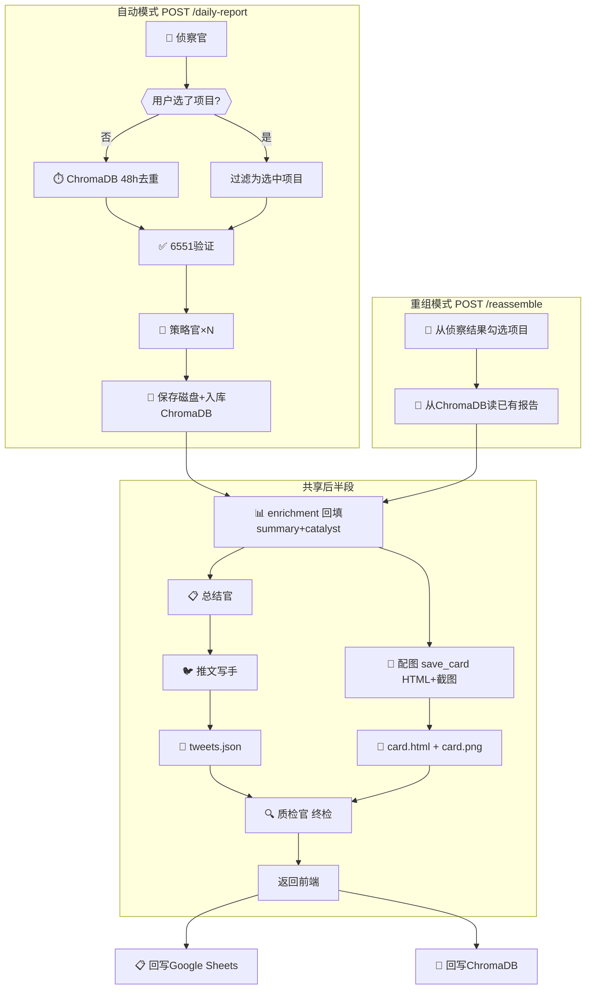

# P36 投研管线修复方案

> 创建时间: 2026-03-10 | 状态: 设计中

## 背景

P35 完成后的全链路深度排查发现管线存在 **6 个问题**，涉及数据丢失、架构设计、冗余逻辑三大类。

---

## 问题清单

### 🔴 P0 — 推文 twitter handle 丢失

**现象**: 前端推文区域无 twitter 账号显示
**根因**: 数据在两个地方丢失：
1. `_save_tweets()` 保存 md 时只写 name/text，丢弃 twitter
2. `GET /latest` 从 md 文件重新解析，再次丢失 twitter

**修复**: `_save_tweets()` 同时保存 JSON（保留所有字段），`/latest` 优先读 JSON

---

### 🔴 P0 — 配图催化剂为空

**现象**: 配图卡片上大部分项目无催化标签
**根因**: 
- 策略官输出 `卡片催化剂: 无。` 时，fallback 到 `pick_best_catalyst()`
- `pick_best_catalyst()` 的 importance 评分过滤门槛过高，把大部分催化事件过滤掉了

**修复**: 降低 `pick_best_catalyst` 过滤门槛；当 `卡片催化剂` 非空非"无"时直接采用，跳过 importance 检查

---

### 🔴 P0 — 质检官位置错误

**现象**: 质检官在 enrichment 之后、推文/配图之前运行，检查的是中间数据而非最终产物
**设计意图**: 质检官应替代人工，检查**最终呈现的内容**（推文格式、配图催化、内容完整性）

**当前顺序**:
```
enrichment → 质检官 → 总结官 → 推文 → 配图 → 日报 → Sheets
```

**修复后顺序**:
```
enrichment → 总结官 → 推文 → 配图 → 日报 → 质检官（终检） → Sheets
```

质检官移到最后，检查最终产物质量。

---

### 🟡 P1 — 主推文极短

**现象**: 主推文（tweets[0]）有时仅 9 字（"今日发现，值得围观"）
**根因**: LLM 输出不稳定

**修复**: 主推文生成后加最小长度检查（≥50字），不足则用 fallback 模板拼接项目亮点

---

### 🟡 P1 — Sheets / ChromaDB 去重冗余

**现象**: Sheets `dedup_filter` 和 ChromaDB `get_recent_reports(48h)` 功能重叠
**根因**: ChromaDB 是 P35 新增，Sheets 是 P32 旧逻辑，未清理

**修复**: 
- 去重统一用 ChromaDB
- Sheets 降为**只写**（末尾回写用于外部可视性）
- 移除 `dedup_filter` 对 Sheets 的依赖

---

### 🟡 P1 — 日报渲染冗余

**现象**: `report.jinja2` 把策略官各项目报告拼成一个 `daily_research_{date}.md`
**根因**: 策略官已将完整报告保存到磁盘，二次渲染只是加标题串起来，无新增内容

**修复**: 移除日报渲染。`GET /latest` 直接从磁盘读策略官报告拼接返回，前端展示不变。

---

### 🟢 P2 — enrichment name 匹配不稳定

**现象**: LLM 改变项目名称（如 Anchorage → Anchorage Digital），导致匹配失败
**修复**: enrichment 已有 twitter+name 双路径匹配，增加模糊子串匹配

---

## P36 修复后完整管线（统一视图）



> [!IMPORTANT]
> **数据依赖（代码实际逻辑）**:
> - `总结官` 用的是 `analysis_results`（策略官原始报告）
> - `推文写手` 需要 `summary`(总结官) + `enriched_projects[:6]`(enrichment)
> - `配图` 需要 `enriched_projects`(enrichment)，与推文**独立并行**
> - ChromaDB去重**仅在无用户选择时**执行（代码 `if not selected_projects:`）
> - `save_card` 内部包含 HTML生成 + Playwright截图，是一个函数

---

## 验证计划

1. 完整管线运行：检查配图催化剂、推文 twitter handle、主推文长度
2. 重组模式运行：同上
3. ChromaDB 去重：确认 Sheets 读取已移除
4. 质检官终检：确认检查的是最终产物
5. 完整报告：确认从 ChromaDB 读策略官报告正常显示
6. 回写：确认 Sheets + ChromaDB 双写成功


