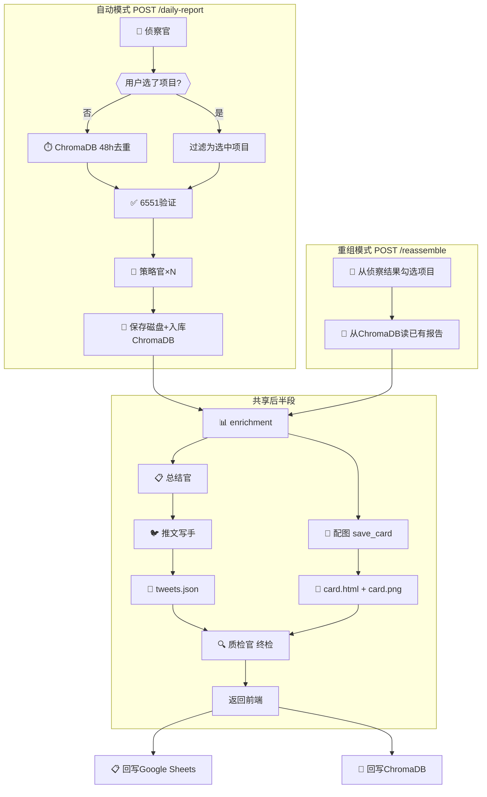
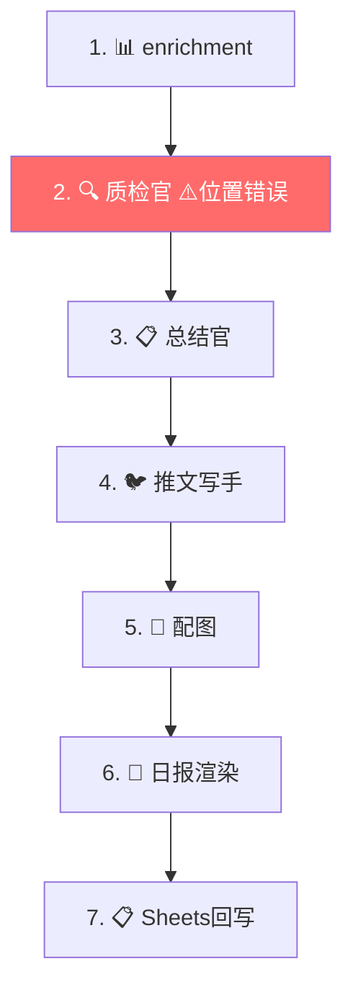
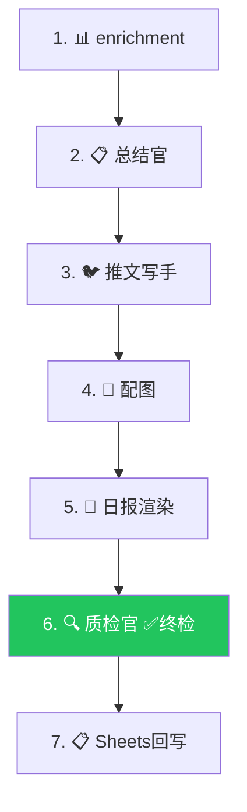
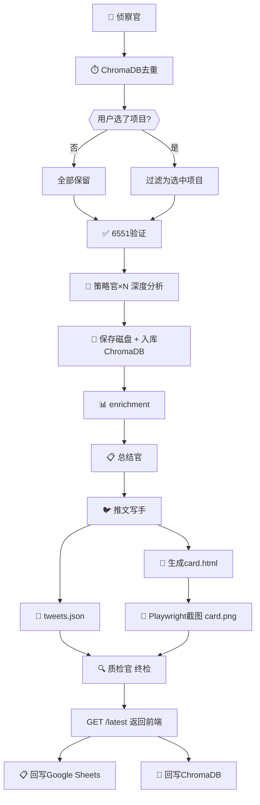
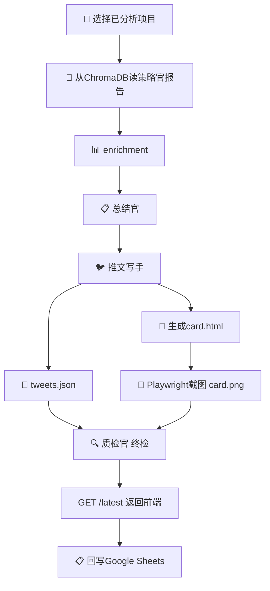
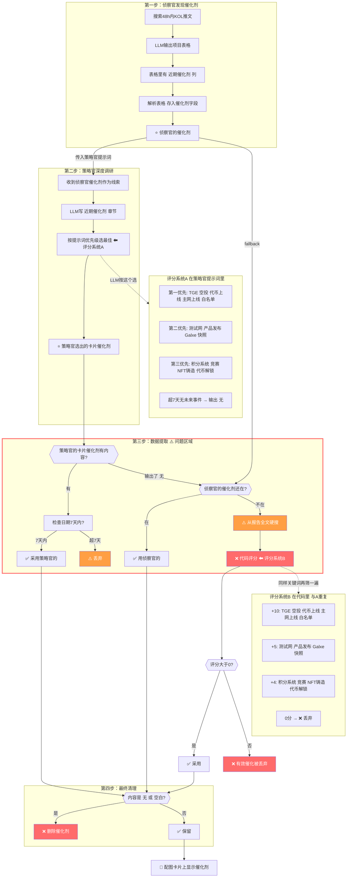
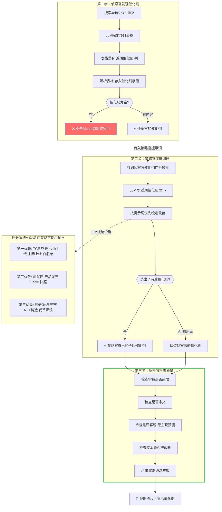

# 投研管线全链路深度排查报告

> 排查时间: 2026-03-10 17:40 | 基于 20260310 运行数据

---

## 管线流程图

### 完整管线：自动模式 + 重组模式（统一视图）



### 后半段：当前顺序 ❌ vs P36目标顺序 ✅

````carousel
**当前代码顺序（有问题）**


<!-- slide -->
**P36 目标顺序（质检官移到最后）**


````

### 关键说明

> [!WARNING]
> **质检官位置错误**: 当前在第2步（检查中间数据），应移到第6步（终检最终产物）。详见 [P36 修复方案](file:///d:/AI_Projects/2026001/reports/设计文档/P36_投研管线修复方案.md)

> [!NOTE]
> **Sheets/ChromaDB 去重冗余**: 去重统一用 ChromaDB，Sheets 降为只写。
> **6551验证**: 位于侦察官之后、策略官之前，验证侦察官 twitter handle。重组模式跳过。

### P36修复后：自动模式 vs 重组模式对比

````carousel
**自动模式 `POST /daily-report`**


<!-- slide -->
**重组模式 `POST /reassemble`**


<!-- slide -->
**对比总结**

| | 自动模式 | 重组模式 |
|--|---------|---------|
| 侦察官 | ✅ | ❌ 跳过 |
| ChromaDB去重 | ✅ | ❌ 跳过 |
| 6551验证 | ✅ | ❌ 跳过 |
| 策略官分析 | ✅ 新生成 | ❌ 从ChromaDB读 |
| enrichment | ✅ | ✅ |
| 总结官 | ✅ | ✅ |
| 推文写手 | ✅ | ✅ |
| card.html+截图 | ✅ | ✅ |
| 质检官终检 | ✅ | ✅ |
| 回写Sheets | ✅ | ✅ |
| 回写ChromaDB | ✅ | ❌ 已存在 |
````

---

## 催化剂完整链路（全部组件）



### 问题总结

| 问题 | 说明 |
|------|------|
| ❌ 两套评分系统完全重复 | 策略官提示词（LLM选）和代码评分（代码选）用同样的关键词做同一件事 |
| ❌ 代码评分丢弃有效催化 | 不含关键词的事件评分0被丢弃 |
| ❌ 链路过长 | 侦察官选过→策略官选过→代码又选一遍 |
| ⚠️ 7天检查重复 | 策略官Prompt已说"超7天输出无"，代码又检查一遍 |
| ⚠️ 正则硬搜不可靠 | 全文搜索容易匹配错误段落 |

> [!CAUTION]
> P34 已发现评分重复，标记为"暂保留待观察"，但从未移除。

### P36 修复后：催化剂链路



**核心改动**：
- 侦察阶段就过滤无催化剂项目（不是Alpha不入报告）
- 移除代码评分系统B + 三级fallback + 7天日期检查 + 正则硬搜
- 质检官只做质量检查，不重新选催化剂

---

## 🔴 已确认的严重问题

### 问题 1: 推文 twitter handle 在 API 层丢失

**严重度**: 🔴 高
**位置**: [research.py L72-92](file:///d:/AI_Projects/2026001/backend/app/api/research.py#L72-L92)

**根因**: `/api/research/latest` 不直接返回管线生成的推文数据，而是从 `tweets_{date}.md` 文件**重新解析**。解析代码只提取 `name` 和 `text`，完全丢失 `twitter` 字段。

**数据丢失链路**:
```
管线生成 tweets[] (含 twitter) → _save_tweets() 保存md (丢弃 twitter) → /latest 重新解析md (无 twitter)
```

**修复方向**: 
- 方案A: `_save_tweets()` 保存 JSON 格式（保留所有字段），`/latest` 直接读 JSON
- 方案B: `_save_tweets()` 写入 markdown 时在标题附带 handle（如 `## Decibel (@DecibelTrade)`），解析时提取

---

### 问题 2: 推文 twitter handle 3级匹配仍然失效

**严重度**: 🔴 高
**位置**: [daily_report_service.py L727-741](file:///d:/AI_Projects/2026001/backend/app/services/daily_report_service.py#L727-L741)

**根因**: 即使管线内的 3 级匹配成功找到了 twitter，数据也会被问题1阻断（保存→重新解析→丢失）。此外，LLM 推文文本的第一行格式为 `项目名称：Anchorage Digital @Anchorage`，但正则 `name_match` 在 `@` 处截断名字，得到的 `name` 是 "Anchorage Digital"，而项目数据里是 "Anchorage"，名称不一致。

**现场数据佐证**:
```
enriched_projects[]: name="Anchorage", twitter="@Anchorage"
LLM 推文解析:        name="Anchorage Digital"  ← 不一致
handle_map:          "anchorage" → "@Anchorage"   ← 精确匹配失败
包含匹配:            "anchorage" in "anchorage digital" → ✅ 应命中
```

> [!NOTE]
> 3 级匹配的"包含匹配"理论上可以命中（子串匹配），但被问题1完全阻断。需要先修问题1。

---

### 问题 3: 配图催化剂为空

**严重度**: 🔴 高
**位置**: [daily_report_service.py L400-549](file:///d:/AI_Projects/2026001/backend/app/services/daily_report_service.py#L400-L549)

**根因**: enrichment 的催化剂提取优先读 `卡片催化剂:` 行，找到后还要过**日期新鲜度检查**（7天）和**重要性评分**。今天的报告中：

| 项目 | `卡片催化剂:` 行 | 结果 |
|------|-----------------|------|
| Anchorage | `卡片催化剂: 无。` | ❌ 被"无"过滤 |
| KAST | `卡片催化剂: 2026-03-06 ...Pengu Black Card` | ⚠️ 日期在 7 天内OK, 但 importance 评分可能为 0 |
| Utexo | `卡片催化剂: 2026-03-06 ...Tether领投750万美元` | ✅ 有效（融资=高分） |
| Whop | 未检查 | 需确认 |
| LayerZero | 未检查 | 需确认 |

**问题链路**: 策略官 → 输出 `卡片催化剂: 无。` → enrichment 正确忽略"无" → fallback 到正则提取 `## 近期催化剂` 章节 → `pick_best_catalyst()` → importance 过滤 → **空**

> [!IMPORTANT]
> 当 `卡片催化剂: 无。` 时，enrichment fallback 到从 `## 近期催化剂` 正文提取，但 `pick_best_catalyst()` 的 importance 评分可能把所有候选都过滤掉了（不够"重要"）。

---

### 问题 4: 推文极短（仅 7-9 字）

**严重度**: 🟡 中
**位置**: 主推文生成（[daily_report_service.py L773-832](file:///d:/AI_Projects/2026001/backend/app/services/daily_report_service.py#L773-L832)）

**根因**: 主推文（`tweets[0]`）由 LLM 二次生成，prompt 要求"悬念引导 + 标语"。LLM 有时只生成很短的文本如"今日发现，值得围观"（9字）。这是 LLM 不稳定输出，非代码 bug。

**影响**: 配上极短推文发布到 X 会显得不专业

**修复方向**: 在主推文生成后加最小长度检查，不足则用 fallback 模板拼接

---

## 🟡 潜在风险

### 问题 5: enrichment name 匹配不稳定

**位置**: [daily_report_service.py L437-445](file:///d:/AI_Projects/2026001/backend/app/services/daily_report_service.py#L437-L445)

**描述**: enrichment 使用双路径匹配（twitter handle + name），但：
- twitter 方式依赖侦察官解析的 `@handle` 和策略官报告文件名一致
- name 方式要求精确匹配，但策略官可能输出不同名称（"0G Labs" vs "0G"）

**影响**: 可能导致 summary/catalyst 回填到错误项目或完全找不到

---

### 问题 6: 重组模式数据不完整

**位置**: [research.py /reassemble endpoint](file:///d:/AI_Projects/2026001/backend/app/api/research.py#L260-L340)

**描述**: 重组模式从磁盘 `load_analysis_from_disk()` 重新读取报告，但：
- 不经过 6551 验证
- 不入库 ChromaDB
- 推文/配图由后半段管线重新生成

**影响**: 重组和正常模式的输出质量可能不一致

---

### 问题 7: 进度条显示不准

**位置**: [ProgressTab.tsx](file:///d:/AI_Projects/2026001/frontend/src/features/studio/components/sidebar/ProgressTab.tsx)

**描述**: 前端进度条基于 `statusMessage` 关键词匹配，后端单次请求无中间状态推送，导致显示不准确（如"日报组装"出现在侦察阶段）

**影响**: 用户体验混乱

---

## 修复优先级建议

| 优先级 | 问题 | 修复复杂度 | 说明 |
|--------|------|-----------|------|
| **P0** | #1 推文 twitter 丢失 | 低 | `_save_tweets` + `/latest` 双改，保留 twitter 字段 |
| **P0** | #3 配图催化剂为空 | 中 | 降低 `pick_best_catalyst` 的过滤门槛 or 直接采用 `## 近期催化剂` 首条 |
| **P1** | #4 主推文极短 | 低 | 加最小长度 fallback |
| **P1** | #5 enrichment 匹配 | 中 | 加模糊匹配 |
| **P2** | #7 进度条 | 高 | 需要 SSE/WebSocket |
| **P2** | #6 重组一致性 | 低 | 接受现状或小改 |
