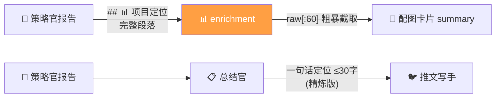
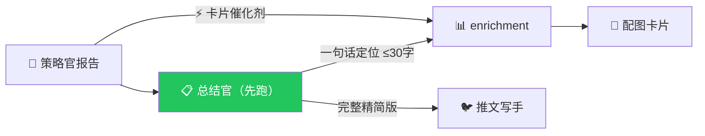

# P37 管线优化：卡片摘要精炼 + Grok Fallback

> 创建时间: 2026-03-15 | 状态: 设计中

## 背景

P36 修复后管线运行正常，但仍有两个问题：
1. **卡片描述溢出**：enrichment 从策略官报告粗暴截取前 60 字作为 `summary`，导致配图卡片文字超出边界
2. **Surf API 余额不足**：侦察官和策略官依赖 Surf API，余额 0 时管线直接失败

---

## 问题 1：卡片摘要来源不合理

### 当前链路（策略官 → enrichment → 卡片）



**问题**：
- enrichment 和总结官都从策略官报告提取项目定位，但方式不同
- enrichment 用 `raw[:60]` 硬截断 → **粗暴、易溢出**
- 总结官用 LLM 精炼到 ≤30 字 → **精炼、适配卡片**
- 两者互不通信，总结官的精炼结果被浪费

### 代码佐证

**enrichment** ([daily_report_service.py L507-533](file:///d:/AI_Projects/2026001/backend/app/services/daily_report_service.py#L507-L533)):
```python
# 从策略官报告的 "## 📊 项目定位" 段落提取
pos_match = POS_PATTERN.search(content)  # content = 策略官原始报告
raw = lines[0]
p["summary"] = raw[:60]  # ← 粗暴截取
```

**总结官** ([summarizer.jinja2](file:///d:/AI_Projects/2026001/backend/data/prompts/research/summarizer.jinja2)):
```
每个项目保留以下 3 个板块：
1. 一句话定位（不超过30字）  ← LLM 精炼，完美适配卡片
2. 团队与背书
3. 关键事件
```

**执行顺序** ([daily_report_service.py L1121-1139](file:///d:/AI_Projects/2026001/backend/app/services/daily_report_service.py#L1121-L1139)):
```python
enriched_projects = _enrich_projects_from_analysis(projects, analysis_results)  # ← 先
summary = run_summarizer(analysis_results, api_config)                          # ← 后
tweets = run_tweet_writer(summary, card_projects, api_config)
card_path = run_card_generator(enriched_projects, date_str)
```

### 修复方案



---

## 问题 2：Surf API 无 Fallback

### 当前状态

侦察官和策略官都依赖 Surf API，余额 0 时直接返回空结果。

### 已实施的临时修复

在 `run_scout()` 和 `_analyze_single_project()` 中添加了 Grok fallback：

```python
# Surf 失败 → Grok fallback
if result["status"] != 200:
    grok_text = generate_text(prompt=user_prompt, provider="grok", ...)
```

### 已发现的 Grok 数据质量问题

| 问题 | 原因 | 修复 |
|------|------|------|
| Twitter 列显示 KOL 源账号 | Grok 把搜索的源账号混入 Twitter 列 | `_clean_twitter_field()` 过滤已知 KOL handle |
| 主推文为 0 | 本地 `ARK_API_KEY` 可能过期 | 确认本地 `.env` Key 有效 |

---

## 三步详细排查

### Step 1: 策略官 `_analyze_single_project()`

| 项 | 内容 |
|-----|------|
| **文件** | [daily_report_service.py L244-340](file:///d:/AI_Projects/2026001/backend/app/services/daily_report_service.py#L244-L340) |
| **Prompt** | [analyst.jinja2](file:///d:/AI_Projects/2026001/backend/data/prompts/research/analyst.jinja2) |
| **输入** | 单个项目 `{name, twitter, category, token, stage, catalyst}` |
| **输出** | `{name, twitter, content, elapsed, error}` |
| **LLM** | Surf API (surf-1.5) → Grok fallback |
| **关键输出段落** | `## 项目定位`（完整描述，50-200字）、`⚡ 卡片催化剂: YYYY-MM-DD 一句话`（≤30字） |

**策略官输出示例**：
```markdown
## 项目定位
Monad是一个高性能EVM兼容Layer 1区块链，通过并行执行实现10,000 TPS、
1秒区块时间和即时确认，同时保持完全EVM字节码兼容性。

## 近期催化剂
- 2026-03-10 测试网第二阶段开放
- 2026-Q2 主网预计上线
卡片催化剂: 2026-03-10 测试网第二阶段开放
```

### Step 2: 总结官 `run_summarizer()`

| 项 | 内容 |
|-----|------|
| **文件** | [daily_report_service.py L387-448](file:///d:/AI_Projects/2026001/backend/app/services/daily_report_service.py#L387-L448) |
| **Prompt** | [summarizer.jinja2](file:///d:/AI_Projects/2026001/backend/data/prompts/research/summarizer.jinja2) |
| **输入** | `analysis_results` — 所有策略官报告拼接成一个长文本 |
| **输出** | `summary: str` — 所有项目的精简版（每个 3 板块） |
| **LLM** | volcengine (默认) |
| **关键输出格式** | 每个项目：`1. 一句话定位（≤30字）` + `2. 团队与背书` + `3. 关键事件` |

**总结官输出示例**：
```markdown
## Monad
1. 一句话定位：高性能EVM兼容L1链，支持万级TPS
2. 团队与背书：...
3. 关键事件：...
```

> [!IMPORTANT]
> 总结官输出是**纯文本字符串**，不是结构化对象。需要正则解析才能提取每个项目的一句话定位。

### Step 3: enrichment `_enrich_projects_from_analysis()`

| 项 | 内容 |
|-----|------|
| **文件** | [daily_report_service.py L458-559](file:///d:/AI_Projects/2026001/backend/app/services/daily_report_service.py#L458-L559) |
| **输入** | `projects` + `analysis_results` (策略官原始报告) |
| **输出** | `enriched_projects` — 每个项目增加 `summary` 和 `catalyst` 字段 |
| **不调用 LLM** | 纯正则提取 |
| **summary 来源** | 策略官报告 `## 📊 项目定位` 第一段 → `raw[:60]` |
| **catalyst 来源** | 策略官报告 `⚡ 卡片催化剂: xxx` 行 |
| **匹配方式** | twitter handle 优先 → name 精确 → name 模糊子串 |

### 下游消费者

| 消费者 | 需要 enrichment 输出 | 需要总结官输出 |
|--------|---------------------|---------------|
| 推文写手 `run_tweet_writer` | ✅ `card_projects[:6]`（含 summary, catalyst） | ✅ `summary`（精简版文本） |
| 配图生成 `run_card_generator` | ✅ `enriched_projects`（summary → 卡片描述, catalyst → 红色标签） | ❌ |
| 质检官 `run_reviewer` | ✅ `enriched_projects`（检查 summary + catalyst） | ❌ |
| Sheets 回写 | ✅ `enriched_projects` | ❌ |
| 日报渲染 | ❌ 直接用 `analysis_results` | ❌ (fallback 用 `summary`) |

---

## 改动方案

### 改动 1: 调换执行顺序（总结官先跑）

**文件**: [daily_report_service.py L1121-1127](file:///d:/AI_Projects/2026001/backend/app/services/daily_report_service.py#L1121-L1127)

```diff
-    # ===== enrichment — 从策略官报告回填 summary + catalyst =====
-    _progress("enrich", "提取项目定位与催化剂...")
-    enriched_projects = _enrich_projects_from_analysis(projects, analysis_results)
-
-    # ===== 总结官（总结归纳） =====
-    _progress("summarizer", "总结归纳分析报告...")
-    summary = run_summarizer(analysis_results, api_config)
+    # ===== 总结官（先跑，生成精炼定位） =====
+    _progress("summarizer", "总结归纳分析报告...")
+    summary = run_summarizer(analysis_results, api_config)
+
+    # ===== enrichment — 从总结官+策略官回填 summary + catalyst =====
+    _progress("enrich", "提取项目定位与催化剂...")
+    enriched_projects = _enrich_projects_from_analysis(projects, analysis_results, summary)
```

**风险**: 🟢 低。两者互不依赖，只是调换调用顺序。

---

### 改动 2: enrichment 优先读总结官的一句话定位

**文件**: [daily_report_service.py L458-533](file:///d:/AI_Projects/2026001/backend/app/services/daily_report_service.py#L458-L533)

函数签名增加 `summary_text` 参数：

```diff
 def _enrich_projects_from_analysis(
     projects: list[dict],
     analysis_results: list[dict],
+    summary_text: str = "",
 ) -> list[dict]:
```

summary 提取逻辑改为：

```python
# 优先从总结官输出提取一句话定位
summarizer_summaries = _parse_summarizer_positions(summary_text)

for p in projects:
    name_key = p.get("name", "").lower().strip()
    
    # 优先用总结官的精炼定位（≤30字）
    if name_key in summarizer_summaries:
        p["summary"] = summarizer_summaries[name_key]
    elif content:
        # Fallback: 从策略官报告截取（老逻辑）
        p["summary"] = raw[:60]
```

新增解析函数：

```python
def _parse_summarizer_positions(summary_text: str) -> dict:
    """从总结官输出中解析每个项目的一句话定位"""
    positions = {}
    # 匹配 "## 项目名" 后面的 "1. 一句话定位：xxx" 或 "一句话定位：xxx"
    pattern = re.compile(
        r"##\s*(.+?)\s*\n.*?一句话定位[：:]\s*(.+?)(?:\n|$)",
        re.DOTALL
    )
    for match in pattern.finditer(summary_text):
        name = match.group(1).strip().lower()
        position = match.group(2).strip()
        positions[name] = position[:40]  # 安全上限 40 字
    return positions
```

**风险**: 🟡 中。需要确保正则能匹配总结官的实际输出格式。有 fallback 到旧逻辑兜底。

---

### 改动 3: 总结官 prompt 增加输出格式约束

**文件**: [summarizer.jinja2](file:///d:/AI_Projects/2026001/backend/data/prompts/research/summarizer.jinja2)

```diff
 每个项目保留以下 3 个板块（每项 100-200 字）：
-1. 一句话定位（不超过30字）
+1. 一句话定位（不超过20字，格式：「⚡ 卡片定位: xxx」）
 2. 团队与背书（融资金额与领投方、核心成员背景）
 3. 关键事件（TGE状态、代币分配与解锁、空投、当前活动等）
```

**风险**: 🟢 低。只改 prompt 格式约束。

---

### 改动 4: Twitter 字段清洗（已实施）

**文件**: [scout.py](file:///d:/AI_Projects/2026001/backend/app/agents/research/scout.py)

已添加 `_clean_twitter_field()` 函数，过滤 KOL 信源账号。

**状态**: ✅ 已完成

---

### 改动 5: Grok Fallback（已实施）

**文件**: [daily_report_service.py](file:///d:/AI_Projects/2026001/backend/app/services/daily_report_service.py)

已在 `run_scout()` 和 `_analyze_single_project()` 添加 Grok fallback。

**状态**: ✅ 已完成

---

## 验证计划

### 自动验证
1. 本地启动后端 → 点击侦察官搜索 → 确认 Grok fallback 生效 + Twitter 清洗生效
2. 点击生成日报 → 检查配图卡片 summary 是否 ≤20 字
3. 检查推文是否正常生成（确认 ARK_API_KEY 有效）

### 对比验证
- 记录改动前后的配图截图，对比 summary 长度和质量

---

## 风险矩阵

| 改动 | 风险 | 影响范围 | 回滚难度 |
|------|------|----------|----------|
| 调换顺序 | 🟢 低 | 执行顺序 | 简单（换回来） |
| enrichment 读总结官 | 🟡 中 | 卡片 summary | 简单（有 fallback） |
| prompt 格式约束 | 🟢 低 | 总结官输出 | 简单（恢复旧 prompt） |
| Twitter 清洗 | 🟢 低 | 侦察官输出 | 简单（删除函数） |
| Grok Fallback | 🟢 低 | 侦察官+策略官 | 简单（删除 fallback 块） |
